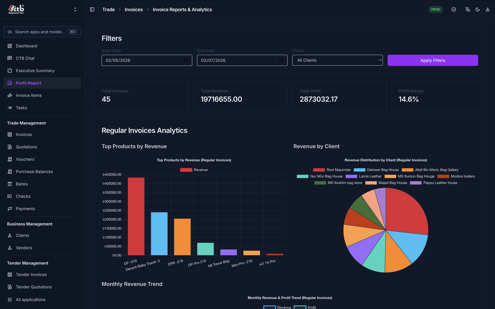
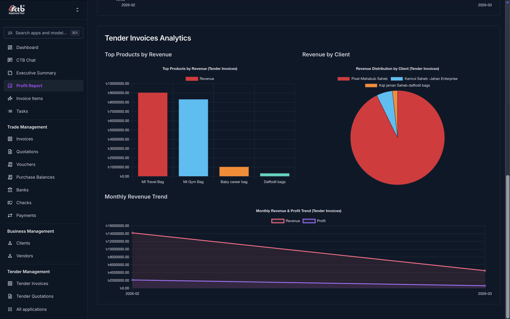
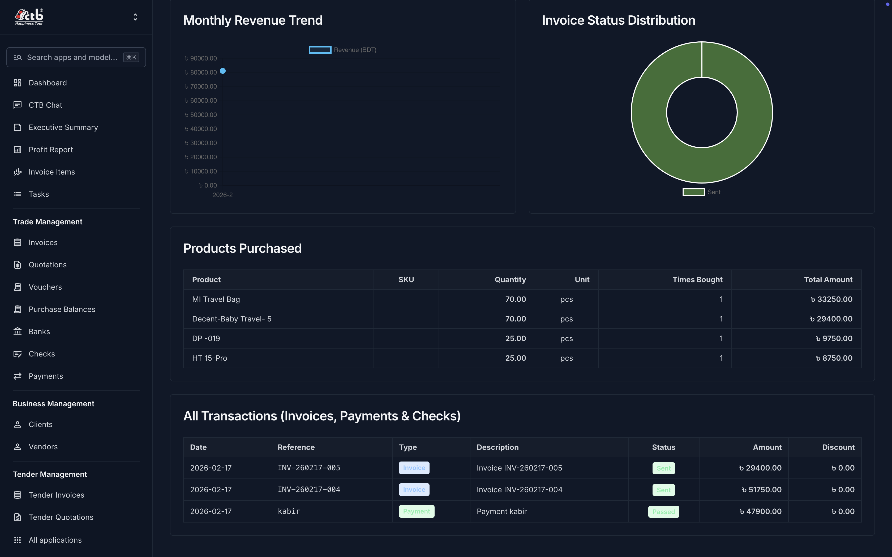
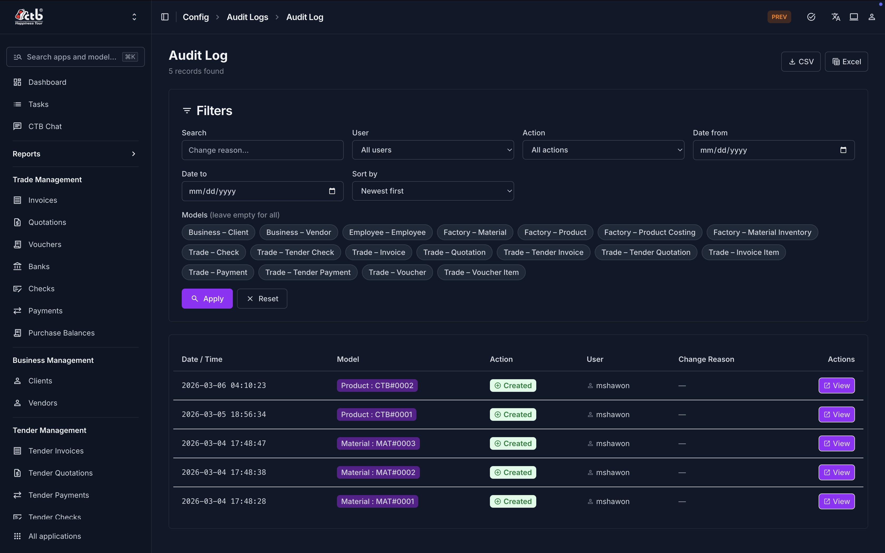
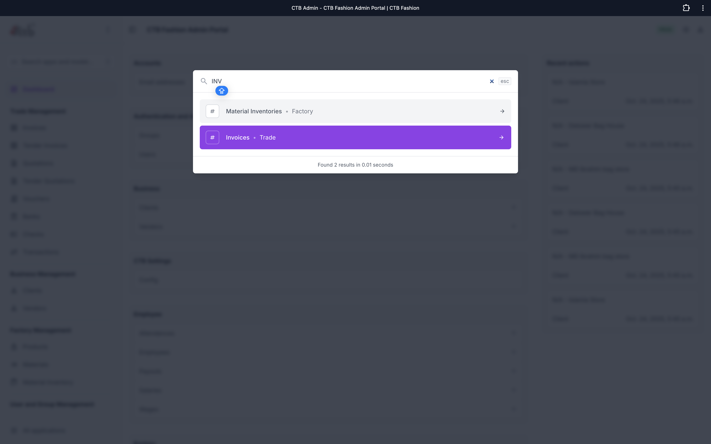
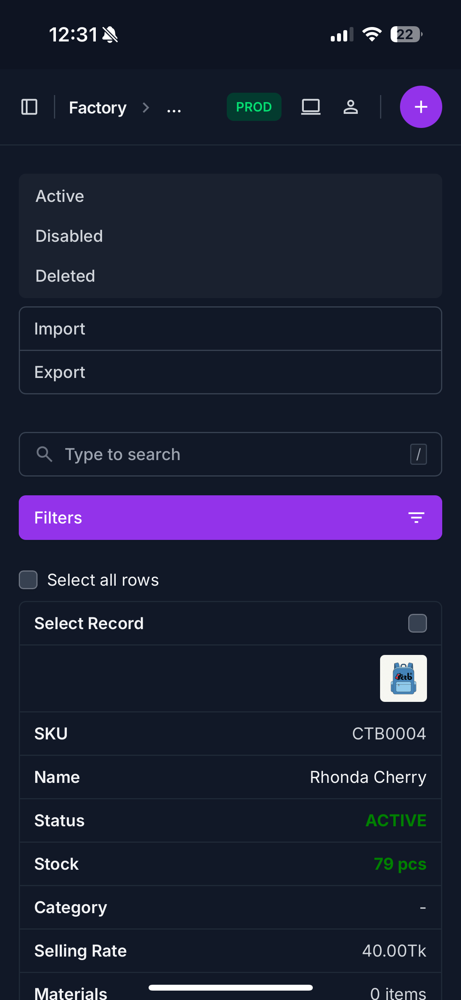

# CTB Admin Documentation

[](https://github.com/sharf-shawon/CTB2025.docs/actions/workflows/docs-ci.yml)
[](https://github.com/sharf-shawon/CTB2025.docs/actions/workflows/docs-deploy.yml)


CTB2025 is a business management platform for bag, garment, and fashion operations. It helps teams run client and vendor operations, factory inventory, trade and invoicing, and employee workflows from one admin system.

This repository, CTB2025.docs, is the public documentation site for CTB2025. The core CTB2025 application repository is private.

## Read the Documentation

Primary destination: [https://docs.ctbinfo.com/](https://docs.ctbinfo.com/)

If you need access to the private application repository, contact the CTB team through your organization admin or via the project contact listed in your internal onboarding channel.

## Why CTB2025

- Business module: Manage clients and vendors.
- Factory module: Manage products, materials, and inventory.
- Trade module: Create invoices, track payments, manage checks, vouchers, and banks.
- Employee module: Manage HR, attendance, salary, wages, and tasks.
- Settings and Admin module: Manage users, runtime settings, SMS, and maintenance controls.

## Feature Showcase Screenshots

Explore more visuals in [docs/gallery](docs/gallery).

### Invoice and profit reporting dashboard





### Client and attendance reporting




### Admin productivity and control





### Mobile and PWA experience




## What This Public Repo Contains

- End-user guides in `docs/user-guide/`
- Screenshot library in `docs/user-guide/screenshots/`
- MkDocs config and theme customizations
- CI, deployment, and Copilot agent automation for docs operations

This repo does not contain CTB2025 application source code.

## Quick Paths

- New users: [Getting Started](https://docs.ctbinfo.com/user-guide/00-getting-started/overview/)
- Operations teams: [User Guide Index](https://docs.ctbinfo.com/user-guide/)
- Documentation writers: [.github/DOCS_WRITER_GUIDE.md](.github/DOCS_WRITER_GUIDE.md)
- Contributors: [.github/CONTRIBUTING.md](.github/CONTRIBUTING.md)
- Security reporting: [.github/SECURITY.md](.github/SECURITY.md)

## Contributing to Documentation

1. Read [.github/copilot-instructions.md](.github/copilot-instructions.md).
1. Follow [.github/CONTRIBUTING.md](.github/CONTRIBUTING.md).
1. Open an issue using templates in `.github/ISSUE_TEMPLATE/`.
1. Include a valid screenshot path under `docs/user-guide/screenshots/...`.
1. For docs-agent flow, comment `@copilot ready-to-write` on the issue.

## Copilot Knowledge and Learnings System

To improve consistency over time, this repo uses two knowledge files:

- `.github/knowledge/ctb-knowledge.md`: stable module map, terminology, and docs conventions
- `.github/knowledge/copilot-learnings.md`: one-line lessons from merged docs pull requests

Post-merge automation (`Docs Audit`) updates these files to capture and reuse institutional knowledge.

## Development Setup

### Prerequisites

- Python 3.13
- [uv](https://docs.astral.sh/uv/getting-started/installation/)

### Install dependencies

```bash
uv sync --extra dev
uv run pre-commit install
```

### Tools for screenshot capture and annotation

- Markup Hero desktop download (Mac and Windows): [https://markuphero.com/download](https://markuphero.com/download)
- Markup Hero Chrome extension: [https://chromewebstore.google.com/detail/scrolling-screenshot-full/bnlghmkgojdehkigfkkblmmeldkmoccb](https://chromewebstore.google.com/detail/scrolling-screenshot-full/bnlghmkgojdehkigfkkblmmeldkmoccb)
- Markup Hero online annotation: [https://markuphero.com/new](https://markuphero.com/new)

Screenshot annotation recommendations:

- Use callout arrows to show click targets.
- Use consistent highlight style and text sizing across screenshots.
- For multi-step screenshots, annotate as Click 1, Click 2, Click 3 and reference those labels in page instructions.

### Run locally

```bash
uv run mkdocs serve
```

Then open the URL shown in terminal (usually `http://127.0.0.1:8000`).

### Build and validate

```bash
uv run mkdocs build --strict
uv run pre-commit run --all-files
```

## CI, Deployment, and Operations

- CI build and quality checks: `.github/workflows/docs-ci.yml`
- GitHub Pages deployment: `.github/workflows/docs-deploy.yml`
- Docs issue triage: `.github/workflows/docs-triage.yml`
- Post-merge audit and knowledge sync: `.github/workflows/docs-audit.yml`
- Branch protection baseline: `.github/BRANCH_PROTECTION.md`

## Discoverability Keywords

- Factory management admin documentation
- Business management platform documentation
- Inventory and invoicing workflow guides
- Payroll and employee operations documentation
- Bangladeshi garments and factory POS documentation

Visit: [https://docs.ctbinfo.com/](https://docs.ctbinfo.com/)
