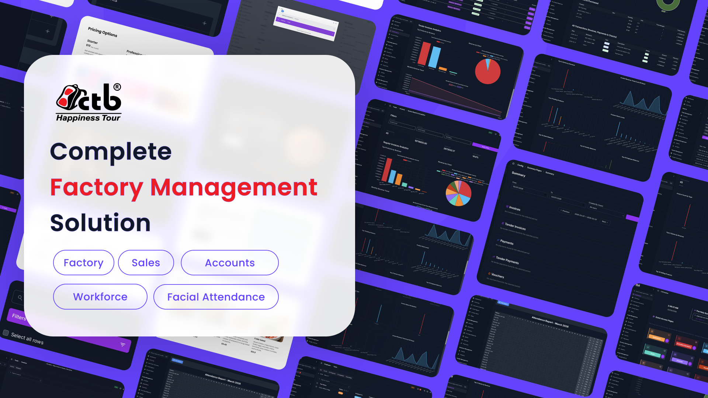

# CTB Admin Documentation

CTB Admin runs your day-to-day business operations in one place. This site explains how, module by module: what each screen is for, how to reach it, the steps to complete a task, and what every field on it means.

## Start here

1. Read the **[Getting Started Overview](user-guide/00-getting-started/overview.md)** to understand the interface and how global search works.
1. Read **[Login and Logout](user-guide/00-getting-started/login-and-logout.md)** if you are setting up a new user or device.
1. Review the **[Dashboard](user-guide/00-getting-started/dashboard.md)** guide for the key metrics and quick access cards.

Already know your way around? Go straight to **[Start Here](user-guide/README.md)** for the full module index and role-based paths.

## Finding what you need

- **Search** — Use the box at the top of any page. It searches the whole site and suggests matches as you type.
- **[Browse by tag](tags.md)** — Filter every page by module, task type, or role.
- **[Glossary](user-guide/09-reference/glossary.md)** — What a business term means in CTB Admin.
- **[Troubleshooting](user-guide/09-reference/troubleshooting.md)** — Error screens, missing buttons, and totals that look wrong.

## How this documentation is organized

The User Guide is grouped by business function. Choose the section that matches your work.

### Getting Started

Sign in, learn the interface, and find any record quickly.

- [Overview](user-guide/00-getting-started/overview.md)
- [Login and Logout](user-guide/00-getting-started/login-and-logout.md)
- [Dashboard](user-guide/00-getting-started/dashboard.md)

### Business

Manage clients and vendors, including onboarding, profile updates, and account-level details.

- [Business](user-guide/01-business/README.md)
- [Clients](user-guide/01-business/clients/overview.md)
- [Vendors](user-guide/01-business/vendors/overview.md)

### Factory

Manage categories, materials, inventory, and products used for production workflows.

- [Factory](user-guide/02-factory/README.md)
- [Materials](user-guide/02-factory/materials/overview.md)
- [Products](user-guide/02-factory/products/overview.md)

### Trade

Handle invoicing, payments, checks, vouchers, and banking records.

- [Trade](user-guide/03-trade/README.md)
- [Invoices](user-guide/03-trade/invoices/overview.md)
- [Payments](user-guide/03-trade/payments/overview.md)

### Employee

Manage employees, attendance, salary, wages, payouts, and tasks.

- [Employee](user-guide/04-employee/README.md)
- [Employees](user-guide/04-employee/employees/overview.md)
- [Salary](user-guide/04-employee/salary/overview.md)

### Returns

Record returned finished goods and returned raw materials.

- [Returns](user-guide/05-returns/README.md)
- [Product Returns](user-guide/05-returns/product-returns.md)
- [Material Returns](user-guide/05-returns/material-returns.md)

### Commission and Campaigns

Run incentive campaigns for employees and clients, and review what each paid out.

- [Commission and Campaigns](user-guide/06-commission/README.md)
- [Commission Campaigns](user-guide/06-commission/commission-campaigns.md)
- [Employee Analytics](user-guide/06-commission/employee-analytics.md)

### Reports

Review sales, profit, invoice, voucher, and attendance analytics.

- [Reports](user-guide/07-reports/README.md)
- [Summary Report](user-guide/07-reports/summary-report.md)
- [Profit Report](user-guide/07-reports/profit-report.md)

### Settings and Admin

Control users, audit logs, app settings, SMS notifications, and maintenance options.

- [Settings and Admin](user-guide/08-settings-and-admin/README.md)
- [User Management](user-guide/08-settings-and-admin/user-management.md)
- [Audit Log](user-guide/08-settings-and-admin/audit-log.md)

### Reference

Shared definitions, permissions, error messages, and offline behaviour.

- [Reference](user-guide/09-reference/README.md)
- [Glossary](user-guide/09-reference/glossary.md)
- [Permissions](user-guide/09-reference/permissions.md)
- [Troubleshooting](user-guide/09-reference/troubleshooting.md)

## Common tasks by role

### Office staff

- [Add Client](user-guide/01-business/clients/add-client.md) — Onboard a new client
- [Create Invoice](user-guide/03-trade/invoices/create-invoice.md) — Raise an invoice
- [Product Returns](user-guide/05-returns/product-returns.md) — Record returned goods

### Accounts and finance

- [Add Payment](user-guide/03-trade/payments/add-payment.md) — Record money received or sent
- [Add Check](user-guide/03-trade/checks/add-check.md) — Track a physical check
- [Summary Report](user-guide/07-reports/summary-report.md) — Review business performance

### HR and payroll

- [Record Attendance](user-guide/04-employee/attendance/record-attendance.md) — Log daily attendance
- [Generate Salary](user-guide/04-employee/salary/generate-salary.md) — Produce payroll for the month
- [Create Payout](user-guide/04-employee/payouts/create-payout.md) — Record an advance or bonus

### Administrators

- [User Management](user-guide/08-settings-and-admin/user-management.md) — Create accounts and grant access
- [Permissions](user-guide/09-reference/permissions.md) — Who can see and change what
- [Audit Log](user-guide/08-settings-and-admin/audit-log.md) — Who changed a record, and when

## Navigation tips

- Use the left sidebar to jump directly to a module.
- Open a module's landing page first to see its pages and the order you normally work through them.
- Every page follows the same shape: what it is for, when to use it, how to reach it, the steps, and a reference for every field.
- Each page shows when it was last updated, at the top.
