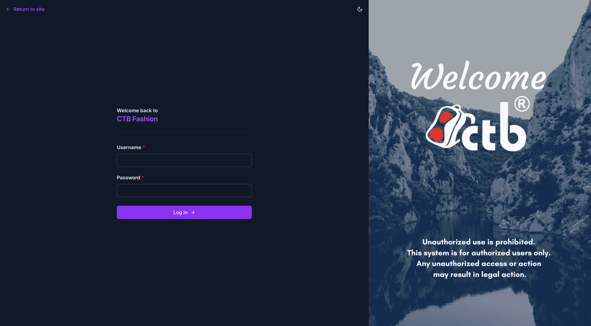
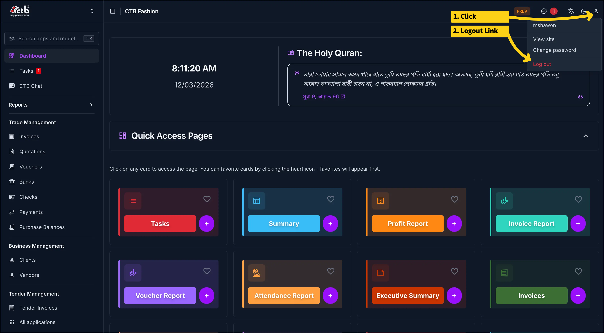

# Login and Logout

Use this page to sign in to CTB Admin and sign out when you are done. All access to the system requires a valid username and password.

## When to use this page

- Starting a new work session in CTB Admin.
- Switching between user accounts.
- Ending a session securely before leaving your workstation.

## How to access this page

Open your browser and navigate to your CTB Admin URL. The login page appears automatically when you are not signed in.

______________________________________________________________________

## Logging In

The login page displays a **"Welcome back to CTB Fashion"** heading alongside the CTB logo.

1. Enter your **Username** in the first field.
1. Enter your **Password** in the second field.
1. Click **Log in →**.

If your credentials are correct, the system redirects you to the **Dashboard**.

### Field Reference — Login

| Field    | Description                                                                          |
| -------- | ------------------------------------------------------------------------------------ |
| Username | Your assigned CTB Admin username. Contact your administrator if you do not have one. |
| Password | Your account password. Passwords are case-sensitive.                                 |

!!! note "Return to site"
The **← Return to site** link in the top-left corner takes you back to the public-facing website without logging in.

!!! warning "Failed Login"
If you enter an incorrect username or password, the form displays an error message. Check your credentials and try again. Contact your administrator to reset your password if needed.

!!! tip "Session Timeout"
CTB Admin automatically ends your session after a period of inactivity. You will be redirected to the login page and must sign in again.

______________________________________________________________________

## Logging Out

To sign out of CTB Admin:

1. Click the **user avatar icon** in the top-right corner of any page.
1. A dropdown menu appears showing your username, **View site**, **Change password**, and **Log out**.
1. Click **Log out** (shown in red).
1. The system signs you out immediately.

!!! warning "Shared Computers"
Always log out after each session on shared or public computers to protect business data.

______________________________________________________________________

## Tips and common issues

- If the login page does not load, check that you are using the correct URL and that the service is available.
- Passwords are case-sensitive. Make sure **Caps Lock** is off before entering your password.
- If you are redirected back to the login page after signing in, your browser may be blocking cookies. Check your browser cookie settings.
- Only administrators can create user accounts or reset passwords. Contact your administrator if you are locked out.

## Related pages

- **Dashboard** — The first page you see after a successful login.
- **User Management** — Add or manage user accounts (administrators only).
