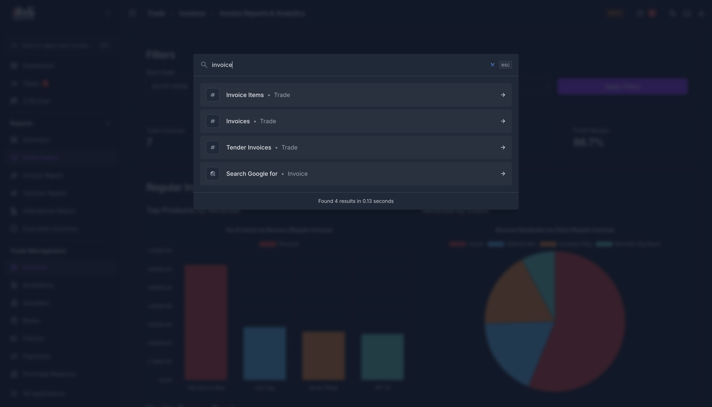

# Overview

CTB Admin helps you manage your bag, garment, and fashion business from one place.

## Summary

Use this page to understand what CTB Admin covers and how to start working efficiently from your first day. It helps you use quick navigation and search to reach records faster.

## When to use this page

- When you are new to CTB Admin and need a quick orientation.
- When you want to find records quickly without opening multiple modules.
- When you want to standardize fast lookup steps for your team.

## How to access this page

From the left sidebar, go to **Getting Started -> Overview**.

## Step-by-step instructions

1. Open **Getting Started -> Overview** from the sidebar.
1. Read the quick search guidance below to understand how global lookup works.
1. Press ++ctrl+k++ on Windows or ++cmd+k++ on Mac.
1. Enter a keyword such as SKU, name, phone number, or ID.
1. Select the matching result to open the record directly.
1. If you use barcode scanning, configure the scanner to trigger search and then scan the code.

## Field reference

- **Quick Search shortcut** - Opens global search so you can find records from anywhere in CTB Admin.
- **Search keyword** - The value you type (for example SKU, name, phone number, or ID) to locate records.
- **Search result list** - Matching records and pages you can open directly.

## Quick Search

Use Quick Search to find records faster without opening each module.

1. Press ++ctrl+k++ on Windows or ++cmd+k++ on Mac.
1. Type a keyword such as a SKU, name, phone number, or ID.
1. Select the result you need to open its page.

SKU is usually the fastest and most accurate way to find a record.

If you use barcodes, set up your barcode scanner to enter the search shortcut and then scan the code.

## Tips and common issues

- Use SKU first when possible because it is usually the most precise match.
- If search does not return expected results, check spelling and remove extra spaces.
- Confirm your account has permission to view the record type you are searching for.

## Related pages

- [Login and Logout](../00-getting-started/login-and-logout.md)
- [Dashboard](../00-getting-started/dashboard.md)
