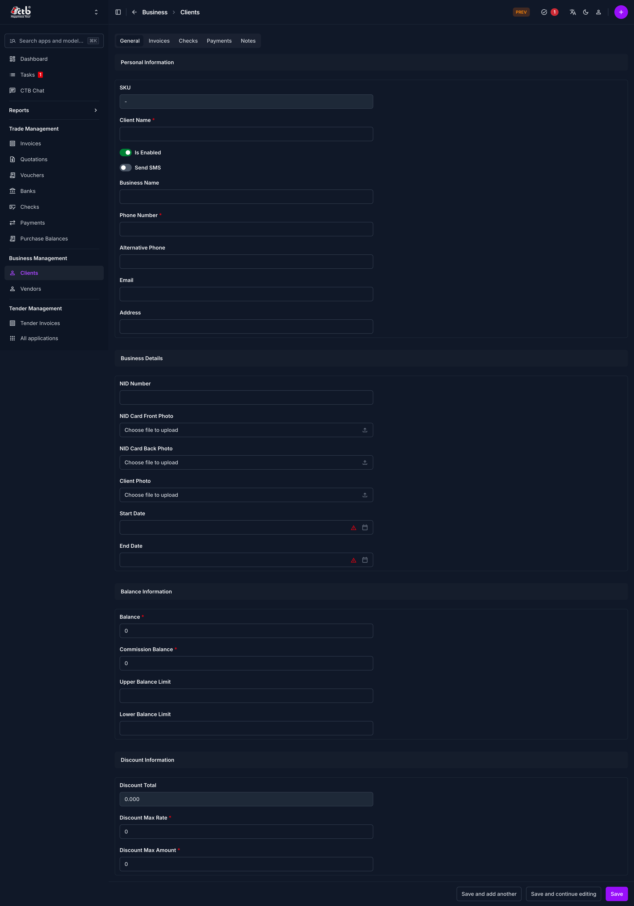

# Add Client

## Summary

Use this page to create a new client profile for trade, billing, and balance tracking. A complete client record helps you manage invoices, payments, checks, and reporting accurately.

## When to use this page

- When you onboard a new buyer, customer, or party.
- When you need a client record before creating invoices or receiving payments.
- When you want to set opening balances, commission balance, or discount settings at the client level.
- When you need to store client contact details and business identity documents.

## How to access this page

From the sidebar, go to **Business Management → Clients**. Then click **Add Client**.

## Prerequisites

- You have permission to create client records.
- You know the client's basic contact details and business identity details.
- You have any required document files ready for upload (for example NID photos or client photo).

## Step-by-step instructions

1. Open **Business Management → Clients → Add Client**.
1. In **Personal Information**, enter the client identity and contact details such as **Client Name**, **Phone Number**, and **Address**.
1. Set toggles based on your workflow:
   - Turn on **Is Enabled** to keep the client active.
   - Turn on **Send SMS** if you want this client to receive SMS notifications.
1. In **Business Details**, enter the business and identity information.
1. Upload documents where needed, such as **NID Card Front Photo**, **NID Card Back Photo**, and **Client Photo**.
1. Set **Start Date** and **End Date** if your business process uses contract or active period dates.
1. In **Balance Information**, enter opening values for **Balance**, **Commission Balance**, and optional limits.
1. In **Discount Information**, enter discount values if this client receives standard discounts.
1. Click one of the save actions:
   - **Save** to create the client and return.
   - **Save and continue editing** to create and remain on the same record.
   - **Save and add another** to create this client and immediately open a new add form.

## Field reference

- **SKU** — Internal client code. Use a consistent code format for easier search and reporting.
- **Client Name** — Main client name used across invoices, payments, and reports.
- **Is Enabled** — Controls whether the client is active for normal operations.
- **Send SMS** — Enables or disables SMS notifications for this client.
- **Business Name** — Registered or trade business name used in business communication.
- **Phone Number** — Primary contact number for operational communication.
- **Alternative Phone** — Secondary number when the primary contact is not available.
- **Email** — Email address for formal communication and record keeping.
- **Address** — Physical or mailing address.
- **NID Number** — Identity number for verification and compliance records.
- **NID Card Front Photo** — Upload of the front side of the NID card.
- **NID Card Back Photo** — Upload of the back side of the NID card.
- **Client Photo** — Client profile photo for identification.
- **Start Date** — Date when client business relation starts.
- **End Date** — Date when client relation, contract, or validity period ends.
- **Balance** — Opening or current client balance tracked by the system.
- **Commission Balance** — Commission-related balance for this client account.
- **Upper Balance Limit** — Maximum threshold used for balance monitoring.
- **Lower Balance Limit** — Minimum threshold used for balance monitoring.
- **Discount Total** — Total discount value tracked for this client.
- **Discount Max Rate** — Maximum allowed discount rate for this client.
- **Discount Max Amount** — Maximum allowed discount amount for this client.

This page stores a client record in the CTB client master (Business.models.Client), so values you enter here affect downstream trade and reporting workflows.

## Tips and common issues

- Always enter **Client Name** and **Phone Number** carefully, because these are commonly used for search and contact.
- Keep **Is Enabled** turned on for active clients; disabled clients can be excluded from day-to-day operations.
- Upload clear document images to avoid verification problems later.
- Review opening **Balance** and **Commission Balance** before saving to prevent reconciliation issues.
- Use **Save and continue editing** if you need to verify uploaded files and all limits immediately after creation.

## Related pages

- See [Clients Overview](overview.md) to manage and search all clients.
- See [Client Detail](client-detail.md) to review full client profile information.
- See [Edit Client](edit-client.md) to update an existing client.
- See [Client Reports](client-reports.md) for analytics and client-level tracking.
