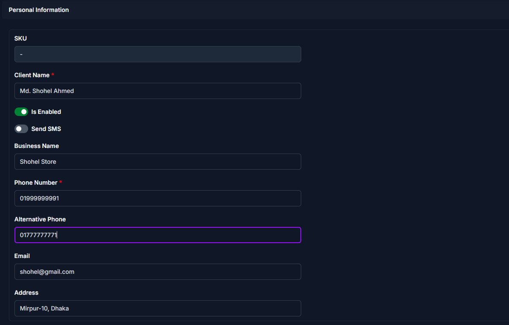

# Add Client

Use this page to register a new client in CTB Admin. A client is any individual or organization that purchases goods or services. Client records store contact details, identification information, and financial data used across invoices, payments, and reports.

## Summary

Use this page to create a complete client profile before you issue invoices or record payments. A well-configured client record keeps reporting, communication, and balance tracking accurate.

______________________________________________________________________

## When to use this page

- Onboarding a new client or business partner
- Creating a client profile before issuing invoices
- Storing client contact details and identification documents

______________________________________________________________________

## How to access this page

From the sidebar, go to **Business → Clients**. On the Client List page, click the **purple (+) icon** in the top-right corner.

The system opens the **Add Client Page**.

______________________________________________________________________

## Step-by-step instructions

1. Open **Business → Clients** and click the **Add** icon.
1. Fill the **Personal Information** section.
1. Fill the **Business Details** section and upload required documents.
1. Fill **Balance & Discount Information** based on your business policy.
1. Click **Save** to create the client, or choose another save option if needed.

______________________________________________________________________

## Field reference

### Personal information

Fill in the following fields:

| Step | Field             | What to Do           | Description                                         |
| ---- | ----------------- | -------------------- | --------------------------------------------------- |
| 1    | Client Name       | Enter client name    | The name used in invoices and reports               |
| 2    | Is Enabled        | Toggle ON/OFF        | Controls whether the client is active               |
| 3    | Send SMS          | Enable if needed     | Sends SMS notifications for client-related activity |
| 4    | Business Name     | Enter if applicable  | Client’s company or trade name                      |
| 5    | Phone Number      | Enter primary number | Main contact number                                 |
| 6    | Alternative Phone | Enter if available   | Secondary contact number                            |
| 7    | Email             | Enter if available   | Used for communication                              |

!!! warning "Required Fields"

    Fields marked with a **red star (\*)** are mandatory.

### Business details

| Step | Field                | What to Do           | Description                         |
| ---- | -------------------- | -------------------- | ----------------------------------- |
| 1    | NID Number           | Enter NID number     | Used for identity verification      |
| 2    | NID Card Front Photo | Upload image         | Front side of NID                   |
| 3    | NID Card Back Photo  | Upload image         | Back side of NID                    |
| 4    | Client Photo         | Upload if available  | Client profile photo                |
| 5    | Start Date           | Select date          | When the client relationship begins |
| 6    | End Date             | Select if applicable | Leave empty if ongoing              |

!!! note

    Upload clear images for proper verification.

### Balance & discount information

| Step | Field               | What to Do   | Description                         |
| ---- | ------------------- | ------------ | ----------------------------------- |
| 1    | Balance             | Enter amount | Current financial balance           |
| 2    | Commission Balance  | Enter amount | Balance for commission transactions |
| 3    | Upper Balance Limit | Set limit    | Maximum allowed balance             |
| 4    | Lower Balance Limit | Set limit    | Minimum allowed balance             |
| 5    | Discount Max Rate   | Enter rate   | Maximum discount percentage         |
| 6    | Discount Max Amount | Enter amount | Maximum discount amount per invoice |

!!! warning "Required Fields"

    Fields marked with a **red star (\*)** are mandatory.

______________________________________________________________________

## Saving the Client

After completing all sections:

- Click **Save** to create the client
- Click **Save and add another** to quickly add multiple clients
- Click **Save and continue editing** to save and stay on the page

______________________________________________________________________

## Tips and common issues

- Ensure the **Phone number is correct** before enabling SMS
- Upload clear **NID images** for verification
- Leave **End Date empty** if the client is ongoing
- Configure **Discount Max Rate** and **Discount Max Amount** to control pricing

______________________________________________________________________

## Related pages

- **Edit Client** — Update client information
- **Client Detail** — View client profile and transactions
- **Client Reports** — Analyze client-related financial data
