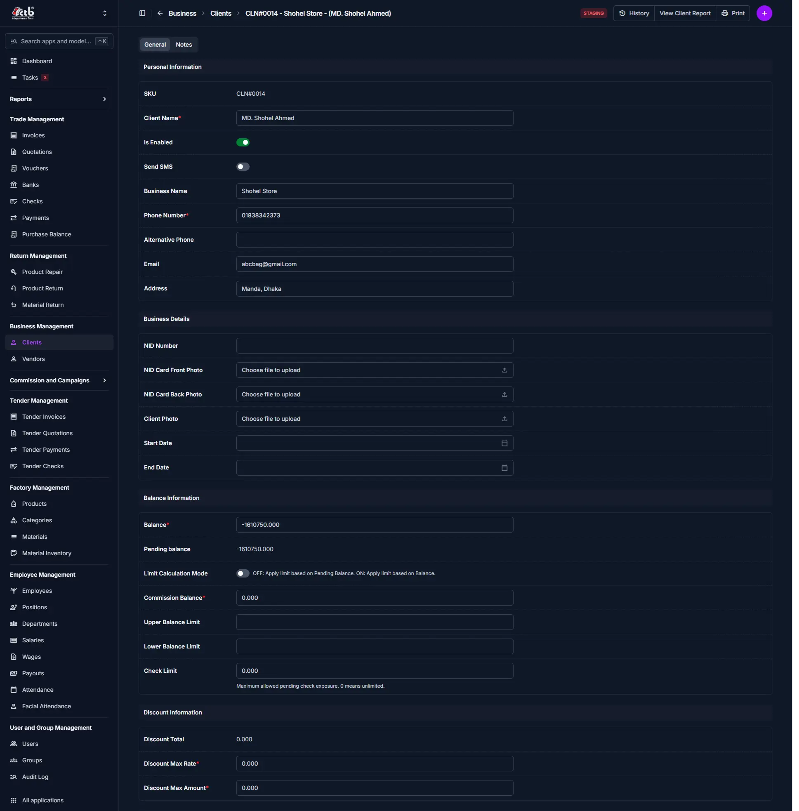

# Add Client

<!-- metadata: owner: business_team, last_updated: 2026-07-26, git_ref: main, staging_verified: true -->

## Summary

Use this page to onboard new clients in CTB Admin. Creating a comprehensive client record establishes credit limits, contact details, identity verification, and financial parameters required for issuing invoices and tracking receivables.

______________________________________________________________________

## When to use this page

- Onboarding a new retail, wholesale, or corporate client
- Establishing client credit, upper balance limits, and check limits before invoicing
- Storing National ID (NID) photos and contact information for compliance
- Configuring commission balances and discount caps for account officers

______________________________________________________________________

## How to access this page

From the sidebar, go to **Business → Clients** (`/en/admin/Business/client/`). On the Client List page, click the **purple (+) icon** in the top-right corner.

______________________________________________________________________

## Prerequisites

- **Required User Permissions**:
    - `Business | Client | Can add Client` (`business.add_client`)
    - `Business | Client | Can import client` (`business.import_client`) for bulk onboarding.

______________________________________________________________________

## Step-by-step instructions

1. Open **Business → Clients** and click **(+) Add Client**.
1. Enter the primary **Name** and optional **Business Name**.
1. Input a unique **Phone** number and optional **Alternative Phone** or **Email**.
1. Upload profile photo, **NID Front Photo**, and **NID Back Photo** for verification.
1. Set initial financial limits under **Balance & Discount Information**: **Upper Limit**, **Lower Limit**, and **Check Limit**.
1. Set discount controls: **Discount Max Rate (%)** and **Discount Max Amount**.
1. Confirm **Is Enabled** is toggled ON to keep the account active.
1. Click **Save** to finalize client registration.

______________________________________________________________________

## Verification & definition of done

- **Unique SKU Generated**: System assigns a client SKU (`CLN-YYYYMMDD-XXXX`).
- **Profile Created**: Client appears in **Business → Clients** list view.
- **Invoicing Unlocked**: Client can now be selected in **Trade → Create Invoice**.

______________________________________________________________________

## Field reference

| Field Name            | Type    | Required | Backend Validation / Constraints                | Description                                                      |
| :-------------------- | :------ | :------- | :---------------------------------------------- | :--------------------------------------------------------------- |
| **SKU**               | Text    | Auto     | Prefix `CLN`, read-only                         | System-generated tracking SKU.                                   |
| **Name**              | Text    | Yes      | Max 50 characters                               | Client's full personal or primary contact name.                  |
| **Business Name**     | Text    | No       | Max 50 characters                               | Registered company or trade name.                                |
| **Phone**             | Text    | Yes      | Max 15 characters, unique constraint            | Primary contact phone number. Must be unique across all clients. |
| **Alternative Phone** | Text    | No       | Max 15 characters                               | Secondary telephone contact.                                     |
| **Email**             | Email   | No       | Max 254 characters, valid email format          | Electronic mail address.                                         |
| **NID**               | Text    | No       | Max 20 characters, unique constraint            | National Identification Number.                                  |
| **Photo**             | File    | No       | Upload size `500x500`, resized image            | Client profile picture.                                          |
| **NID Front Photo**   | File    | No       | Upload size `500x315`, resized image            | Front scan/photo of NID card.                                    |
| **NID Back Photo**    | File    | No       | Upload size `500x315`, resized image            | Back scan/photo of NID card.                                     |
| **Balance**           | Decimal | No       | Max 13 digits, 3 decimal places, default `0.00` | Current account balance.                                         |
| **Upper Limit**       | Decimal | No       | Max 13 digits, 3 decimal places                 | Credit limit threshold. Invoices exceeding this lock to `Draft`. |
| **Check Limit**       | Decimal | No       | Max 13 digits, 3 decimal places                 | Maximum cumulative pending check balance permitted.              |
| **Is Enabled**        | Boolean | No       | Default `True`                                  | Active status toggle.                                            |

______________________________________________________________________

## Exception handling & error recovery

| Error Symptom / Message                         | Root Cause                                             | Step-by-Step Remediation                                                                                                                     |
| :---------------------------------------------- | :----------------------------------------------------- | :------------------------------------------------------------------------------------------------------------------------------------------- |
| **"Client with this Phone already exists"**     | Duplicate primary phone number entered.                | 1. Check **Business → Clients** search to see if client is already registered. 2. Enter a unique phone number.                            |
| **"Client with this NID already exists"**       | Duplicate NID entered.                                 | 1. Verify NID document digits. 2. Update NID field with unique identification number.                                                     |
| **Invoice locked to Draft when billing client** | Total invoice amount exceeds client's **Upper Limit**. | 1. Edit client record in **Business → Clients** to increase **Upper Limit**. 2. Alternatively, request superuser approval on the invoice. |

______________________________________________________________________

## Related workflows & next steps

- **[Create Invoice](../../03-trade/invoices/create-invoice.md)** — Issue a sales invoice to the newly registered client.
- **[Add Payment](../../03-trade/payments/add-payment.md)** — Record initial deposit or payment receipt from client.
- **Client Ledger** — Monitor credit limits and transaction balance statements.

______________________________________________________________________

## Related pages

- **Edit Client** — Update client information
- **Client Detail** — View client profile and transactions
- **Client Reports** — Analyze client-related financial data
