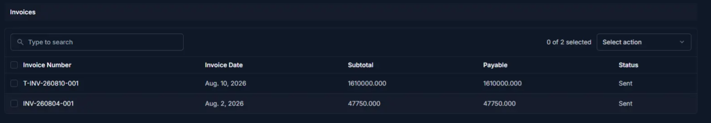
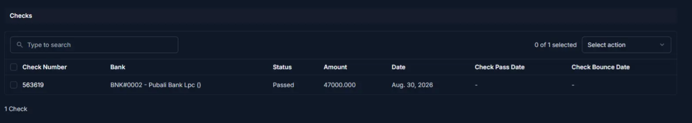
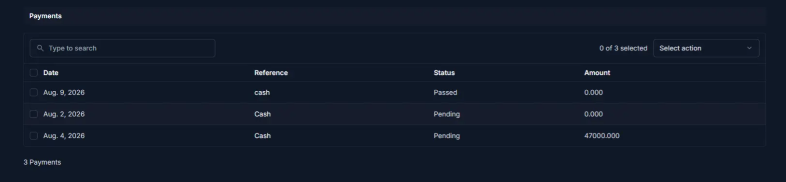

# Client Detail

The **Client Detail** page displays the complete profile of a client, including personal information, business details, financial data, and activity history. Use it to review client information and to edit the record or manage its transactions.

## Summary

Use this page to review a client's complete profile before you perform billing, payment, or account decisions. It combines identity, contact, and financial information in one place.

<!-- TODO: screenshot client-detail.png -->
______________________________________________________________________

## When to use this page

- Viewing a client’s full profile and details
- Checking balance, discounts, and financial limits
- Reviewing client identification and business information
- Accessing client-related actions such as editing or transactions

______________________________________________________________________

## How to access this page

1. Go to **Business → Clients** from the sidebar.
1. On the **Client List** page, click on any client row or name.

The system will open the **Client Detail** page.

______________________________________________________________________

## Step-by-step instructions

1. Open **Business → Clients** from the sidebar.
1. Select the target client from the list.
1. Review personal and business details for accuracy.
1. Check balance and discount limits before creating new transactions.
1. Use available actions such as **Edit Client** or **Create Invoice** as needed.

______________________________________________________________________

## Field reference

- **SKU** - System-generated client identifier used for tracking.
- **Client Name** - Primary display name for the client record.
- **Phone Number** - Main contact number used for communication and SMS.
- **Balance** - Current financial balance for the client account.
- **Discount limits** - Maximum rate and amount allowed for invoice discounts.

______________________________________________________________________

## Page overview

The page is typically divided into multiple sections:

- Personal Information
- Business Details
- Balance & Discount Information
- Activity / Transactions (if available)

______________________________________________________________________

## Personal information

This section displays the client’s basic information.

| Field               | Description                                    |
| ------------------- | ---------------------------------------------- |
| SKU                 | Unique client ID generated by the system       |
| Client Name         | Full name of the client                        |
| Status (Is Enabled) | Shows whether the client is active or inactive |
| Send SMS            | Indicates if SMS notifications are enabled     |
| Business Name       | Client’s business or trade name                |
| Phone Number        | Primary contact number                         |
| Alternative Phone   | Secondary contact number                       |
| Email               | Client’s email address                         |

______________________________________________________________________

## Business details

This section contains identity and contract-related information.

| Field                | Description                                  |
| -------------------- | -------------------------------------------- |
| NID Number           | National ID number of the client             |
| NID Card Front Photo | Front image of the client's NID card         |
| NID Card Back Photo  | Back image of the client's NID card          |
| Client Photo         | Profile photo of the client                  |
| Start Date           | Start date of the client relationship        |
| End Date             | End date of the client relationship (if any) |

!!! note

    Uploaded images help verify client identity and should be clear and readable.

______________________________________________________________________

## Balance and discount information

This section shows the client’s financial status, pending amounts, limits, and discount settings.

| Field                  | Description                                                                 |
| ---------------------- | --------------------------------------------------------------------------- |
| Balance                | Current financial balance of the client                                     |
| Pending balance        | Amount currently pending (unsettled/payable)                                |
| Limit Calculation Mode | OFF: Apply limit based on Pending balance. ON: Apply limit based on Balance |
| Commission Balance     | Commission-related balance                                                  |
| Upper Balance Limit    | Maximum allowed balance                                                     |
| Lower Balance Limit    | Minimum allowed balance                                                     |
| Check Limit            | Maximum allowed pending check exposure (0 = unlimited)                      |
| Discount Total         | Total discount applied (auto-calculated)                                    |
| Discount Max Rate      | Maximum allowed discount percentage                                         |
| Discount Max Amount    | Maximum allowed discount amount                                             |

______________________________________________________________________

## Available actions

From the **Client Detail** page, you can perform the following actions:

| Action                  | Description                          |
| ----------------------- | ------------------------------------ |
| Edit Client             | Modify the client’s information      |
| Create Invoice          | Create a new invoice for this client |
| View Transactions       | Check transaction history            |
| Enable / Disable Client | Change the client’s active status    |

______________________________________________________________________

## Tips and common issues

\* The **SKU** is system-generated and cannot be changed. 
\* Financial fields such as **Discount Total** are calculated automatically. 
\* If a client is **inactive**, they may not appear in invoice selection lists.

!!! warning

    Make sure the **Phone Number** is correct before enabling **Send SMS**, as this number will receive automated SMS notifications.

______________________________________________________________________

## Related pages

- **Add Client** — Create a new client
- **Edit Client** — Update client information
- **Client Reports** — Analyze client activity and financial data

______________________________________________________________________

## Invoices

The **Invoices** panel lists invoices related to the client. Use the table to open, filter, or perform actions on invoices such as sending or marking as paid.

Typical columns: **Invoice Number**, **Invoice Date**, **Subtotal**, **Payable**, **Status**

Select rows to perform bulk actions using the **Select action** menu.

______________________________________________________________________

## Checks

The **Checks** panel shows checks issued by or to the client. Columns include **Check Number**, **Bank**, **Status**, **Amount**, **Date**, **Check Pass Date**, and **Check Bounce Date**.

Use check actions to mark status changes or to record bounce information.

______________________________________________________________________

## Payments

The **Payments** panel displays recorded payments for the client. Columns include **Date**, **Reference**, **Status**, and **Amount**.

Payments can be filtered and selected for actions (for example, reconcile or refund).

______________________________________________________________________

## Product returns

The **Product Returns** area lists product returns associated with this client. If none exist, the page shows a message and a button to **Add Product Return**.

______________________________________________________________________

## Page actions and footer controls

At the bottom of the page you will typically find the primary action buttons. Examples from the UI:

- **Delete Client** — Permanently delete the client record (destructive)
- **Save** — Save changes and close the form
- **Save and continue editing** — Save changes and remain on the edit page
- **Save and add another** — Save current record and open a blank add form

Use the **History**, **View Client Report**, and quick action buttons from the top-right of the page for additional operations.

______________________________________________________________________
