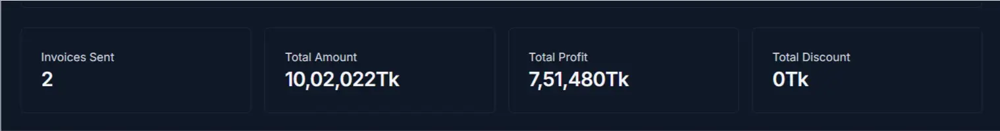
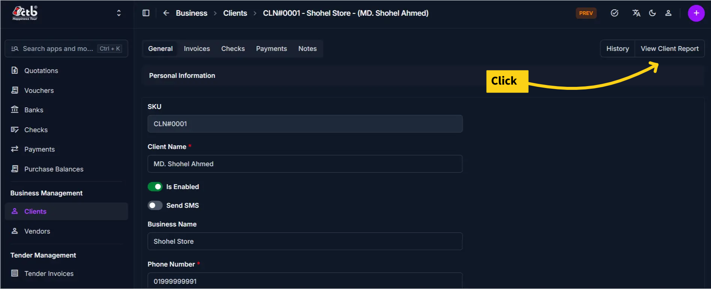
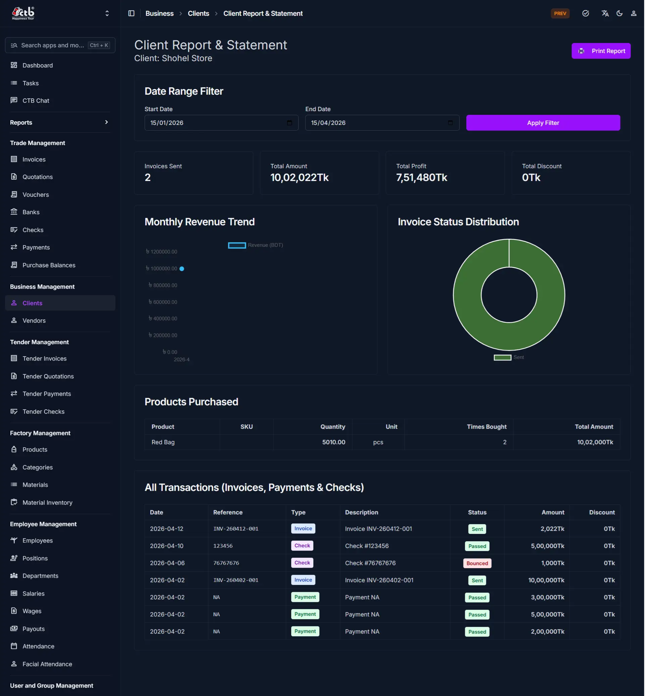
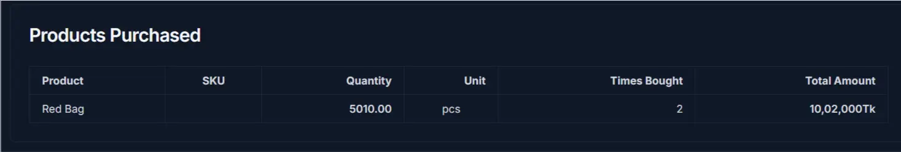
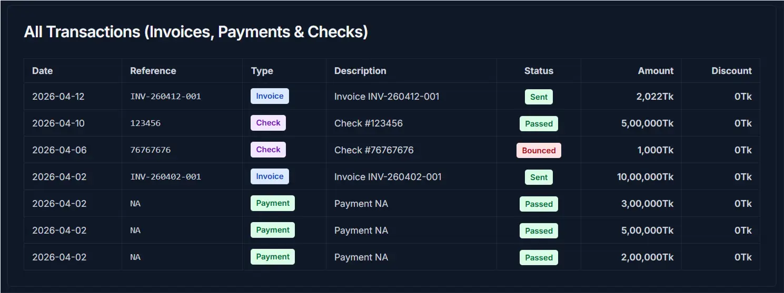
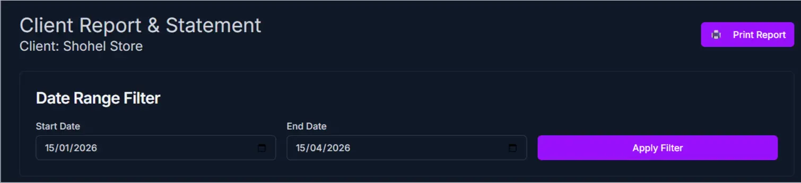
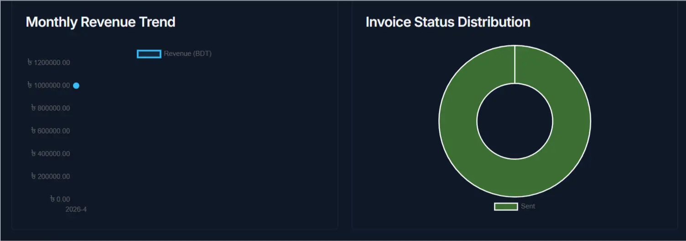

# Client Report & Statement

Use this page to view a detailed financial summary and transaction history for a specific client. The Client Report displays invoices sent, payments received, checks issued, and revenue trends in one comprehensive dashboard.

## Summary

The top section displays key financial information:

| Metric            | Description                                                |
| ----------------- | ---------------------------------------------------------- |
| Invoices Sent     | Total number of invoices issued to this client             |
| Total Amount Sent | Total value of all invoices (in the selected date range)   |
| Total Amount      | Sum of all transaction amounts                             |
| Year Discount     | Total discounts applied to invoices in the selected period |

!!! note

    All metrics recalculate automatically when you apply a new date range filter.

______________________________________________________________________

## When to use this page

- Reviewing a client's total transaction history and financial status
- Analyzing monthly revenue trends and payment patterns
- Verifying invoice amounts, discounts, and payment status
- Printing or exporting the client statement for accounting or client records
- Monitoring which products the client has purchased

______________________________________________________________________

## How to access this page

1. Go to **Business → Clients** from the sidebar.
1. Click on any client name or row to open the **Client Detail** page.
1. In the top-right corner, click the **View Client Report** button.

The system opens the **Client Report & Statement** page.

______________________________________________________________________

## Step-by-step instructions

1. Open **Client Report & Statement** from the **Business** section of the sidebar.
1. Complete the **Page overview** section described below.
1. Complete the **Products purchased** section described below.
1. Complete the **All transactions** section described below.
1. Review the values you entered, then save the record.

______________________________________________________________________

## Field reference

### Page overview

The Client Report page displays:

- **Date Range Filter** — Filter transactions by start and end date
- **Summary Metrics** — Key financial totals at a glance
- **Revenue Trend Chart** — Monthly revenue visualization
- **Invoice Status Distribution** — Pie chart showing invoice statuses
- **Products Purchased** — Table of items the client bought
- **All Transactions** — Complete transaction history (invoices, payments, checks)

### Products purchased

This section lists all products the client has ordered:

| Column       | Description                               |
| ------------ | ----------------------------------------- |
| Product      | Name of the product or item               |
| SKU          | Unique product ID                         |
| Quantity     | Total units purchased                     |
| Unit         | Measurement unit (pcs, meters, etc.)      |
| Times Bought | How many separate transactions            |
| Total Amount | Total value of all purchases of that item |

### All transactions

This comprehensive table displays every transaction involving this client (invoices, payments, and checks):

| Column      | Description                                      |
| ----------- | ------------------------------------------------ |
| Date        | Transaction date                                 |
| Reference   | Invoice, check, or payment reference number      |
| Type        | Transaction type (Invoice, Check, Payment, etc.) |
| Description | Details of the transaction                       |
| Status      | Current status (Paid, Pending, Overdue, etc.)    |
| Amount      | Transaction amount                               |
| Discount    | Any discount applied                             |

!!! note

    Transactions are listed in reverse chronological order (most recent first).

______________________________________________________________________

## Date range filter

At the top of the report:

1. Enter a **Start Date** in the first field
1. Enter an **End Date** in the second field
1. Click the **Apply Filter** button to refresh the report

The report automatically recalculates all metrics, charts, and tables based on your selected date range.

______________________________________________________________________

## Charts and analysis

### Monthly revenue trend

A line chart showing how much revenue (total invoice amount) was generated from this client each month. Use this to identify seasonal patterns or business growth trends.

### Invoice status distribution

A pie chart displaying the breakdown of invoice statuses (for example: Pending, Paid, Overdue). This helps you quickly assess the client's payment compliance.

______________________________________________________________________

## Tips and common issues

- Use the **date range filter** to narrow down transactions and focus on specific periods (for example, a quarter or fiscal year)
- The **Monthly Revenue Trend** chart helps identify payment patterns and seasonal activity
- **Invoice Status Distribution** quickly shows how many invoices are unpaid or overdue
- Use the **Print Report** button to generate a formal statement for accounting or client correspondence
- All monetary amounts display in your system's default currency (typically Thai Baht)

______________________________________________________________________

## Related pages

- [Client Detail](client-detail.md) — View and edit client personal and business information
- [Client List](overview.md) — Browse all clients and perform bulk actions
- [Create Invoice](../../03-trade/invoices/create-invoice.md) — Issue new invoices to this client
- [Invoice Report](../../07-reports/invoice-report.md) — System-wide invoice analytics
