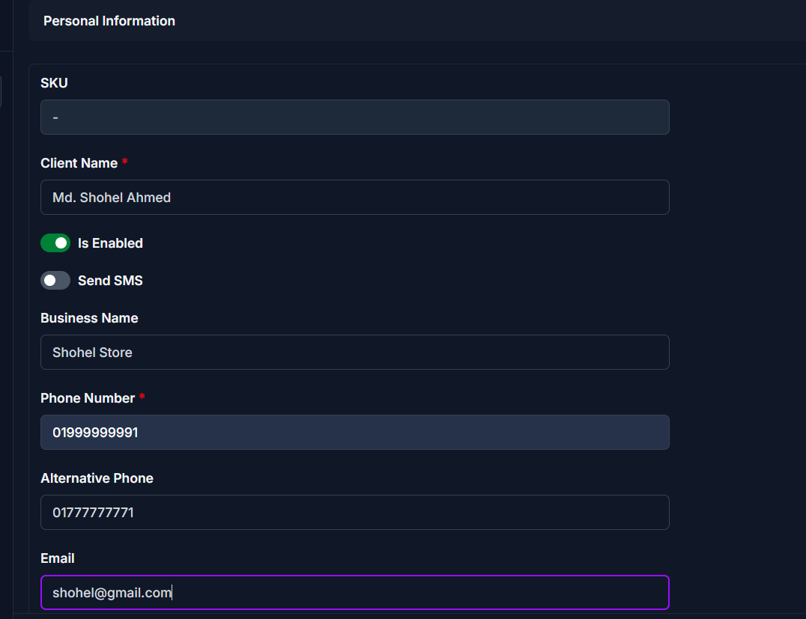
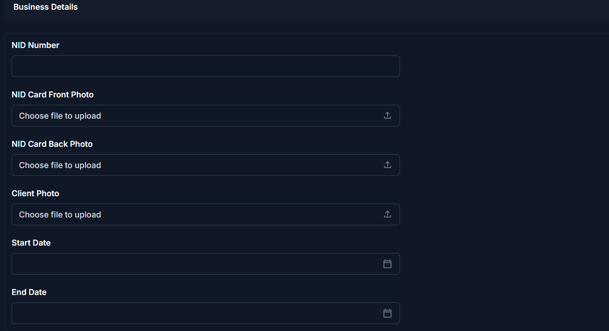
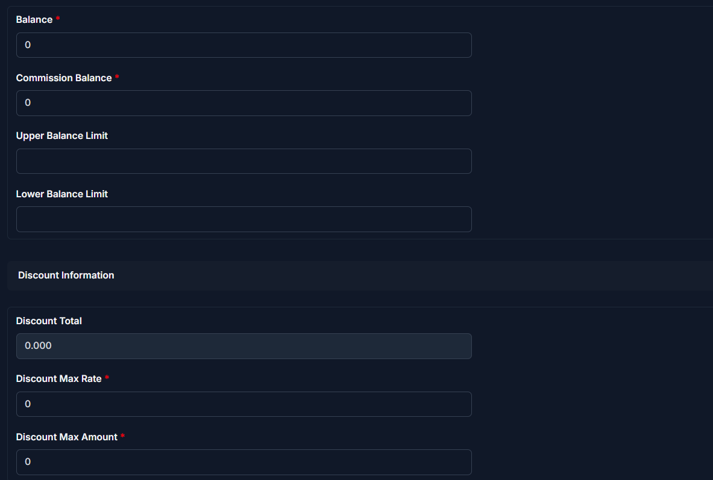

# \<<\<<\<<< HEAD

# Edit Client

Use this page to update an existing client's information in CTB Admin. The layout is identical to the Add Client form — all fields are the same but pre-filled with the saved data.

For full field descriptions, see **[Add Client](add-client.md)**.

## When to use this page

- Correcting a client's contact details or business information.
- Enabling or disabling a client's active status.
- Adjusting balance limits or discount settings after a contract change.

## How to access this page

1. From the sidebar, go to **Business → Clients**.
1. Click the client's name or the edit icon on the **Client List** page.
1. The Client Edit form opens, pre-filled with the client's current data.

______________________________________________________________________

## Steps to Edit a Client

### Personal Information

1. Update the **Client Name** if it has changed.
1. Adjust the **Is Enabled** and **Send SMS** toggles as required:
   - **2.1** Turn **Is Enabled OFF** to deactivate a client who no longer places orders.
   - **2.2** Turn **Send SMS OFF** to stop invoice notifications for this client.
1. Update **Business Name**, **Phone Number**, **Alternative Phone**, or **Email** as needed.

### Business Details

4. Update the **NID Number** if it was entered incorrectly.
1. Replace uploaded photos by clicking **Choose file to upload** and selecting a new file:
   - **5.1** Replace the **NID Card Front Photo** if the image is unclear or outdated.
   - **5.2** Replace the **NID Card Back Photo** if needed.
1. Adjust the **Start Date** or **End Date** if contract terms have changed:
   - **6.1** Update **Start Date** to correct the relationship start.
   - **6.2** Update **End Date** to set or remove the contract end date.

### Balance and Discount Information

7. Revise the balance fields if the client's financial position has changed:
   - **7.1** Update **Balance** to reflect the current account balance.
   - **7.2** Update **Commission Balance** to reflect commission adjustments.
1. Revise balance limits if credit terms have been renegotiated:
   - **8.1** Update **Upper Balance Limit**.
   - **8.2** Update **Lower Balance Limit**.
1. Update **Discount Max Rate** or **Discount Max Amount** if the client's discount terms have changed.

______________________________________________________________________

## Saving Changes

Click **Save** to apply the changes. The system redirects you to the **Client Detail** page.

______________________________________________________________________

## Error Messages When Editing

| Message                                               | Cause                                                                | Action                                                |
| ----------------------------------------------------- | -------------------------------------------------------------------- | ----------------------------------------------------- |
| "This field is required."                             | A mandatory field was cleared or left empty.                         | Fill in all required fields before saving.            |
| "Enter a valid phone number."                         | The phone number contains invalid characters or an incorrect format. | Use digits only and include the correct country code. |
| "Ensure this value is less than or equal to [limit]." | A balance or discount value exceeds the configured system limit.     | Reduce the value to within the allowed range.         |

______________________________________________________________________

## Tips and Common Issues

- The **SKU** field cannot be changed after a client is created.
- The **Discount Total** is read-only and calculated automatically — it cannot be edited directly.
- Deactivating a client (**Is Enabled OFF**) does not delete their invoice history. All past records remain accessible.
- If you only need to view a client's details without editing, use the **Client Detail** page instead.

## Related Pages

- **Add Client** — Learn about all fields and settings when creating a client.
- **Client Detail** — View the full profile and history for a client.
- **Client Reports** — View financial summaries for a client.

> > > > > > > 562ba5bd032c0ffcfa2f03f0a69f3a08a5d7018f
