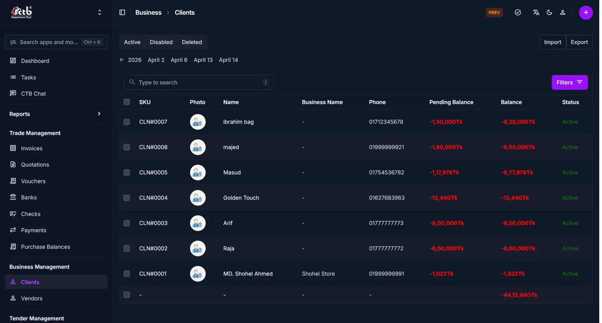

# Clients Overview

The **Clients** module manages all customer and business-partner records in CTB Admin. A client is any individual or organization to whom the company sends invoices or places orders. This page displays all registered clients and their financial balances, allowing you to quickly search, filter, and manage client information.

## What you can do in this module

- **Register new clients** — create client records with contact details, business information, and NID documentation.
- **Manage active status** — enable or disable clients to control whether they appear in new invoice and order dropdowns.
- **Configure financial limits** — set upper and lower balance limits and maximum discount rates per client.
- **Control SMS notifications** — choose which clients receive automated invoice SMS messages.
- **View client history** — access all past invoices, payments, and balance changes from the Client Detail page.
- **Analyze client data** — use the Client Reports page for financial summaries and trends.

______________________________________________________________________

## How to access this page

From the sidebar, go to **Business → Clients**.

The system opens the **Clients List** page where all registered clients are displayed.

______________________________________________________________________

## List Page Columns and Fields

The Clients list displays the following information for each client:

| Column              | Description                                                                        |
| ------------------- | ---------------------------------------------------------------------------------- |
| **SKU**             | System-generated unique identifier for this client (e.g., CLI#0001)                |
| **Photo**           | Profile image or avatar of the client (if uploaded)                                |
| **Name**            | Contact person's name or individual client name                                    |
| **Business Name**   | Official name of the client's organization or business                             |
| **Phone**           | Primary phone number for the client                                                |
| **Pending Balance** | Amount pending payment (balance not yet settled)                                   |
| **Balance**         | Current account balance (positive = client owes; negative = credit owed to client) |
| **Status**          | Client status (Active, Inactive, or other status indicators)                       |

______________________________________________________________________

## Search and Filter

Use the search and filter options to quickly locate specific clients:

- **Search box** — Type to search by client name, business name, phone, or SKU
- **Filters** — Click **Filters** to narrow results by status, balance range, or date range
- **Calendar picker** — Click the date arrows to navigate to a specific date

______________________________________________________________________

## List Actions

From the Clients List page:

- **Create new client** — Click the **purple (+) icon** in the top-right corner to add a new client record
- **View details** — Click on any row to open the full details of that client
- **Edit or delete** — Open a client record to edit or delete it (if permitted by your role)

______________________________________________________________________

## Tips and common issues

- **Balance convention** — Positive amounts (e.g., +50,000tk) mean the client owes the company; negative amounts mean you owe credit to the client
- **Search by name first** — Use the search box to quickly find a client without scrolling the full list
- **Active status controls visibility** — Disabled (inactive) clients do not appear in invoice and order dropdown menus
- **Financial limits prevent overpayment** — Set balance limits to avoid over-invoicing a client beyond agreed credit terms
- **Phone number is required** — Clients must have at least one phone number for SMS notifications to work
- **Discount settings apply automatically** — Once configured, client discount rates are applied to all new invoices for that client
- **Check for duplicates** — Search for a client first before creating a new record to avoid duplicate entries

______________________________________________________________________

## Related Pages

- **Add Client** — Create a new client record
- **Client Detail** — View full information and transaction history for a specific client
- **Edit Client** — Update client contact details, limits, and settings
- **Client Reports** — View financial summaries and trends across all clients
- **Invoices** — Create and manage invoices linked to client records
- **Payments** — Record and view payments received from clients
