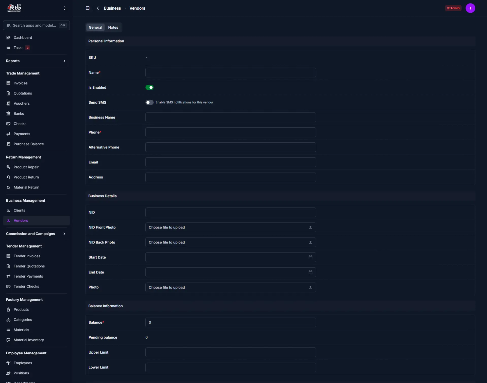

# Add Vendor

<!-- metadata: owner: business_team, last_updated: 2026-08-15, git_ref: main, staging_verified: true -->

## Summary

Use this page to register raw material vendors, packaging vendors, or service providers in CTB Admin. A complete vendor record tracks accounts payable, contact details, identity verification, and financial limits required for purchase vouchers and payment processing.

______________________________________________________________________

## When to use this page

- Onboarding a new fabric, hardware, or packaging material vendor
- Establishing credit, upper balance limits, and payment terms before creating purchase vouchers
- Storing National ID (NID) photos and vendor company contact information for compliance
- Configuring SMS notification options for vendor procurement updates

______________________________________________________________________

## How to access this page

From the sidebar, go to **Business → Vendors** (`/en/admin/Business/vendor/`). On the Vendor List page, click the **purple (+) icon** in the top-right corner.

______________________________________________________________________

## Prerequisites

- **Required User Permissions**:
    - `Business | Vendor | Can add Vendor` (`business.add_vendor`)
    - `Business | Vendor | Can import vendor` (`business.import_vendor`) for bulk onboarding.

______________________________________________________________________

## Step-by-step instructions

1. Open **Business → Vendors** and click **(+) Add Vendor**.
1. Enter the primary vendor **Name** and optional **Business Name**.
1. Input a unique **Phone** number and optional **Alternative Phone** or **Email**.
1. Enable **Send SMS** if automated notification alerts are required for this vendor.
1. Upload vendor profile photo, **NID Front Photo**, and **NID Back Photo** for verification.
1. Specify financial limits under **Balance Information**: **Upper Limit** and **Lower Limit**.
1. Confirm **Is Enabled** is toggled ON to activate the vendor profile.
1. Click **Save** to finalize vendor registration.

______________________________________________________________________

## Verification & definition of done

- **Unique SKU Generated**: System assigns a vendor SKU (`VND-YYYYMMDD-XXXX`).
- **Profile Created**: Vendor appears in **Business → Vendors** list view.
- **Voucher Entry Unlocked**: Vendor can now be selected in **Trade → Create Voucher** and **Trade → Payments**.

______________________________________________________________________

## Field reference

| Field Name            | Type    | Required | Backend Validation / Constraints                | Description                                   |
| :-------------------- | :------ | :------- | :---------------------------------------------- | :-------------------------------------------- |
| **SKU**               | Text    | Auto     | Prefix `VND`, read-only                         | System-generated tracking SKU.                |
| **Name**              | Text    | Yes      | Max 50 characters                               | Vendor's primary name or contact person.      |
| **Business Name**     | Text    | No       | Max 50 characters                               | Company or trade name.                        |
| **Phone**             | Text    | Yes      | Max 15 characters, unique constraint            | Primary contact phone number. Must be unique. |
| **Alternative Phone** | Text    | No       | Max 15 characters                               | Secondary telephone contact.                  |
| **Send SMS**          | Boolean | No       | Default `False`                                 | Enables automated SMS notifications.          |
| **Email**             | Email   | No       | Max 254 characters, valid email format          | Electronic mail address.                      |
| **Address**           | Text    | No       | Max 255 characters                              | Physical office or warehouse location.        |
| **NID**               | Text    | No       | Max 20 characters, unique constraint            | National Identification Number.               |
| **Photo**             | File    | No       | Upload size `500x500`, resized image            | Vendor profile image.                         |
| **NID Front Photo**   | File    | No       | Upload size `500x315`, resized image            | Front scan/photo of NID card.                 |
| **NID Back Photo**    | File    | No       | Upload size `500x315`, resized image            | Back scan/photo of NID card.                  |
| **Balance**           | Decimal | No       | Max 13 digits, 3 decimal places, default `0.00` | Current account payable balance.              |
| **Upper Limit**       | Decimal | No       | Max 13 digits, 3 decimal places                 | Maximum credit balance allowed for purchases. |
| **Lower Limit**       | Decimal | No       | Max 13 digits, 3 decimal places                 | Minimum threshold for account balance.        |
| **Is Enabled**        | Boolean | No       | Default `True`                                  | Active status toggle.                         |

______________________________________________________________________

## Exception handling & error recovery

| Error Symptom / Message                           | Root Cause                                                        | Step-by-Step Remediation                                                                                                                |
| :------------------------------------------------ | :---------------------------------------------------------------- | :-------------------------------------------------------------------------------------------------------------------------------------- |
| **"Vendor with this Phone already exists"**       | Duplicate primary phone number entered.                           | 1. Check **Business → Vendors** search to see if vendor is registered. 2. Enter a unique phone number.                               |
| **"Vendor with this NID already exists"**         | Duplicate NID entered.                                            | 1. Verify NID document digits. 2. Enter unique NID digits.                                                                           |
| **"Cannot delete vendor with existing vouchers"** | Protection constraint (`models.PROTECT`) prevents record removal. | 1. Soft-delete or archive vouchers before removing vendor. 2. Toggle **Is Enabled** to OFF to deactivate vendor instead of deleting. |

______________________________________________________________________

## Related workflows & next steps

- **Create Voucher** — Record purchase vouchers for materials supplied by this vendor.
- **Add Payment** — Issue payments to settle outstanding vendor balances.
- **Purchase Balances** — Track accounts payable statements per vendor.

______________________________________________________________________

## Related pages

- **Edit Vendor** — Update vendor information
- **Vendor Detail** — View vendor profile and transactions
- **Vendor Reports** — Analyze vendor-related financial data
