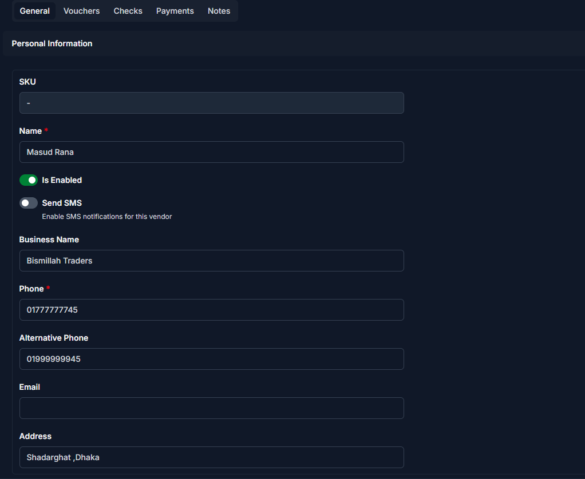
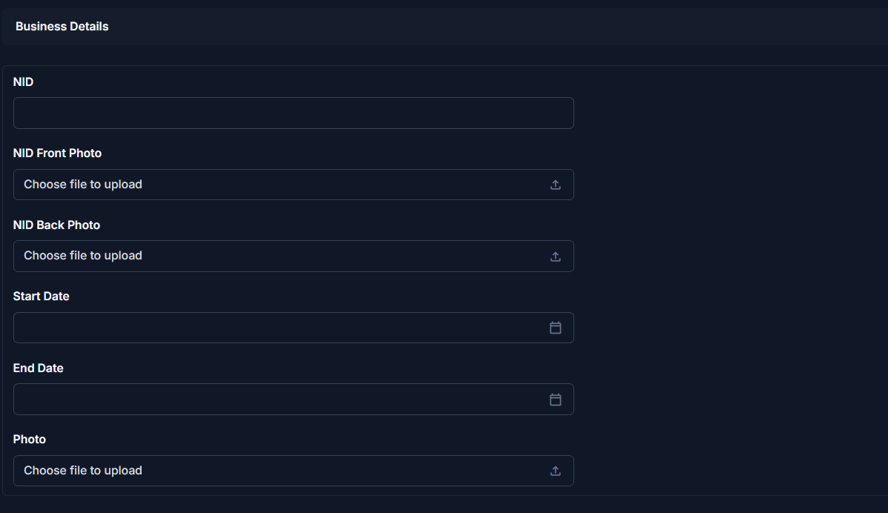
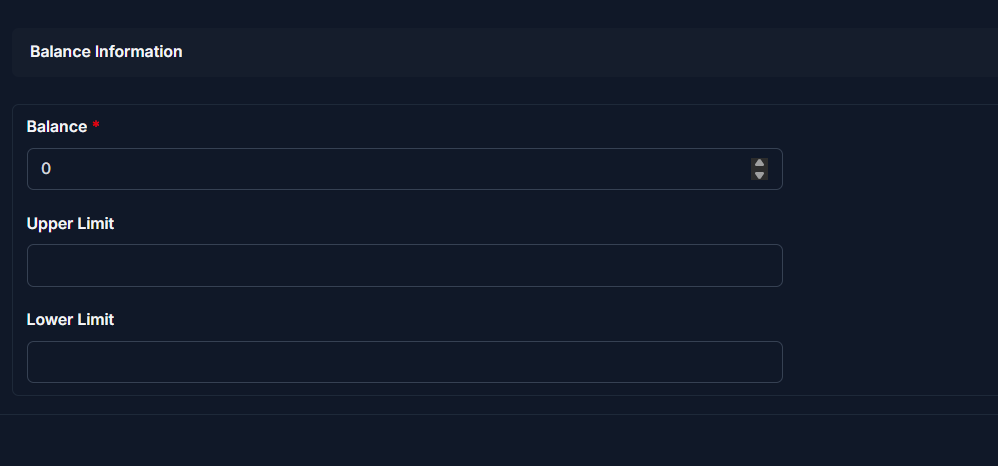

# Add Vendor

Use this page to register a new vendor in CTB Admin. A vendor is any individual or organization that supplies goods or services. Vendor records store contact details, identification information, and financial data used across purchases, payments, and reports.

## When to use this page

- Onboarding a new supplier or service provider
- Creating a vendor profile before recording purchases
- Storing vendor contact details and identification documents

## How to access this page

From the sidebar, go to **Business → Vendors**. On the Vendor List page, click the **purple (+) icon** in the top-right corner.

The system opens the **Add Vendor Page**.

______________________________________________________________________

## Personal Information

Fill in the following fields:

| Step | Field             | What to Do           | Description                                         |
| ---- | ----------------- | -------------------- | --------------------------------------------------- |
| 1    | Name              | Enter vendor name    | The name used in purchases and reports              |
| 2    | Is Enabled        | Toggle ON/OFF        | Controls whether the vendor is active               |
| 3    | Send SMS          | Enable if needed     | Sends SMS notifications for vendor-related activity |
| 4    | Business Name     | Enter if applicable  | Vendor’s company or trade name                      |
| 5    | Phone             | Enter primary number | Main contact number                                 |
| 6    | Alternative Phone | Enter if available   | Secondary contact number                            |
| 7    | Email             | Enter if available   | Used for communication                              |
| 8    | Address           | Enter address        | Physical location of the vendor                     |

!!! warning "Required Fields"
Fields marked with a **red star (\*)** are mandatory.

______________________________________________________________________

## Business Details

| Step | Field           | What to Do           | Description                         |
| ---- | --------------- | -------------------- | ----------------------------------- |
| 1    | NID             | Enter NID number     | Used for identity verification      |
| 2    | NID Front Photo | Upload image         | Front side of NID                   |
| 3    | NID Back Photo  | Upload image         | Back side of NID                    |
| 4    | Start Date      | Select date          | When the vendor relationship begins |
| 5    | End Date        | Select if applicable | Leave empty if ongoing              |
| 6    | Photo           | Upload if available  | Vendor profile photo                |

!!! note
Upload clear images for proper verification.

______________________________________________________________________

## Balance Information

| Step | Field       | What to Do   | Description                        |
| ---- | ----------- | ------------ | ---------------------------------- |
| 1    | Balance     | Enter amount | Current payable/receivable balance |
| 2    | Upper Limit | Set limit    | Maximum allowed balance            |
| 3    | Lower Limit | Set limit    | Minimum allowed balance            |

!!! warning "Required Fields"
Fields marked with a **red star (\*)** are mandatory.

______________________________________________________________________

## Saving the Vendor

After completing all sections:

- Click **Save** to create the vendor
- Click **Save and add another** to quickly add multiple vendors
- Click **Save and continue editing** to save and stay on the page

______________________________________________________________________

!!! Tips and Common Issues

- Ensure the **Phone number is correct** before enabling SMS  
- Upload clear **NID images** for verification  
- Leave **End Date empty** if the vendor is ongoing  

______________________________________________________________________

## Related Pages

- **Edit Vendor** — Update vendor information
- **Vendor Detail** — View vendor profile and transactions
- **Vendor Reports** — Analyze vendor-related financial data
