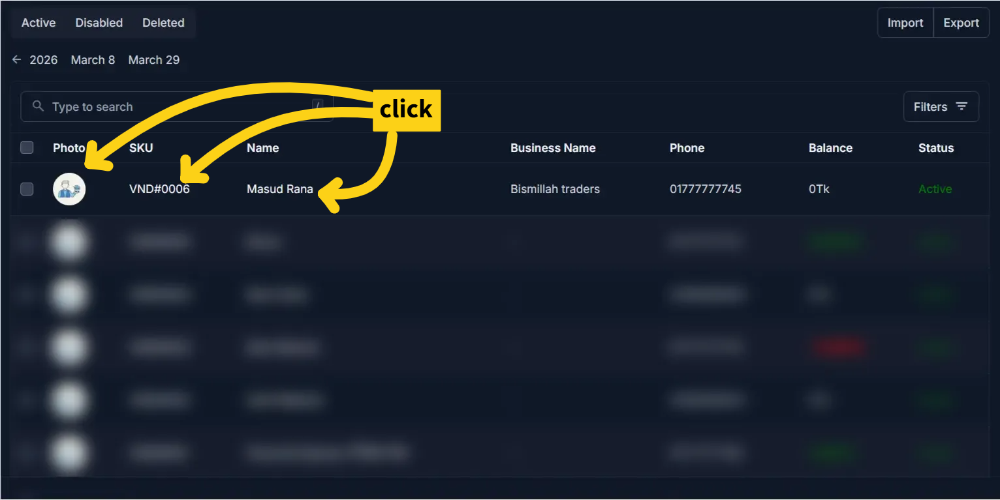

# Edit Vendor

Use this page to update an existing vendor’s information. This includes contact details, identification documents, and financial settings.

## Summary

Use this page to maintain vendor records when contact, identity, or balance data changes. Updates here affect future purchasing and payment workflows.

______________________________________________________________________

## When to use this page

- Updating vendor contact or business information
- Changing vendor status (active/inactive)
- Modifying balance limits or financial data
- Updating identification documents or photos

______________________________________________________________________

## How to access this page

1. Go to **Business → Vendors** from the sidebar
1. On the Vendor List page, select a vendor
1. Click on the **Photo** or **SKU** or **Client Name**

The system opens the **Edit Vendor Page**.

______________________________________________________________________

## Step-by-step instructions

1. Open **Business → Vendors** from the sidebar.
1. Select a vendor from the list.
1. Update the required fields in personal, business, and balance sections.
1. Verify financial changes and document updates.
1. Click **Save** to apply changes.

______________________________________________________________________

## Field reference

- **Name** - Display name used for the vendor record.
- **Is Enabled** - Controls whether the vendor can be used in new transactions.
- **Phone** - Main contact number, especially important when SMS is enabled.
- **NID and photos** - Identity information and document images for verification.
- **Balance and limits** - Financial fields that influence reports and operational checks.

______________________________________________________________________

## What’s different from add Vendor

- All fields are **pre-filled** with existing vendor data
- You are **modifying**, not creating a new record
- Some fields may already contain system-generated or historical values
- Changes will immediately affect future transactions

______________________________________________________________________

## Personal information

Update the following fields as needed:

| Field             | What you can change | Notes                                        |
| ----------------- | ------------------- | -------------------------------------------- |
| Name              | Edit                | Updates how the vendor appears in the system |
| Is Enabled        | Toggle ON/OFF       | Disabling prevents usage in new transactions |
| Send SMS          | Enable/Disable      | Controls notification behavior               |
| Business Name     | Edit                | Optional                                     |
| Phone             | Edit                | Must be valid if SMS is enabled              |
| Alternative Phone | Edit                | Optional                                     |
| Email             | Edit                | Optional                                     |
| Address           | Edit                | Update vendor location                       |

______________________________________________________________________

## Business details

| Field           | What you can change | Notes                                    |
| --------------- | ------------------- | ---------------------------------------- |
| NID             | Edit                | Ensure accuracy for verification         |
| NID Front Photo | Replace             | Upload a new image if needed             |
| NID Back Photo  | Replace             | Upload updated image                     |
| Start Date      | Edit                | Should reflect actual relationship start |
| End Date        | Set/Update          | Leave empty if ongoing                   |
| Photo           | Replace             | Update vendor profile image              |

!!! note

    Replacing images will overwrite previous uploads.

______________________________________________________________________

## Balance information

| Field       | What you can change | Notes                                  |
| ----------- | ------------------- | -------------------------------------- |
| Balance     | Adjust if required  | Be careful — affects financial records |
| Upper Limit | Modify              | Controls maximum allowed balance       |
| Lower Limit | Modify              | Controls minimum allowed balance       |

!!! warning

    Changing balance-related fields can impact financial tracking and reports.

______________________________________________________________________

## Saving changes

After updating the required fields:

- Click **Save** to apply changes
- Changes are immediately reflected across the system

______________________________________________________________________

## Tips and common issues

- Disabling a vendor prevents it from being used in future transactions
- Ensure **Phone number is correct** before enabling SMS
- Avoid unnecessary changes to **Balance**, as it affects reports
- Always verify **NID information** before saving

______________________________________________________________________

## Related pages

- **Add Vendor** — Create a new vendor
- **Vendor Detail** — View vendor profile and history
- **Vendor Reports** — Analyze vendor financial data
