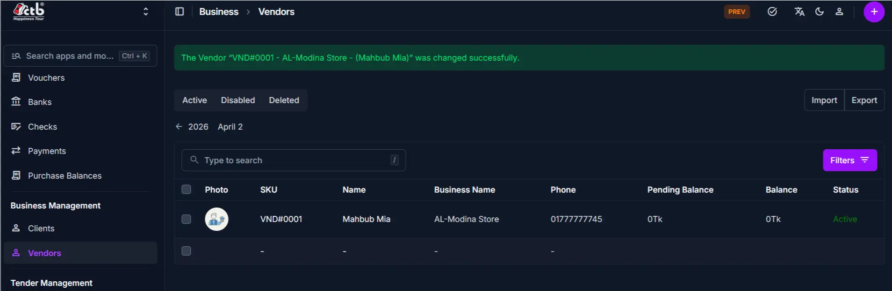

# Vendors Overview

## Summary

The **Vendors** module manages all vendor and business-partner records in CTB Admin. A vendor is any individual or organization that provides goods or services to your business. This page displays all registered vendors and their financial balances, allowing you to search, filter, and manage vendor information for purchases and payments.

______________________________________________________________________

## When to use this page

- When you need to work with vendors overview in CTB Admin.

______________________________________________________________________

## How to access this page

From the sidebar, go to **Business → Vendors**.

The system opens the **Vendors List** page where all registered vendors are displayed.

______________________________________________________________________

## Step-by-step instructions

1. Open **Vendors Overview** from the **Business** section of the sidebar.
1. Complete the **List page columns and fields** section described below.
1. Complete the **Search and filter** section described below.
1. Complete the **List actions** section described below.
1. Complete the **Related modules** section described below.
1. Review the values you entered, then save the record.

______________________________________________________________________

## Field reference

### List page columns and fields

The Vendors list displays the following information for each vendor:

| Column              | Description                                                                              |
| ------------------- | ---------------------------------------------------------------------------------------- |
| **Photo**           | Profile image or avatar of the vendor (if uploaded)                                      |
| **SKU**             | System-generated unique identifier for this vendor (e.g., VND#0001)                      |
| **Name**            | Contact person's name or individual vendor name                                          |
| **Business Name**   | Official name of the vendor's organization or business                                   |
| **Phone**           | Primary phone number for the vendor                                                      |
| **Pending Balance** | Amount pending payment (balance not yet settled)                                         |
| **Balance**         | Current account balance (positive = you owe vendor; negative = vendor owes your company) |
| **Status**          | Vendor status (Active, Inactive, or other status indicators)                             |

### Search and filter

Use the search and filter options to quickly locate specific vendors:

- **Search box** — Type to search by vendor name, business name, phone, or SKU
- **Status tabs** — Click **Active**, **Disabled**, or **Deleted** to filter vendors by status
- **Filters** — Click **Filters** to narrow results by balance range or date range
- **Calendar picker** — Click the date arrows to move to a specific date

### List actions

From the Vendors List page:

- **Create new vendor** — Click the **purple (+) icon** in the top-right corner to add a new vendor record
- **View details** — Click on any row to open the full details of that vendor
- **Edit or delete** — Open a vendor record to edit or delete it (if permitted by your role)
- **Import/Export** — Use **Import** and **Export** buttons to bulk-load or extract vendor data

### Related modules

- **Trade → Purchases** — Purchase records are linked to vendors and update their balances.
- **Trade → Payments** — Payments reduce vendor payable balances.

______________________________________________________________________

## What you can do in this module

- **Register new vendors** — create vendor records with business information, contact details, and identification documents.
- **Manage vendor status** — enable or disable vendors to control whether they appear in purchase and payment dropdowns.
- **Track financial balances** — monitor payable amounts and financial history for each vendor.
- **View vendor history** — access all past purchases, payments, and balance changes from the Vendor Detail page.
- **Analyze vendor data** — use the Vendor Reports page for financial summaries and transaction trends.

______________________________________________________________________

## Typical workflow

1. **Add** a new vendor before recording any purchase or payable transaction.
1. **Edit** the vendor record when contact details or financial information change.
1. **View the Vendor Detail** page to monitor balances and transaction history.
1. **Use Vendor Reports** for tracking expenses and financial analysis.

______________________________________________________________________

## Tips and common issues

- **Balance convention** — Positive amounts (e.g., +100,000tk) mean you owe the vendor; negative amounts mean the vendor owes your company
- **Search by name first** — Use the search box to quickly find a vendor without scrolling the full list
- **Active status controls visibility** — Disabled (inactive) vendors do not appear in purchase and payment dropdown menus
- **Status tabs for quick filtering** — Use the Active/Disabled/Deleted tabs to filter vendors by their current status
- **Phone number is important** — Vendors should have at least one phone number for communication
- **Check for duplicates** — Search for a vendor first before creating a new record to avoid duplicate entries
- **Balance history matters** — Review vendor balance history before disabling a vendor to ensure no outstanding payables remain

______________________________________________________________________

## Related pages

- **Add Vendor** — Create a new vendor record
- **Edit Vendor** — Update vendor contact details and settings
- **Vendor Detail** — View full information and transaction history for a specific vendor
- **Vendor Reports** — View financial summaries and trends across all vendors
- **Purchases** — Create and manage purchase entries linked to vendor records
- **Payments** — Record and view payments made to vendors

| Page           | Purpose                                                          |
| -------------- | ---------------------------------------------------------------- |
| Overview       | This page. Module summary and navigation guide.                  |
| Add Vendor     | Register a new vendor and configure all required details.        |
| Edit Vendor    | Update an existing vendor’s information.                         |
| Vendor Detail  | View a vendor’s full profile, transaction history, and balances. |
| Vendor Reports | Financial summaries and transaction analytics per vendor.        |
