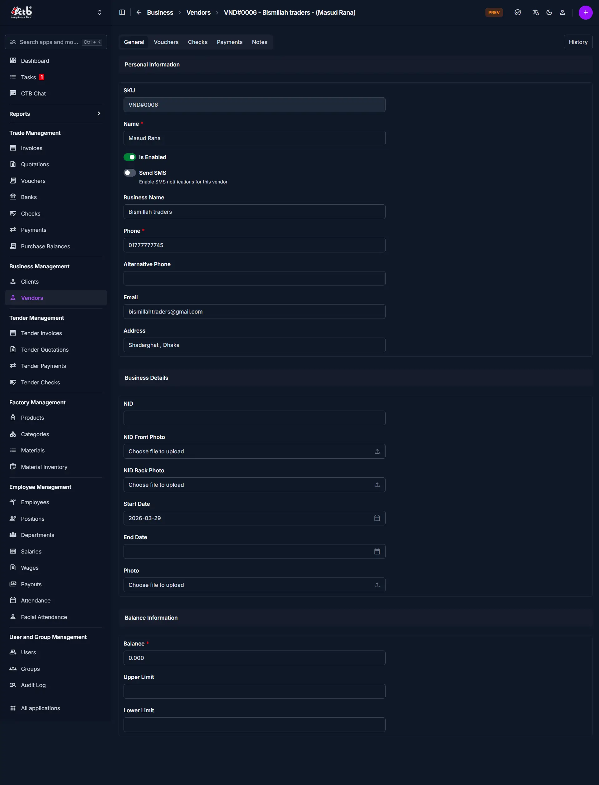
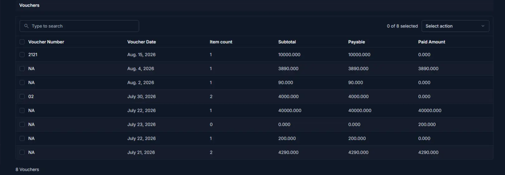
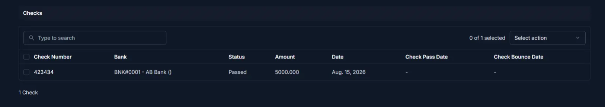
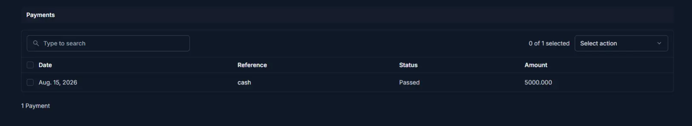
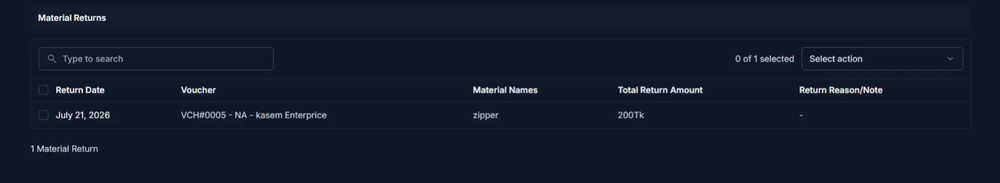
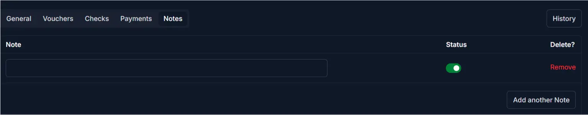

# Vendor Detail

The **Vendor Detail** page displays a vendor's complete profile, documents, and transaction history (vouchers, checks, payments) together with internal notes. Use this page to verify vendor identity, review financial exposure, and take contextual actions such as editing or creating related transactions.

## Summary

Use this page to confirm vendor information and financial activity before performing operational or accounting tasks. The page consolidates identity, contact, document uploads, balance data, and transaction panels in one view.

<!-- TODO: screenshot vendor-detail-full-page.png -->
______________________________________________________________________

## When to use this page

- Reviewing a vendor’s profile before processing payments or vouchers
- Checking voucher, check, and payment history for reconciliation
- Viewing internal notes or special instructions
- Verifying identity documents and business details before onboarding

______________________________________________________________________

## How to access this page

1. Go to **Business → Vendors** from the sidebar.
2. On the **Vendors** list, click the vendor row or name.

The system opens the **Vendor Detail** page with the **General** tab selected by default.

______________________________________________________________________

## Quick steps

1. Open **Business → Vendors**.
2. Select the target vendor from the list.
3. Review the **General** tab for profile and balance information.
4. Switch to **Vouchers**, **Checks**, or **Payments** to inspect transaction history.
5. Open **Notes** for internal remarks and add or update notes as needed.

______________________________________________________________________

## Page overview

The page is divided into these main areas:

- General (profile, documents, balance)
- Vouchers (purchase voucher list)
- Checks (check records)
- Payments (payment entries)
- Notes (internal remarks)

______________________________________________________________________

## General Section

This tab shows editable vendor profile fields and business details.

### Field reference

| Field               | Description / behaviour                                                    |
| ------------------- | ------------------------------------------------------------------------- |
| SKU                 | System-generated vendor identifier (read-only)                            |
| Name                | Vendor display name                                                        |
| Is Enabled          | Toggle to enable or disable the vendor for new transactions                |
| Send SMS            | Enable SMS notifications for this vendor                                  |
| Business Name       | Vendor business or trade name                                              |
| Phone               | Primary contact number (required for SMS)                                  |
| Alternative Phone   | Secondary contact number                                                   |
| Email               | Contact email                                                              |
| Address             | Postal or physical address                                                 |
| NID                 | National ID / registration number                                          |
| NID Front / Back    | Upload fields for NID images (front / back)                                |
| Photo               | Vendor or company photo                                                    |
| Start Date / End Date | Contract or relationship dates; leave End Date blank if ongoing         |
| Balance             | Current account balance for the vendor                                     |
| Pending balance     | Amount currently pending or unsettled                                      |
| Upper / Lower Limit | Allowed balance thresholds                                                  |

!!! warning

    Editing balances, limits or identifiers can affect accounting reports. Verify values before saving.

______________________________________________________________________

## Documents and images

Uploaded images (NID photos, profile photo) help verify identity. Use clear, legible images and replace them when they are expired or unreadable.

______________________________________________________________________

## Vouchers History

Lists purchase vouchers associated with the vendor. Use this panel to inspect payable amounts, voucher status, and to open voucher details where edits are permitted through the purchase/voucher flows.

### When to use

- Reconciliation of purchase history
- Checking outstanding voucher amounts
- Verifying voucher dates and totals prior to payment

!!! note

    Voucher records are managed from the purchase module; this tab provides viewing and navigation only.

______________________________________________________________________

## Checks History

Shows checks issued to or from the vendor, their statuses, and relevant dates.

### When to use

- Tracking check clearance and bounce status
- Reviewing check amounts and bank details
- Updating internal records after check settlement

______________________________________________________________________

## Payments History

Displays payments made to the vendor and related metadata.

### When to use

- Confirming paid amounts and payment dates
- Reconciling payments against vouchers or invoices
- Initiating refunds or adjustments when necessary

_____________________________________________________________________

## Material returns History

Lists material return records associated with the vendor. Material returns capture goods returned to the supplier (for example, damaged or surplus materials) and often link back to the originating voucher.

### When to use

- Reviewing returned materials and their return amounts
- Confirming return reasons before issuing credits or adjustments
- Tracing returns back to vouchers for reconciliation

### Typical columns

| Column             | Description                                     |
| ------------------ | ----------------------------------------------- |
| Return Date        | Date when materials were returned               |
| Voucher            | Linked voucher reference (if any)               |
| Material Names     | Short list of returned material names           |
| Total Return Amount| Monetary total for the returned materials       |
| Return Reason/Note | Optional note explaining the return             |

!!! note

    Use the voucher link to open the originating purchase record when you need to verify quantities, prices, or supplier communication.

_____________________________________________________________________

______________________________________________________________________

## Notes tab

Store and review internal notes related to the vendor. Notes are visible to staff with the appropriate role and help preserve context about special terms or informal agreements.

### When to use

- Recording onboarding notes or special payment terms
- Noting contact preferences or escalation paths
- Preserving audit trail of internal remarks

______________________________________________________________________

## Available actions

| Action                | Description                                 |
| --------------------- | ------------------------------------------- |
| Edit Vendor           | Modify profile fields and documents         |
| Add Voucher           | Create a purchase voucher (from purchase module) |
| Add Check             | Record a new check related to this vendor   |
| Add Payment           | Record a payment against vendor balance     |
| Add Material Return   | Record returned materials (if applicable)   |

______________________________________________________________________

## Saving and footer controls

- **Save** — Apply changes and return to the list or previous page
- **Save and continue editing** — Persist changes and stay on the page
- **Save and add another** — Save then open the add form for a new vendor
- **Delete** — Permanently remove the vendor (destructive)

Use the top-right quick actions and history controls for additional operations like viewing change history or generating a vendor report.

______________________________________________________________________

## Tips and common issues

- Disabling a vendor prevents future transactions for that vendor.
- Verify **Phone** before enabling **Send SMS** so notifications reach the correct number.
- Balance and pending amounts are automatically used by limit checks—confirm values before adjusting.
- Uploaded documents should be legible and current to avoid verification issues.

______________________________________________________________________

## Related pages

- **Add Vendor** — Create a new vendor
- **Edit Vendor** — Update vendor information
- **Vendors Overview** — Browse and filter vendor records

______________________________________________________________________

## Troubleshooting and support

If data appears incorrect or missing, check the audit/history, verify backing records (purchase, payments), and contact your system administrator if reconciliation is required.
