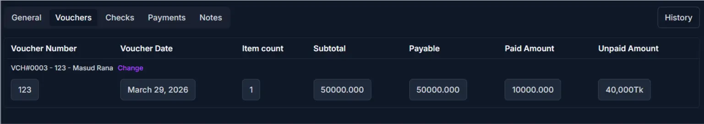
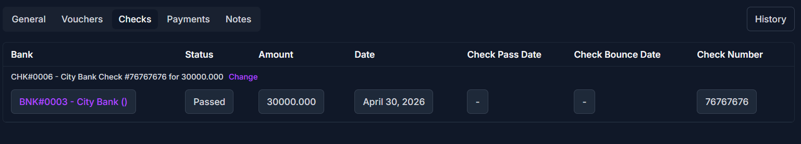
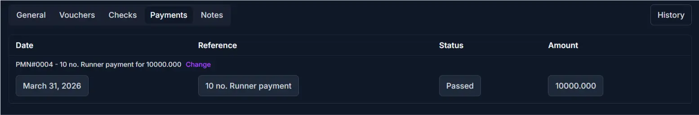

# Edit Vendor

Use this page to update an existing vendor’s information, including profile details, documents, and financial settings.

## When to use this page

- Updating vendor contact or business information
- Changing vendor status (active/inactive)
- Modifying financial limits or balance
- Reviewing vendor-related transactions while editing

## How to access this page

1. Go to **Business → Vendors**
1. Select a vendor from the list
1. Click **Edit**

The system opens the **Edit Vendor Page**.

______________________________________________________________________

## Page Layout

At the top, you will see a tab bar with the following sections:

**General, Vouchers, Checks, Payments, Notes**

Each tab allows you to view or manage different types of vendor information.

______________________________________________________________________

## General Tab

This is the default tab used for editing vendor information.

### When to use

- Updating vendor name, phone, and address
- Enabling or disabling the vendor
- Uploading or replacing documents
- Modifying balance and limits

### Editable Fields

| Field               | What you can change | Notes                                 |
| ------------------- | ------------------- | ------------------------------------- |
| Name                | Edit                | Updates vendor identity               |
| Is Enabled          | Toggle              | Disables vendor from new transactions |
| Send SMS            | Enable/Disable      | Controls notifications                |
| Business Name       | Edit                | Optional                              |
| Phone               | Edit                | Must be valid if SMS is enabled       |
| Alternative Phone   | Edit                | Optional                              |
| Email               | Edit                | Optional                              |
| Address             | Edit                | Vendor location                       |
| NID                 | Edit                | Identification number                 |
| NID Photos          | Replace             | Upload new images if needed           |
| Start / End Date    | Edit                | Leave end date empty if ongoing       |
| Balance             | Adjust              | Impacts financial records             |
| Upper / Lower Limit | Modify              | Controls balance range                |

!!! warning
Changing balance or limits may affect financial reports and transactions.

______________________________________________________________________

## Vouchers Tab

Displays all purchase vouchers related to the vendor.

### When to use

- Reviewing purchase history
- Checking total payable amounts
- Verifying past transactions

!!! note
This tab is for viewing data only. Editing is done from the purchase/invoice module.

______________________________________________________________________

## Checks Tab

Shows all check transactions associated with the vendor.

### When to use

- Tracking issued or received checks
- Verifying check payment status
- Reviewing financial commitments

______________________________________________________________________

## Payments Tab

Displays all payment records linked to the vendor.

### When to use

- Checking paid vs unpaid amounts
- Reviewing payment history
- Verifying recent transactions

______________________________________________________________________

## Notes Tab

Stores internal notes related to the vendor.

### When to use

- Adding remarks or important information
- Keeping internal communication records
- Tracking special conditions or agreements

______________________________________________________________________

## Saving Changes

- Click **Save** to apply updates
- Changes are immediately reflected across the system

______________________________________________________________________

## Tips and Common Issues

- Disabling a vendor prevents future transactions
- Always verify **balance changes** before saving
- Use tabs to review financial data before making edits
- Ensure documents are clear and updated

______________________________________________________________________

## Related Pages

- **Add Vendor** — Create a new vendor
- **Vendor Detail** — View complete vendor profile
- **Vendor Reports** — Analyze vendor financial data
