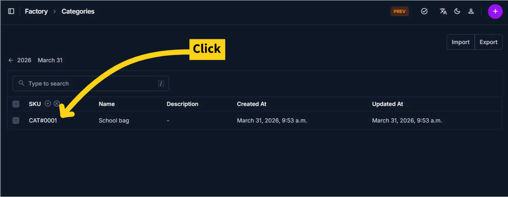
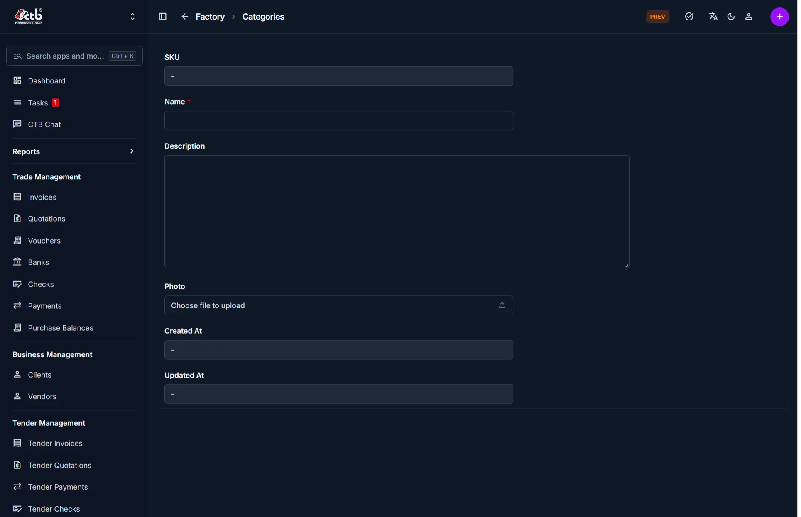

# Edit Category

Use this page to update an existing category’s information. Categories are used to organize products, so changes here directly affect how products are grouped and displayed across the system.

## When to use this page

- Renaming a category for better clarity
- Updating description or image
- Fixing incorrect or inconsistent category data
- Standardizing category structure across products

## How to access this page

1. Go to **Factory → Categories**
1. Select a category from the list
1. Click on the **sku**

The system opens the **Edit Category Page**.

______________________________________________________________________

## What’s different from Add Category

- All fields are **pre-filled** with existing data
- You are updating an existing structure used by products
- Changes will affect all products assigned to this category

______________________________________________________________________

## Category Information

Update the following fields as needed:

| Field       | What you can change | Notes                                                |
| ----------- | ------------------- | ---------------------------------------------------- |
| Name        | Edit                | Updates how the category appears across all products |
| Description | Edit                | Clarifies the purpose of the category                |
| Photo       | Replace             | Upload a new image if needed                         |

______________________________________________________________________

## System Fields

These fields are automatically managed:

| Field      | Description                                |
| ---------- | ------------------------------------------ |
| SKU        | System-generated identifier (not editable) |
| Created At | Original creation date                     |
| Updated At | Updated automatically after changes        |

!!! note
System fields cannot be modified manually.

______________________________________________________________________

## Saving Changes

- Click **Save** to apply updates
- Changes are immediately reflected across all related products

______________________________________________________________________

## Tips and Common Issues

- Renaming a category will update it for all linked products
- Avoid frequent name changes to maintain consistency
- Ensure the category name clearly represents grouped products

!!! warning
Changing category structure after products are assigned may impact organization and reporting.

______________________________________________________________________

## Related Modules

- **Categories** — View all categories
- **Products** — Products linked to categories
- **Inventory** — Organized based on category structure
