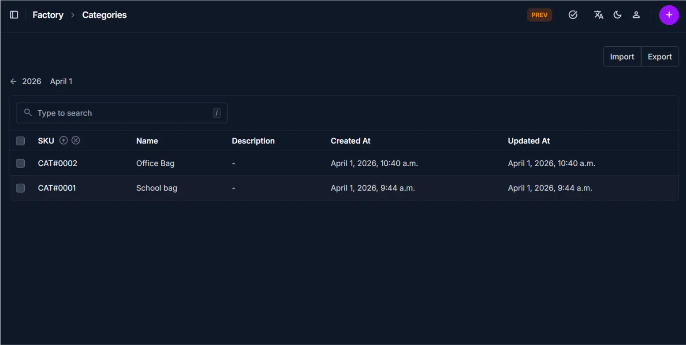

# Categories Overview

The **Categories** page displays all product categories in a structured table. It allows you to quickly search, review, and manage categories used across products.

______________________________________________________________________

## Page Layout

The page includes:

- Search bar for quick lookup
- Category list table
- Import and Export options
- Add (+) button for creating new categories

______________________________________________________________________

## Category List

The table shows all categories with key details:

| Column      | Description                              |
| ----------- | ---------------------------------------- |
| SKU         | Unique identifier for each category      |
| Name        | Category name used for grouping products |
| Description | Additional details (if provided)         |
| Created At  | Date and time the category was created   |
| Updated At  | Last modification date                   |

______________________________________________________________________

## Search Bar

Use the search bar to quickly find categories.

### How to use

- Type a keyword (e.g., category name or SKU)
- The table updates instantly based on your input

!!! tip
Use SKU for faster and more accurate search results.

______________________________________________________________________

## Import / Export

These options allow bulk data management.

### Import

- Upload category data from a file
- Useful when adding multiple categories at once

### Export

- Download the current category list
- Useful for reporting or backup

!!! note
Ensure the import file format matches system requirements.

______________________________________________________________________

## Tips and Best Practices

- Use search instead of manually scanning the list
- Keep category names consistent for easier management
- Use export regularly for backup and reporting

______________________________________________________________________

!!! tip
\* Use search instead of manually scanning the list
\* Keep category names consistent for easier management
\* Use export regularly for backup and reporting

______________________________________________________________________

## Related Pages

- **Add Category** — Create a new category
- **Edit Category** — Update category information
- **Products** — Assign categories to products
