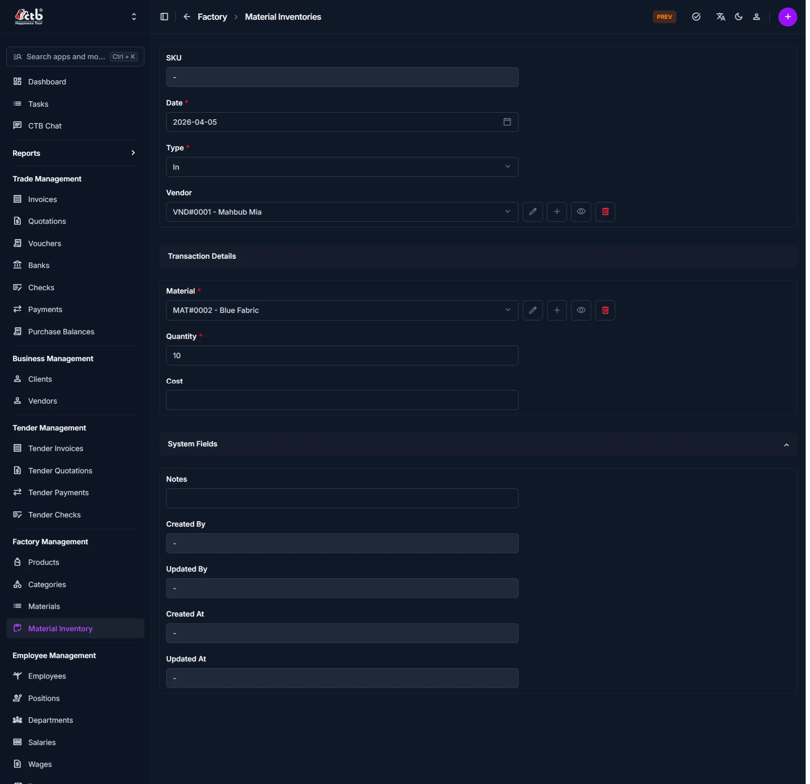

# Add Inventory

## Overview

The **Add Inventory** page is used to record stock movement for materials.
You can add stock, remove stock, or transfer stock using this page.

______________________________________________________________________

## When to Use

Use this page when:

- Adding new stock to inventory
- Recording material usage or consumption
- Managing stock transfers

______________________________________________________________________

## How to Add Inventory

1. Go to **Factory → Material Inventory**
1. Click the **+ (Add)** button

______________________________________________________________________

## Basic Information

| Field | Description                                      |
| ----- | ------------------------------------------------ |
| SKU   | Auto-generated inventory reference               |
| Date  | Date of the transaction                          |
| Type  | Defines the inventory action (In, Out, Transfer) |

______________________________________________________________________

## Type Behavior (Important)

The form changes based on the selected **Type**:

### In (Stock Increase)

- **Vendor field appears**
- Used when purchasing or receiving materials

### Out (Stock Decrease)

- **Employee field appears**
- Used when materials are issued or consumed

### Transfer

- **Both Vendor and Employee fields are hidden**
- Used for internal stock movement

!!! warning
Selecting the wrong type will result in incorrect inventory records.

______________________________________________________________________

## Transaction Details

| Field    | Description                          |
| -------- | ------------------------------------ |
| Material | Select the material                  |
| Quantity | Amount of stock to add/remove        |
| Cost     | Cost per unit (mainly used for "In") |

______________________________________________________________________

## System Fields

| Field      | Description      |
| ---------- | ---------------- |
| Notes      | Optional remarks |
| Created By | System-generated |
| Updated By | System-generated |
| Created At | Auto timestamp   |
| Updated At | Auto timestamp   |

______________________________________________________________________

## Best Practices

- Always select the correct **Type** before entering data
- Use accurate **Quantity** to maintain stock integrity
- Add **Notes** for traceability

______________________________________________________________________

## Related Pages

- **Materials** — Manage material details
- **Inventory In / Out Tabs** — View stock history
