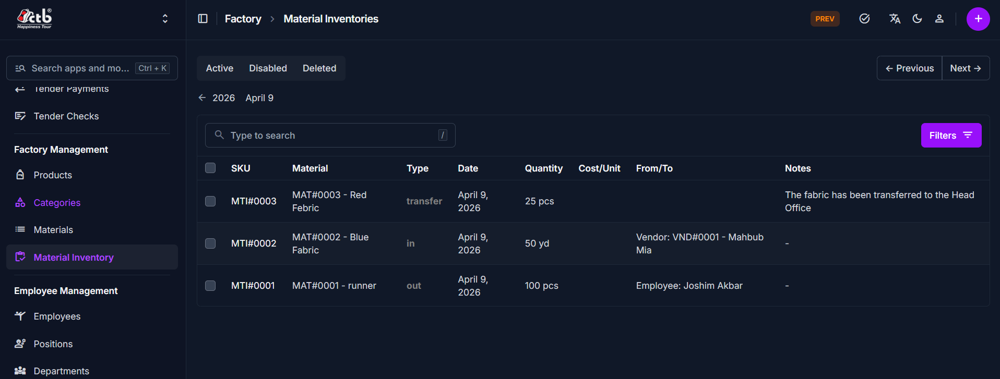

# Material Inventory Overview

## Overview

The **Material Inventory** pages let you monitor stock movement and review current inventory status for factory materials. Use this section to see all stock records, identify recent transactions, and check whether materials are marked active.

______________________________________________________________________

## When to use this page

- Review recent material stock additions and deductions
- Check the current inventory position for a material
- Verify whether a material is active or disabled
- Trace stock movement before updating a material record

______________________________________________________________________

## How to access this page

1. From the sidebar, go to **Factory → Material Inventory**.
1. The list page shows inventory entries grouped by **Active**, **Disabled**, and **Deleted**.
1. Select a record to open the inventory detail page and review the full transaction.

______________________________________________________________________

## Page sections

### Inventory List

The main list shows each material inventory transaction on a single page.

Key columns include:

- **SKU** — Inventory reference code for the transaction
- **Material** — Linked material name and SKU
- **Type** — Transaction type such as `in`, `out`, or `transfer`
- **Date** — When the stock movement occurred
- **Quantity** — Amount added or removed
- **Cost/Unit** — Unit price for the transaction
- **From/To** — Source or destination information such as vendor or employee
- **Notes** — Optional remarks about the transaction

### Search and filters

- Use the search field to find specific inventory records by SKU or material name.
- Use the **Active / Disabled / Deleted** tabs to filter records by status.
- Use the **Filters** button to narrow results by additional values.

______________________________________________________________________

## Best practices

- Review the correct **Type** before using an inventory record for reconciliation.
- Verify the **Material** and **Quantity** on each transaction to avoid stock errors.
- Use the list status tabs to keep unpublished or deleted records separate from active stock entries.

______________________________________________________________________

## Related Pages

- **Add Inventory** — Record new material stock movement
- **Materials** — Manage material details and stock references
- **Inventory In / Out** — Review detailed history of stock changes
