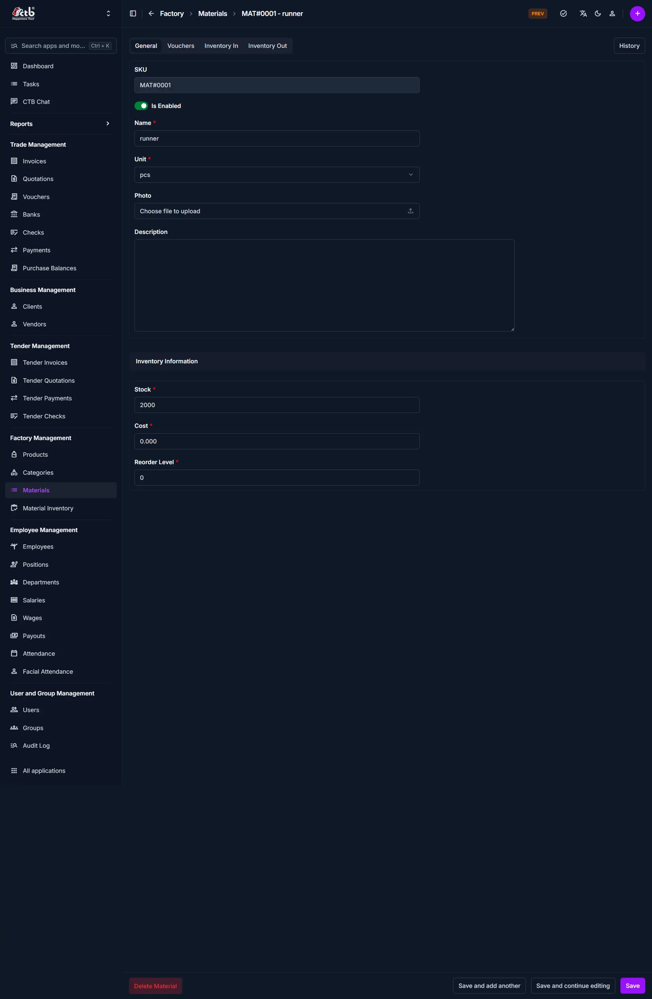

# Add Material

## Overview

The **Add Material** page is used to create a new raw material in the system.
Materials are used for inventory tracking, cost calculation, and production processes.

______________________________________________________________________

## When to Use

Use this page when:

- Adding a new raw material (e.g., fabric, thread, accessories)
- Setting initial stock and cost
- Defining how the material will be measured (unit)

______________________________________________________________________

## How to access this page

1. Go to **Factory → Materials**
1. Click the **Add (+)** button to add a new material

## General Information

### Fields

| Field       | Description                                                             |
| ----------- | ----------------------------------------------------------------------- |
| SKU         | Auto-generated or unique identifier for the material                    |
| Is Enabled  | Toggle to activate/deactivate the material                              |
| Name        | Name of the material (e.g., Blue Fabric)                                |
| Unit        | Measurement unit (e.g., pcs, set, mm, cm, m, in, ft, yd, roll, box, kg) |
| Photo       | Upload an image of the material (optional)                              |
| Description | Additional notes or details                                             |

______________________________________________________________________

## Inventory Information

This section defines stock and cost details.

| Field         | Description                                     |
| ------------- | ----------------------------------------------- |
| Stock         | Current available quantity                      |
| Cost          | Cost per unit of the material                   |
| Reorder Level | Minimum stock level before restocking is needed |

______________________________________________________________________

## Field Guidelines

- Use clear and consistent naming (avoid duplicates like “Blue fabric” vs “blue Fabric”)
- Select the correct unit — this affects all inventory calculations
- Set a realistic reorder level to avoid stock shortages

!!! warning
Incorrect stock or cost values will directly affect inventory reports and financial calculations.

______________________________________________________________________

## Tips and Best Practices

- Always set **Reorder Level** — this prevents stockouts
- Keep **Is Enabled** ON only for active materials
- Use photos for easy identification (especially in large inventories)

______________________________________________________________________

## Related Pages

- **Material List** — View all materials
- **Inventory In** — Add stock
- **Inventory Out** — Reduce stock
