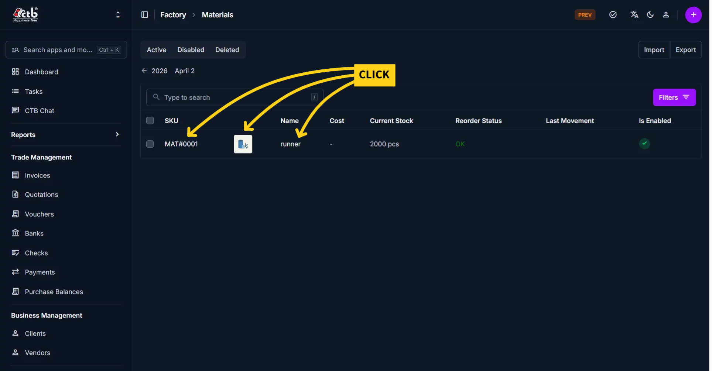
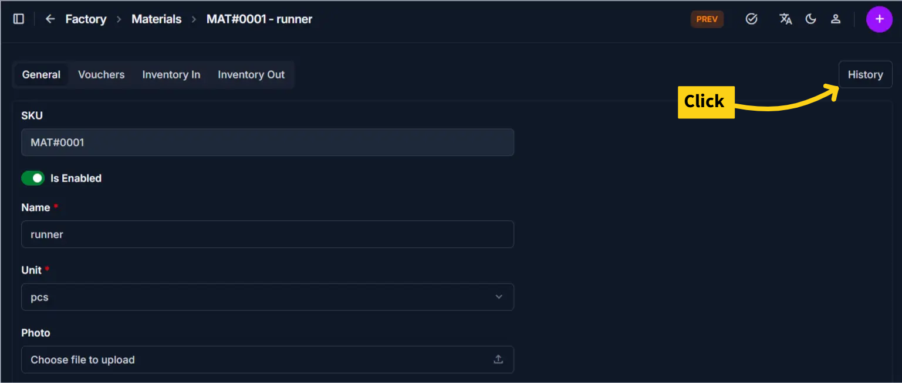
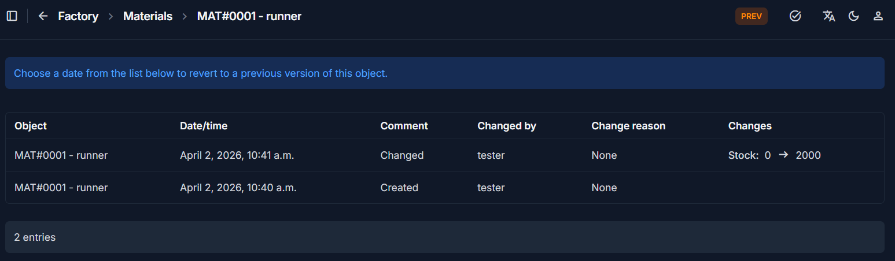

# Edit Material

## Overview

The **Edit Material** page allows you to update existing material information.
This includes general details, inventory settings, and status control.

______________________________________________________________________

## When to Use

Use this page when:

- Updating material name or description
- Correcting unit, cost, or stock values
- Adjusting reorder levels
- Enabling or disabling a material

______________________________________________________________________

## How to Edit a Material

1. Go to **Factory → Materials**
1. In the material list, click on the **SKU, Photo, or Name** of the material
1. The **Edit Material** page will open

______________________________________________________________________

## General Information

### Editable Fields

| Field       | Description                              |
| ----------- | ---------------------------------------- |
| SKU         | Unique identifier (usually not editable) |
| Is Enabled  | Enable or disable the material           |
| Name        | Update the material name                 |
| Unit        | Change measurement unit                  |
| Photo       | Upload or replace material image         |
| Description | Update additional details                |

______________________________________________________________________

## Inventory Information

| Field         | Description                       |
| ------------- | --------------------------------- |
| Stock         | Update current available quantity |
| Cost          | Modify cost per unit              |
| Reorder Level | Adjust minimum stock threshold    |

______________________________________________________________________

## Best Practices

- Avoid changing the **Unit** after the material is already in use
- Update **Stock** through inventory transactions when possible
- Use **Disable** instead of deleting materials that are no longer used

______________________________________________________________________

## Material History Page

The **Material History** page provides a comprehensive audit trail for a specific material. It allows administrators to track changes, identify who made modifications, and revert to previous versions if necessary.

______________________________________________________________________

## Overview

This page displays a chronological list of all actions performed on a material object (e.g., `MAT#0001 - runner`).

> **Tip:** Choose a date from the list to revert to a previous version of this object.

______________________________________________________________________

## History Table Details

The history table breaks down every modification with the following columns:

| Column            | Description                                                                 |
| :---------------- | :-------------------------------------------------------------------------- |
| **Object**        | The specific material ID and name being tracked.                            |
| **Date/time**     | The exact timestamp when the change occurred.                               |
| **Comment**       | The type of action performed (e.g., **Created**, **Changed**).              |
| **Changed by**    | The username of the person who performed the action (e.g., `tester`).       |
| **Change reason** | A note or justification provided by the user at the time of the change.     |
| **Changes**       | A detailed log of what specifically was modified (e.g., `Stock: 0 → 2000`). |

______________________________________________________________________

## Key Functionalities

### 1. Tracking Stock Movements

The **Changes** column explicitly shows value transitions. For example, you can see exactly when stock was initialized or adjusted, moving from an old value to a new one.

### 2. Version Control (Revert)

By clicking on a specific entry, you can view the state of the material at that exact moment. This is essential for correcting accidental data entry or unauthorized changes.

### 3. Audit Accountability

The **Changed by** column ensures that every update is tied to a specific user account, providing transparency for inventory management.

______________________________________________________________________

## Best Practices

- **Review Before Reverting:** Always check the **Changes** column to understand exactly what will be modified before choosing to revert to an older version.
- **Provide Change Reasons:** When prompted by the system during an edit, provide a clear "Change reason" to help colleagues understand why a modification was made (e.g., "Monthly stock count correction").
- **Audit Regularly:** Use this page to investigate discrepancies between physical stock and system records.

## Important Notes

!!! warning

    Changing **Unit** after transactions exist can cause inconsistency in inventory data.

!!! warning

    Editing **Stock manually** may not reflect actual inventory movement history.

______________________________________________________________________

## Related Pages

- **Add Material** — Create new materials
- **Inventory In** — Increase stock properly
- **Inventory Out** — Decrease stock properly
