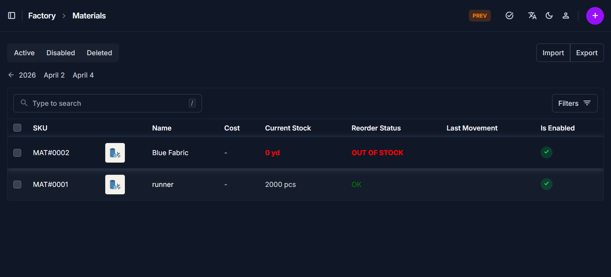
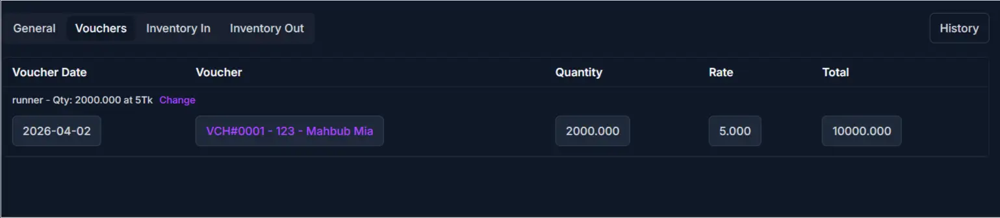
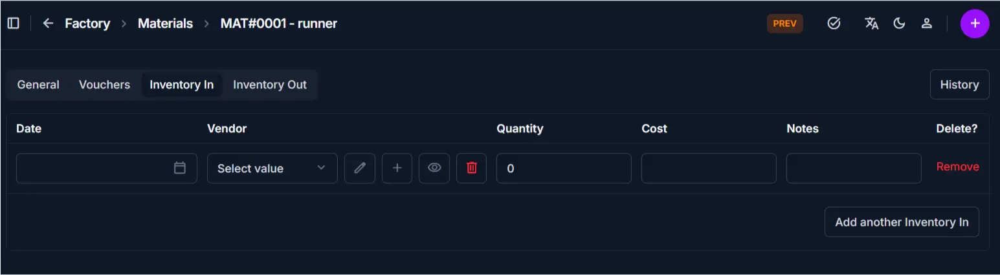
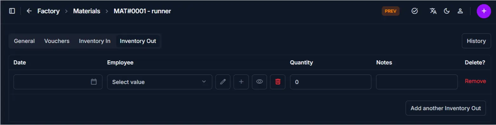

# Material Overview

## Overview

The **Materials** section allows you to manage all raw materials, track stock movement, and monitor inventory activity.

______________________________________________________________________

## Material List Page

The **Material List** page displays all materials in a table format for quick access and management.

### Key Features

- View all materials with essential details
- Quickly search and locate specific materials
- Access material edit page directly

## Table Information

The table provides a real-time summary of your factory's resources:

| Column             | Description                                                                    |
| :----------------- | :----------------------------------------------------------------------------- |
| **SKU**            | Unique identifier (e.g., `MAT#0001`) and clickable link to the edit page.      |
| **Name**           | The descriptive name (e.g., "Blue Fabric") along with a thumbnail image.       |
| **Cost**           | The recorded cost per unit.                                                    |
| **Current Stock**  | Total quantity available. Items at **0** are highlighted in **red**.           |
| **Reorder Status** | Visual alerts such as **OUT OF STOCK** (red) or **OK** (green).                |
| **Last Movement**  | The timestamp of the most recent inventory transaction.                        |
| **Is Enabled**     | A green checkmark indicates if the material is currently active in the system. |

### Search

- Use the search bar to find materials by **name or SKU**

______________________________________________________________________

### Navigation to Edit Page

- Click on the **SKU, Photo, or Name**
- This opens the **Material Edit Page**

______________________________________________________________________

## Material Edit Page Tabs

The material edit page is divided into multiple tabs.
Each tab focuses on a different type of information.

______________________________________________________________________

## General Tab

This tab contains the **basic material details**.

### Includes

- SKU
- Name
- Unit
- Photo
- Description
- Enable/Disable toggle

### Purpose

Used for managing identity and basic configuration of the material.

______________________________________________________________________

## Vouchers Tab

This tab shows all **transactions related to the material**.

### Includes

- Linked vouchers where the material was used
- Transaction history records

### Purpose

Used to track where and how the material has been used in the system.

______________________________________________________________________

## Inventory In Tab

This tab displays all **stock additions**.

### Includes

- Records of incoming stock
- Quantity added
- Date and reference

### Purpose

Used to monitor how stock is increasing over time.

______________________________________________________________________

## Inventory Out Tab

This tab displays all **stock deductions**.

### Includes

- Records of used or removed stock
- Quantity deducted
- Date and reference

### Purpose

Used to track material usage and stock reduction.

______________________________________________________________________

## Best Practices

- Use the **General tab** for updates, not inventory adjustments
- Always review **Inventory In/Out** before changing stock manually
- Use **Vouchers tab** to trace material usage issues

______________________________________________________________________

## Related Pages

- **Add Material** — Create new material
- **Edit Material** — Update material details
- **Inventory In / Out** — Manage stock movement
