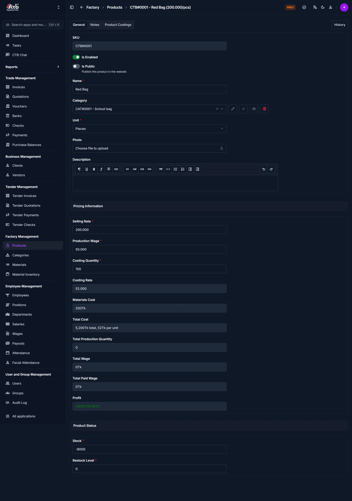

# Add Product

## Summary

Create a new product in CTB Admin. This page lets you define the product details, pricing, production costs, and stock settings used by the factory.

______________________________________________________________________

## When to use this page

Use this page when:

- Adding a new sellable product
- Defining product pricing and category
- Preparing items for invoices, quotations, or sales

______________________________________________________________________

## How to access this page

From the sidebar, go to **Factory → Products**. On the **Products** page, click the **Add Product** button in the top-right corner.

______________________________________________________________________

## Step-by-step instructions

1. Open **Add Product** from the **Factory** section of the sidebar.
1. Complete the **General tab** section described below.
1. Complete the **Product costings tab** section described below.
1. Review the values you entered, then save the record.

______________________________________________________________________

## Field reference

### General tab

The **General** tab is where you enter the product’s main details and status.

### Fields in the general tab

| Field            | Description                                                         |
| ---------------- | ------------------------------------------------------------------- |
| SKU              | Auto-generated product identifier shown at the top.                 |
| Is Enabled       | Activate the product for production and sales.                      |
| Is Public        | Publish the product in the website or public catalog.               |
| Name             | Product name used across production orders and reports.             |
| Category         | Select the product category for organization and filtering.         |
| Unit             | Choose the measurement unit for this product (for example, Pieces). |
| Photo            | Upload a product image (optional).                                  |
| Description      | Enter item details or usage notes.                                  |
| Selling Rate     | Selling price per unit.                                             |
| Production Wage  | Wage cost assigned to producing one unit.                           |
| Costing Quantity | Quantity used for production cost calculation.                      |
| Costing Rate     | Rate used with costing quantity to derive total cost.               |
| Stock            | Current stock quantity for the product.                             |
| Restock Level    | Minimum stock quantity before restocking is needed.                 |

### Product costings tab

The **Product Costings** tab is used to add and manage raw material cost entries for the product.

### Product costing entries

| Field      | Description                                     |
| ---------- | ----------------------------------------------- |
| Material   | Select a raw material used by this product.     |
| Quantity   | The material quantity required for the product. |
| Cost       | Cost per material unit.                         |
| Total Cost | Calculated total material cost for that line.   |

Use the **Add another Product Costing** button to add more materials. Remove a row when a material is no longer part of the product recipe.

______________________________________________________________________

## Notes tab

Use the **Notes** tab to store internal notes or special instructions about the product. This tab is useful for manufacturing details, vendor comments, or quality reminders that do not belong in the main description.

______________________________________________________________________

## Field guidelines

- Enter a clear **Name** so the product is easy to find in the list.
- Choose the correct **Category** and **Unit** before setting cost values.
- Set **Stock** and **Restock Level** to avoid stock shortages.
- Use the **Notes** tab for internal instructions, not public product descriptions.
- Add all raw materials in **Product Costings** so cost totals are accurate.

______________________________________________________________________

## Tips and common issues

- Keep **Is Public** off unless the product should appear on the website.
- Review the calculated **Total Cost** after entering material and wage values.
- Use **Save and continue editing** if you want to keep the form open after saving.

______________________________________________________________________

## Related pages

- [Products Overview](overview.md) for managing existing products.
- [Add Category](../categories/add-category.md) for creating categories.
- [Add Material](../materials/add-material.md) for defining raw materials used in cost calculations.
