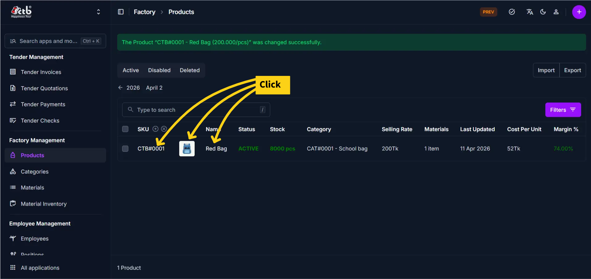
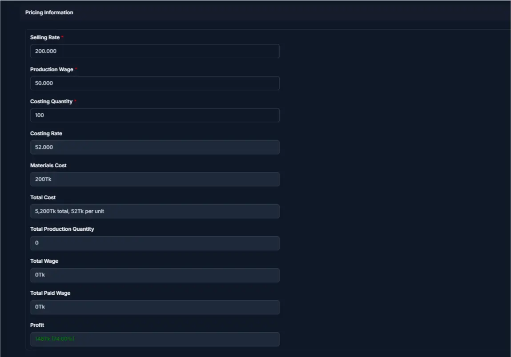
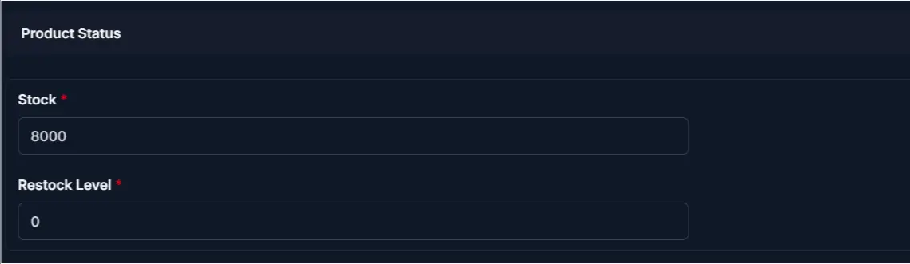

# Edit Product

## Summary

Use this page to update an existing product's information in CTB Admin. This includes product details, materials composition, pricing, and inventory settings.

______________________________________________________________________

## When to use this page

- Updating product name, category, or description
- Changing selling rate or production wages
- Adding or removing materials from product composition
- Adjusting stock levels or restock thresholds
- Enabling or disabling a product from sales
- Modifying cost calculations

______________________________________________________________________

## How to access this page

1. Go to **Factory → Products** from the sidebar
1. On the Products List page, select a product
1. Click on the **Photo** or **SKU** or **Product Name**

The system opens the **Edit Product Page**.

______________________________________________________________________

## Step-by-step instructions

1. Open **Edit Product** from the **Factory** section of the sidebar.
1. Complete the **General information** section described below.
1. Complete the **Pricing and costing information** section described below.
1. Complete the **Product costings (Materials)** section described below.
1. Complete the **Stock and Inventory** section described below.
1. Follow **Saving changes** below to finish.

______________________________________________________________________

## Field reference

### General information

Update the following fields as needed:

| Field       | What you can change | Notes                                          |
| ----------- | ------------------- | ---------------------------------------------- |
| SKU         | Read-only           | Cannot be changed after creation               |
| Is Enabled  | Toggle ON/OFF       | Disabling prevents use in new invoices         |
| Is Public   | Toggle ON/OFF       | Controls visibility on website                 |
| Name        | Edit                | Updates how product appears in system          |
| Category    | Edit                | Used for organization and reporting            |
| Unit        | Edit with caution   | Changing causes calculation issues in invoices |
| Photo       | Replace             | Upload a new product image                     |
| Description | Edit                | Optional notes or additional details           |

!!! warning

    Changing the **Unit** after invoices are created can cause calculation errors. Avoid unless necessary.

### Pricing and costing information

| Field            | What you can change | Notes                                     |
| ---------------- | ------------------- | ----------------------------------------- |
| Selling Rate     | Edit                | Price per unit charged to clients         |
| Production Wage  | Edit                | Wage cost per unit for production labor   |
| Costing Quantity | Edit                | Quantity for which costs are calculated   |
| Costing Rate     | Edit or auto        | Cost per unit (system may auto-calculate) |
| Materials Cost   | Auto-calculated     | Sum of all materials used in product      |
| Total Cost       | Auto-calculated     | Costing Rate + Materials Cost             |
| Profit           | Auto-calculated     | Selling Rate minus Total Cost             |

!!! note

    **Materials Cost**, **Total Cost**, and **Profit** are automatically calculated. Do not edit these fields directly.

### Product costings (Materials)

This tab defines which materials are used to manufacture this product:

| Column     | What you can change | Notes                             |
| ---------- | ------------------- | --------------------------------- |
| Material   | Select              | Choose which material to use      |
| Quantity   | Edit                | How much per unit is used         |
| Cost       | View only           | Cost per unit of the material     |
| Total Cost | Auto-calculated     | Quantity × Material cost          |
| Delete?    | Check to remove     | Remove material from this product |

Click **Add another Product Costing** to add more materials to the composition.

### Stock and Inventory

| Field          | What you can change | Notes                                    |
| -------------- | ------------------- | ---------------------------------------- |
| Product Status | View only           | Shows Active, Disabled, or Deleted state |
| Stock          | Edit with care      | Current available quantity               |
| Restock Level  | Edit                | Minimum stock before reorder is needed   |

!!! warning

    Editing **Stock** manually should be avoided. Use **Inventory In** or **Inventory Out** transactions to maintain a complete audit trail.

______________________________________________________________________

## Saving changes

After updating the required fields:

- Click **Save** to apply changes
- Changes are immediately reflected across the system
- Pricing and costing calculations update automatically

______________________________________________________________________

## Product history

Click the **History** button in the top-right corner to see all changes made to this product, including who made the change, when, and what was modified.

______________________________________________________________________

## Tips and common issues

- The **SKU** field cannot be changed after a product is created
- Disabling a product prevents it from being used in new invoices
- When you add or remove materials, click **Save** immediately to recalculate **Total Cost** and **Profit**
- Avoid manual **Stock** edits — use proper inventory transactions instead
- If **Total Cost** exceeds **Selling Rate**, profit becomes negative — review pricing regularly
- Every change to this product is logged in the **History** tab

______________________________________________________________________

## Related pages

- **Add Product** — Create a new product
- **Products Overview** — View and search all products
- **Materials** — Manage materials used in products
- **Categories** — Organize and manage product categories
- **Product Costings** — View product costing details
