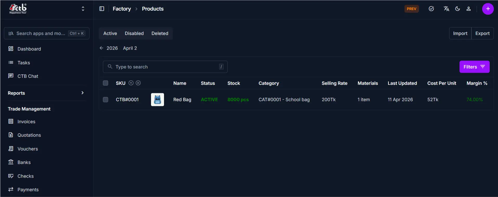
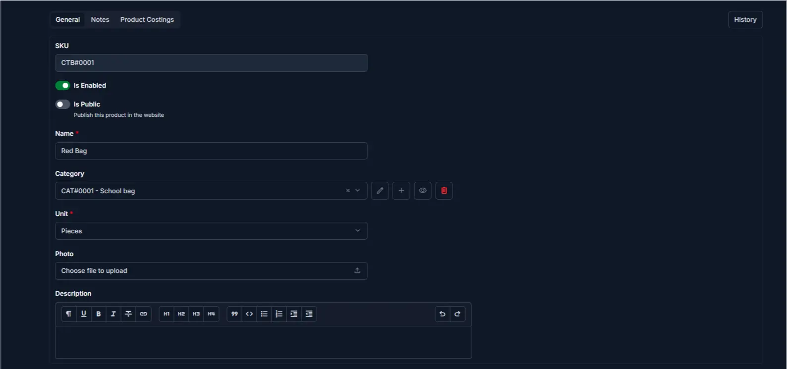
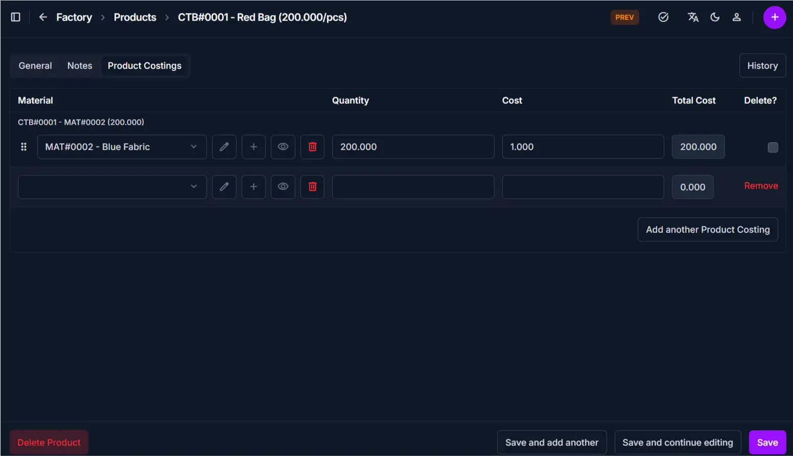

# Products Overview

The **Products** section allows you to manage all manufactured products, define material compositions, set pricing, and track inventory levels.

______________________________________________________________________

## Product List Page

The **Product List** page displays all products in a table format for quick access and management.

### Key Features

- View all products with essential details
- Quickly search and locate specific products
- Access product edit page directly
- Filter by Active, Disabled, or Deleted status
- Import and export product data

## Table Information

The table provides a real-time summary of your factory's product portfolio:

| Column            | Description                                                                   |
| :---------------- | :---------------------------------------------------------------------------- |
| **SKU**           | Unique identifier (e.g., `CTB#0001`) and clickable link to the edit page.     |
| **Name**          | The product name (e.g., "Red Bag") with a thumbnail image.                    |
| **Status**        | Current status badge: **ACTIVE** (green) or **DISABLED** (gray).              |
| **Stock**         | Current available quantity. Items at **0** are highlighted in **red**.        |
| **Category**      | Product category for organization (e.g., "CAT#0001 - School bag").            |
| **Selling Rate**  | Price per unit charged to clients.                                            |
| **Materials**     | Number of materials used in the product composition (e.g., "1 item").         |
| **Last Updated**  | The date and time when the product was last modified.                         |
| **Cost Per Unit** | Total production cost per unit.                                               |
| **Margin %**      | Profit margin percentage (Selling Rate - Cost Per Unit) / Selling Rate × 100. |

### Search

- Use the search bar to find products by **name or SKU**
- Click **Filters** (top-right) to filter by status, category, or other criteria

______________________________________________________________________

### Navigation to Edit Page

- Click on the **SKU, Photo, or Name**
- This opens the **Product Edit Page**

______________________________________________________________________

## Product Edit Page Tabs

The product edit page is divided into multiple tabs.
Each tab focuses on a different type of information.

______________________________________________________________________

## General Tab

This tab contains the **basic product information**.

### Includes

- SKU
- Product name
- Category
- Unit (e.g., pieces, dozens)
- Photo
- Description
- Enable/Disable toggle
- Public visibility toggle

### Purpose

Used for managing product identity, categorization, and basic configuration.

______________________________________________________________________

## Notes Tab

This tab displays **additional product documentation**.

### Includes

- Custom notes or internal comments
- Product specifications or special instructions

### Purpose

Used to store supplementary information about the product for reference by production or sales teams.

______________________________________________________________________

## Product Costings Tab

This tab defines the **material composition and cost calculation** for the product.

### Includes

- List of materials used in the product
- Quantity of each material per unit
- Material cost per unit
- Total material cost
- Selling rate
- Production wage
- Costing rate
- Total production cost
- Profit calculation

### Purpose

Used to track which materials compose the product, manage pricing, and monitor profit margins.

______________________________________________________________________

## Product History Button

This tab displays a **complete audit trail** of the product record.

### Includes

- Chronological list of all actions (Created, Changed)
- Detailed log of value transitions
- User identification and change reasons
- Option to revert to previous versions

### Purpose

Used to track who modified the product, when changes occurred, and to restore previous configurations if needed.

______________________________________________________________________

## Best Practices

- Use the **General tab** to update basic product information
- Keep **Product Costings** up to date to ensure accurate profit calculations
- Review **Margin %** regularly — adjust selling rate if margins are too low
- Use **Disable** for discontinued products instead of deleting them
- Always add all required materials in the **Product Costings** tab before marking a product active
- Check the **History** tab to understand why a product's cost or price was changed

______________________________________________________________________

## Related Pages

- **Add Product** — Create new products
- **Edit Product** — Update product details and costings
- **Categories** — Manage product categories
- **Materials** — Manage and view materials
- **Product Reports** — Analyze product sales and profitability
