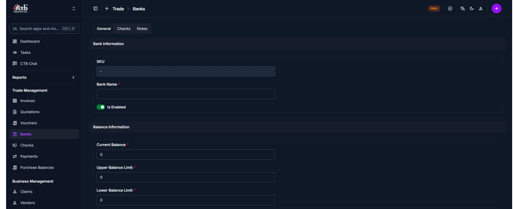
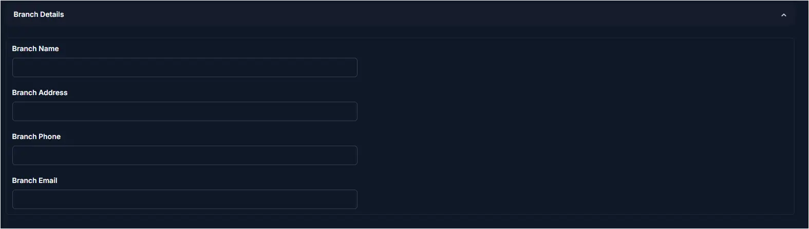
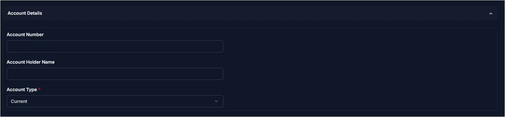

# Add Bank

Use this page to register a new bank account in CTB Admin. When you open a new bank account or need to track an existing one, create a bank record to manage its name, balance limits, branch details, and account information. Bank records help you monitor balances, link checks and payments, and maintain accurate financial records.

## When to use this page

- Registering a new bank account in the system
- Setting up balance limits for financial monitoring
- Linking a bank to checks and payment transactions
- Managing branch and account details for a bank
- Enabling or disabling a bank account from active use

## How to access this page

From the sidebar, go to **Trade Management → Banks**. On the Banks List page, click the **purple (+) icon** in the top-right corner.

The system opens the **Add Bank Page**.

______________________________________________________________________

## Bank Information

Fill in the following fields:

| Step | Field      | What to Do     | Description                                            |
| ---- | ---------- | -------------- | ------------------------------------------------------ |
| 1    | SKU        | Auto-generated | Unique identifier for the bank record (read-only)      |
| 2    | Bank Name  | Enter name     | The name of the bank or bank account                   |
| 3    | Is Enabled | Toggle on/off  | Activate or deactivate this bank account in the system |

!!! warning "Required Fields"
Fields marked with a **red star (\*)** are mandatory. Bank Name is required before saving.

______________________________________________________________________

## Balance Information

Configure the financial limits for this bank account:

| Step | Field               | What to Do   | Description                                                     |
| ---- | ------------------- | ------------ | --------------------------------------------------------------- |
| 1    | Current Balance     | Enter amount | The current available balance in this bank account              |
| 2    | Upper Balance Limit | Enter amount | Maximum balance threshold; alerts when balance exceeds this     |
| 3    | Lower Balance Limit | Enter amount | Minimum balance threshold; alerts when balance falls below this |

!!! note "Balance Limits"
Upper and Lower Balance Limits are used for financial monitoring. The system can notify you when the bank balance crosses either threshold.

______________________________________________________________________

## Branch Details

Click the **Branch Details** section to expand and fill in branch-specific information:

| Field          | What to Do   | Description                         |
| -------------- | ------------ | ----------------------------------- |
| Branch Name    | Enter text   | Name of the specific bank branch    |
| Branch Address | Enter text   | Physical address of the bank branch |
| Branch Phone   | Enter number | Phone number of the bank branch     |

!!! info
Branch Details is a collapsible section. Click the header to expand it before entering data.

______________________________________________________________________

## Account Details

Click the **Account Details** section to expand and fill in account-specific information:

| Field          | What to Do | Description                              |
| -------------- | ---------- | ---------------------------------------- |
| Account Name   | Enter text | Name on the bank account                 |
| Account Number | Enter text | Official bank account number             |
| Account Type   | Enter text | Type of account (e.g., Current, Savings) |

!!! info
Account Details is a collapsible section. Click the header to expand it before entering data.

______________________________________________________________________

## Saving the Bank Record

After completing all sections:

- Click **Save** to create the bank record
- Click **Save and continue editing** to save and stay on the page
- Click **Save and add another** to save and create another bank record immediately

The bank is now registered in the system and available for linking to checks and payments.

______________________________________________________________________

!!! Tips and Common Issues

- **Bank Name is required** — You must enter a bank name before the record can be saved  
- **Is Enabled controls availability** — Disabled banks will not appear as selectable options when creating checks or payments  
- **Current Balance sets the starting point** — Enter the actual current balance so the system can accurately track future transactions  
- **Set realistic balance limits** — Upper and Lower limits help flag unusual account activity; set them based on your operational thresholds  
- **Branch and Account Details are optional** — These sections are collapsible and not required, but recommended for complete record-keeping  
- **Multiple accounts per bank** — You can create separate records for different accounts at the same bank; give each a distinct name  

______________________________________________________________________

## Related Pages

- **Banks Overview** — View all registered bank accounts and their balances
- **Bank Detail** — View or edit bank information after creation
- **Add Check** — Create a check and link it to a bank account
- **Checks Overview** — View all checks associated with bank accounts
- **Payments Overview** — View all payments linked to bank accounts
