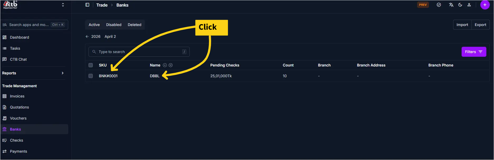
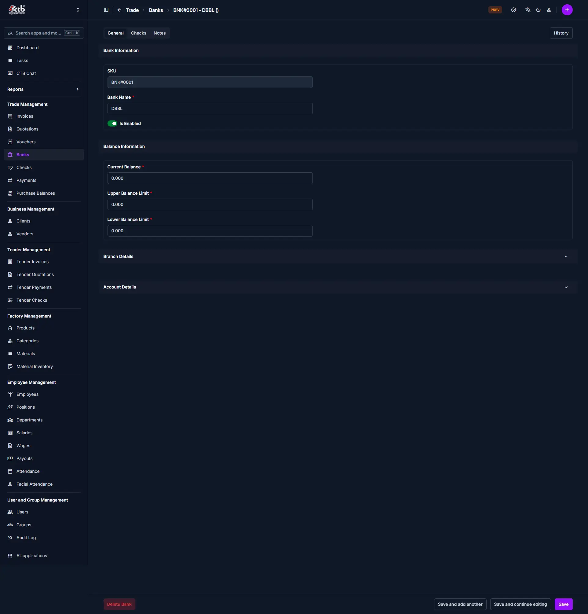
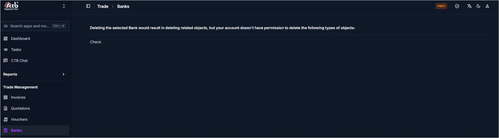

# Bank Detail

## Summary

**Summary**

______________________________________________________________________

## When to use this page

- Verifying a bank account before creating a check, voucher, or payment
- Reviewing the current balance, limits, or status of a bank account
- Checking branch or account details for reporting or reconciliation
- Confirming if the account is active and available for transactions

______________________________________________________________________

## How to access this page

From the sidebar, go to **Trade → Banks**. On the Banks List page, click any bank SKU or name to open the Bank Detail page.

______________________________________________________________________

## Step-by-step instructions

1. From the sidebar, select **Banks** under Trade.
1. On the Banks List page, find the bank you want to review.
1. Click the bank’s SKU or name (see the screenshot above).
1. The Bank Detail page opens, showing all account information.
1. Review or update details as needed. Click **Save** to apply changes.

______________________________________________________________________

## Field reference

| Field                   | Description                                                                |
| ----------------------- | -------------------------------------------------------------------------- |
| **SKU**                 | Unique system identifier for the bank account (used throughout CTB Admin). |
| **Bank Name**           | The name of the bank account as shown in the system.                       |
| **Is Enabled**          | Indicates if the account is active and available for transactions.         |
| **Current Balance**     | The current tracked balance for this bank account.                         |
| **Upper Balance Limit** | Maximum allowed balance for the account (for monitoring or compliance).    |
| **Lower Balance Limit** | Minimum required balance for the account (to avoid overdraft or alerts).   |
| **Branch Details**      | Additional information about the bank branch (expandable section).         |
| **Account Details**     | Further account-specific information (expandable section).                 |

______________________________________________________________________

## Deleting a Bank

Before deleting a bank, the system checks whether the account is linked to any existing records. The table below describes when deletion is and is not permitted:

| Condition                                          | Deletion Allowed |
| -------------------------------------------------- | ---------------- |
| Bank has linked Checks                             | Not permitted    |
| Bank has linked Vouchers                           | Not permitted    |
| Bank has linked Payments                           | Not permitted    |
| Bank has no linked records and user has permission | Permitted        |

!!! warning "Permission Required"

    Even if the bank has no linked records, only users with the appropriate delete permission can remove a bank account. If your account lacks this permission, the system will display an error listing the object types you are not allowed to delete.

**To delete a bank:**

1. Open the bank record from the **Banks List**
1. Confirm there are no linked checks, vouchers, or payments
1. Click the **Delete Bank** button at the bottom-left of the page
1. Confirm the deletion when prompted

The bank record is permanently removed from the system.

!!! tip "Cannot delete the bank?"

    If the system shows a permission error, contact your system administrator to request delete access or to have the linked records removed first. To take the bank out of active use without deleting it, toggle **Is Enabled** to off and save.

______________________________________________________________________

## Tips and common issues

- **Check account status** before using the bank for new checks, vouchers, or payments.
- If the **balance looks incorrect**, review recent checks or payments linked to this account.
- **Closed or inactive accounts** remain in the system for reporting but cannot be used for new transactions.
- Use the **Delete Bank** button only if the account is no longer needed and has no linked records.

______________________________________________________________________

## Related pages

- [Banks Overview](overview.md) — List and manage all bank accounts
- [Add Bank](add-bank.md) — Create a new bank account
- [Checks Overview](../checks/overview.md) — Manage checks linked to banks
- [Vouchers Overview](../vouchers/overview.md) — Manage vouchers linked to banks
