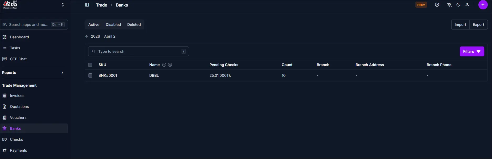

# Banks Overview

## Overview

The **Banks Overview** page lets you review all bank accounts recorded in CTB Admin. Use this section to see each account’s current status, balance, and usage in payments or reconciliation. This helps you confirm which accounts are active before you create checks, vouchers, or payment records.

______________________________________________________________________

## When to use this page

- Review all bank accounts available in the system
- Confirm a bank account before creating a check or voucher
- Check an account’s balance or active status
- Trace pending checks or recent transactions for a bank

______________________________________________________________________

## How to access this page

1. From the sidebar, go to **Trade Management → Banks**.

______________________________________________________________________

## Page sections

### Bank List

The main list displays each bank account on a single page.

Key columns include:

- **SKU** — System reference code for the bank account
- **Name** — Bank name as shown in the system
- **Pending Checks** — Total value of checks not yet cleared
- **Count** — Number of pending checks
- **Branch** — Branch name (if available)
- **Branch Address** — Address of the bank branch
- **Branch Phone** — Contact number for the branch

### Search and filters

- Use the search field to find banks by SKU or name.
- Use the **Active / Disabled / Deleted** tabs to filter records by status.
- Use the **Filters** button to narrow results by additional values.

______________________________________________________________________

## Best practices

- Keep inactive or closed accounts clearly marked so users do not select them by mistake.
- Always confirm the correct bank account before creating checks or vouchers.
- If you cannot find the right account, confirm it was created in CTB Admin and not kept only in paper records.

______________________________________________________________________

## Related Pages

- [Add Bank](add-bank.md) — Create a new bank account
- [Bank Detail](bank-detail.md) — Review or update bank account information
- [Checks Overview](../checks/overview.md) — Manage checks linked to banks
- [Vouchers Overview](../vouchers/overview.md) — Manage vouchers linked to banks
