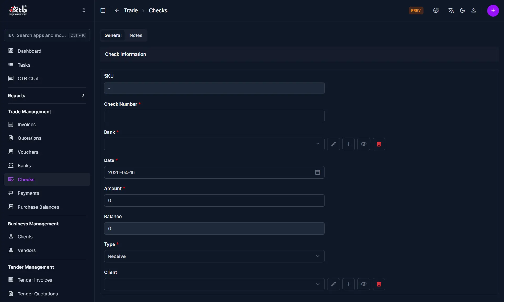
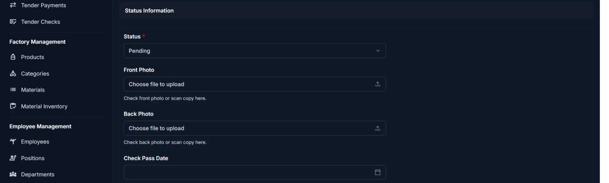
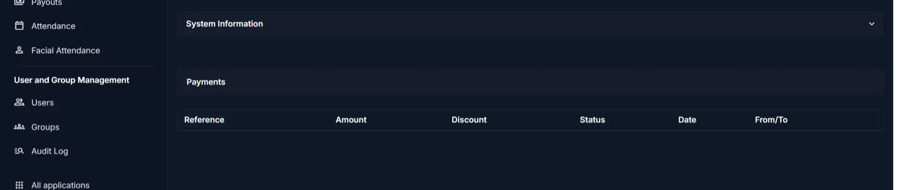

# Add Check

Use this page to register a new bank check in CTB Admin. When you receive a physical check from a client or issue a check to a vendor, create a check record to track the check number, amount, bank, date, and status. Check records help you monitor check usage, link payments to specific checks, and manage your bank account balances.

## Summary

Use this page to create a new check record that can later be linked to payments and bank reconciliation. Accurate check setup helps you track balances, dates, and status changes.

## When to use this page

- Recording a check received from a client
- Recording a check issued to a vendor
- Registering check details before depositing or sending it
- Tracking the physical status of a check (pending, passed, bounced)
- Linking check payments to update client and vendor balances
- Managing check documentation with photos for verification

## How to access this page

From the sidebar, go to **Trade → Checks**. On the Checks List page, click the **purple (+) icon** in the top-right corner.

The system opens the **Add Check Page**.

## Step-by-step instructions

1. Open **Trade -> Checks** and click the add icon.
1. Fill in the check number, bank, date, amount, type, and related party.
1. Set the initial status and upload optional front and back photos.
1. Review linked payments section if needed.
1. Click the appropriate save action to create the check.

## Field reference

- **SKU** - Auto-generated identifier for the check.
- **Check Number** - Unique number printed on the physical check.
- **Bank** - Bank account connected to the check.
- **Amount** - Face value of the check.
- **Status** - Current check state used for workflow control.
- **Front Photo / Back Photo** - Optional verification images for the check.
- **Check Pass Date / Check Bounce Date** - Dates that record status transitions.

______________________________________________________________________

## Check Information

Fill in the following fields:

| Step | Field        | What to Do              | Description                                         |
| ---- | ------------ | ----------------------- | --------------------------------------------------- |
| 1    | SKU          | Auto-generated          | Unique identifier for the check (read-only)         |
| 2    | Check Number | Enter check number      | The number printed on the physical check (unique)   |
| 3    | Bank         | Select or add bank      | The bank account associated with this check         |
| 4    | Date         | Select date             | Date the check was issued or received               |
| 5    | Amount       | Enter amount            | The face value of the check in the default currency |
| 6    | Balance      | Auto-calculated         | Remaining available amount on the check (read-only) |
| 7    | Type         | Select type             | Receive (from client) or Send (to vendor)           |
| 8    | Client       | Select client or vendor | The party associated with the check                 |

!!! warning "Required Fields"

    Fields marked with a **red star (\*)** are mandatory. Check Number is required to prevent duplicate entries.

______________________________________________________________________

## Status Information

Set the check status and upload supporting documents:

| Step | Field             | What to Do              | Description                                                |
| ---- | ----------------- | ----------------------- | ---------------------------------------------------------- |
| 1    | Status            | Select status           | Current state (Pending, Cleared, Bounced, Cancelled, etc.) |
| 2    | Front Photo       | Upload image (optional) | Photo of the front of the check for verification           |
| 3    | Back Photo        | Upload image (optional) | Photo of the back of the check for verification            |
| 4    | Check Pass Date   | Select date (optional)  | Date the check was cleared/passed by the bank              |
| 5    | Check Bounce Date | Select date (optional)  | Date the check bounced (only when Status is Bounced)       |

!!! note "Photos for Verification"

    Use Front Photo and Back Photo to store images of both sides of the check. This helps with verification and archival purposes. Photos are optional but recommended for high-value checks.

______________________________________________________________________

## Payments Section

The Payments section at the bottom shows all payments linked to this check:

| Column    | Description                                    |
| --------- | ---------------------------------------------- |
| Reference | Payment reference number                       |
| Amount    | Payment amount linked to this check            |
| Discount  | Discount applied to the payment (if any)       |
| Status    | Payment status (Pending, Passed, Failed)       |
| Date      | Payment date                                   |
| From/To   | Client or vendor party involved in the payment |

!!! info "Payments Linked Later"

    The Payments section will be empty when you first create a check. Payments are linked to this check when you create or edit a payment record and select this check.

______________________________________________________________________

## Saving the Check

After completing all sections:

- Click **Save** to create the check record
- Click **Save and continue editing** to save and stay on the page
- Click **Save and add another** to save and create another check immediately

The check is now recorded in the system and available for linking to payments.

______________________________________________________________________

## Tips and common issues

- **Check Number must be unique** — The system prevents duplicate check numbers; verify you're not re-entering an existing check number
- **Amount becomes the starting balance** — When you create a check with an amount, the balance starts at that amount and decreases as payments are linked
- **Balance decreases with payments** — Each payment linked to this check reduces the check balance; if balance reaches zero, no more payments can be linked
- **Photos are optional but recommended** — Store front and back photos of high-value checks for audit and verification purposes
- **Bounce dates for failed checks** — Only fill in Check Bounce Date if the Status is Bounced; this triggers financial reconciliation workflows
- **Type matters for reporting** — Use Receive for checks from clients and Send for checks issued to vendors; this affects balance calculations
- **Multiple checks per bank** — You can issue or receive multiple checks from the same bank; each gets its own record

______________________________________________________________________

## Related Pages

- **Checks Overview** — View all checks and their balances
- **Check Detail** — View check status and linked payments
- **Add Payment** — Create a payment and link it to a check
- **Banks Overview** — Manage bank accounts
- **Payments Overview** — View all payments in the system
