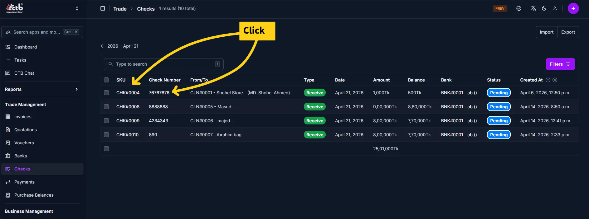

# Check Detail

Use this page to view and manage a check after it has been created or received. The check detail page displays all information related to a check—general details, financial information, status, and supporting documents. You can update check status, add front and back photos, and track payment records linked to this check.

## When to use Check Detail

- Viewing a complete check record with all details and payment information
- Updating check status (Pending, Cleared, Bounced, etc.)
- Adding front and back photos of the check for verification
- Reviewing linked payments and transactions
- Verifying check information for bank reconciliation

## How to access Check Detail

From the sidebar, go to **Trade Management → Checks**. On the Checks List page, click on any check SKU or select a check to open the **Check Detail page**.

## Field reference

- **SKU** - Unique system identifier for the check.
- **Check Number** - Number printed on the physical check.
- **Bank** - Bank account associated with the check.
- **Amount** - Face value recorded when the check was created.
- **Balance** - Remaining amount available after linked payments.
- **Status** - Current lifecycle state of the check.
- **Client** - Client or vendor linked to the check.

______________________________________________________________________

## Check Information

The Check Information section displays core check details:

| Field        | Description                                    |
| ------------ | ---------------------------------------------- |
| SKU          | Unique system identifier for this check        |
| Check Number | Bank check number (printed on the check)       |
| Bank         | Associated bank account (linked to check)      |
| Date         | Date the check was written in the check page   |
| Amount       | Monetary value of the check                    |
| Balance      | Current balance (may reflect partial payments) |
| Type         | Check type (Receive, Send etc.)                |

!!! info "Read-Only Fields"
SKU, Check Number, Bank, Date, and Amount are typically set at check creation and cannot be changed on this detail page. To modify these, you must edit the check or create a new record.

______________________________________________________________________

## Status Information

| Field  | Description                                                       |
| ------ | ----------------------------------------------------------------- |
| Status | Current check status (Pending, Cleared, Bounced, Cancelled, etc.) |

Update the **Status** dropdown to track the check through its lifecycle:

- **Pending** — Check has been recorded but not yet processed by the bank
- **passed** — Bank has processed and cleared the check
- **Bounced** — Check was rejected by the bank (insufficient funds, etc.)
- **Failed** -The cheque did not pass bank verification, so it was rejected

!!! warning "Status Changes"
Changing a check status may trigger notifications or affect linked payments. Review implications before updating.

______________________________________________________________________

## Photos

The page includes two photo upload sections:

| Section     | Purpose                                                         |
| ----------- | --------------------------------------------------------------- |
| Front Photo | Clear photo of the front side of the check                      |
| Back Photo  | Clear photo of the back side of the check (if any endorsements) |

**To upload a photo:**

1. Click **Choose file to upload** in the Front Photo or Back Photo section
1. Select an image from your computer (JPG, PNG, or PDF formats recommended)
1. The system displays "Check front photo or scan copy here" as placeholder text
1. After upload, the image preview appears below

!!! tip "Photo Guidelines"

- Capture check details clearly and in full
- Ensure adequate lighting and no glare
- Back photo is optional but recommended for auditing purposes
- Store high-resolution images for bank verification

______________________________________________________________________

## Check Dates Section

| Field             | Description                                        |
| ----------------- | -------------------------------------------------- |
| Check Sheet Date  | The date written on the physical check page        |
| Check Passed Date | Date the check was cleared and passed by the bank  |
| Check Bounce Date | Date the check was rejected or bounced by the bank |

These dates help track check timing for bank reconciliation:

- **Check Sheet Date** is the date printed or written on the physical check itself
- **Check Passed Date** is filled when the check status changes to **Passed** (bank cleared the check)
- **Check Bounce Date** is filled when the check status changes to **Bounced** (bank rejected the check)

______________________________________________________________________

## Payments Tab

The **Payments** section at the bottom tracks all payments or transactions linked to this check:

| Column    | Description                   |
| --------- | ----------------------------- |
| Reference | Payment or invoice reference  |
| Amount    | Payment amount                |
| Discount  | Discount applied (if any)     |
| Status    | Payment status                |
| Date      | Date of the payment           |
| From/To   | Payment source or destination |

!!! info "Linked Payments"
A single check may be linked to multiple payments. Use this section to verify which transactions are tied to this check.

______________________________________________________________________

## Deleting a Check

A **Delete Check** button is available at the bottom-left of the detail page.

!!! warning "Restricted Action"
Checks can only be deleted when their status is **Pending** and no payments are linked to them. Once a check has been set to **Passed**, **Bounced**, or **Cancelled**, or has linked payments, the Delete button will not be available.

**To delete a check:**

1. Open the check you want to delete from the **Checks List**
1. Confirm the status is **Pending** and no payments are listed in the Payments section
1. Click the **Delete Check** button at the bottom-left of the page
1. Confirm the deletion when prompted

The check record is permanently removed from the system.

!!! tip "Cannot see the Delete button?"
If the Delete button is not visible, the check is either bounced or failed. To preserve financial records, linked or processed checks cannot be deleted.

______________________________________________________________________

## Tips and common issues

- **Check details locked?** — SKU, Check Number, Bank, Date, and Amount are set at creation. If you need to modify these, change the status to Pending and click save to continue editing.
- **Photos not uploading?** — Verify the file format (JPG, PNG, or PDF) and size. Large files may fail; re-export at lower resolution if needed.
- **Payment not showing in Payments tab?** — The payment may not be linked to this check. Review payment creation to ensure the check reference was selected.
- **Cannot delete check?** — Once a check is cleared or used in a transaction, it may be locked from deletion. Archive or cancel it instead.

______________________________________________________________________

## Related pages

- [Checks Overview](overview.md) — List and manage all checks
- [Add Check](add-check.md) — Create a new check record
- [Payments](../payments/overview.md) — View and manage payments linked to checks
- [Banks](../banks/overview.md) — Manage bank accounts
