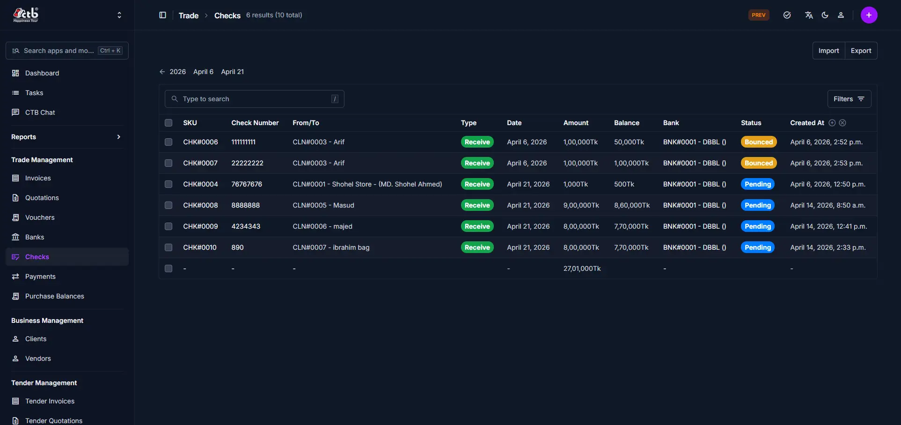

# Checks Overview

## Summary

The **Checks Overview** page lets you monitor all check transactions recorded in CTB Admin. Use this section to review check records, track their status, and confirm which checks are active, pending, or bounced. This helps you manage check-based payments and reconcile bank accounts efficiently.

______________________________________________________________________

## When to use this page

- Review all check transactions in one place
- Find a check by number, client/vendor, or date
- Open a check record for details or updates
- Track check status before processing payments or reconciliation

______________________________________________________________________

## How to access this page

1. From the sidebar, go to **Trade → Checks**.
1. The list page shows checks grouped by **Active**, **Disabled**, and **Deleted**.

______________________________________________________________________

## Step-by-step instructions

1. Open **Checks Overview** from the **Trade** section of the sidebar.
1. Complete the **Page sections** section described below.
1. Review the values you entered, then save the record.

______________________________________________________________________

## Field reference

### Page sections

### Checks list

The main list displays each check transaction on a single page.

Key columns include:

- **SKU** — System reference code for the check
- **Check Number** — Number printed on the physical check
- **From/To** — Linked client or vendor name and code
- **Type** — Indicates if the check is received or issued
- **Date** — Date the check was created or recorded
- **Amount** — Face value of the check
- **Balance** — Remaining amount available on the check
- **Bank** — Linked bank account for the check
- **Status** — Current state (Pending, Bounced, etc.)
- **Created At** — When the check record was added

### Search and filters

- Use the search field to find checks by number, client/vendor, or bank.
- Use the **Active / Disabled / Deleted** tabs to filter records by status.
- Use the **Filters** button to narrow results by additional values.

______________________________________________________________________

## Best practices

- Always verify the check status before linking it to a payment or updating records.
- Use clear references and accurate client/vendor details for easy tracking.
- If a check is missing, confirm it was recorded in the correct module and not deleted.

______________________________________________________________________

## Related pages

- **Add Check** — Record a new check transaction
- **Check Detail** — Review or update check information
- **Banks Overview** — Manage bank accounts linked to checks
- **Payments Overview** — Track payments associated with checks
