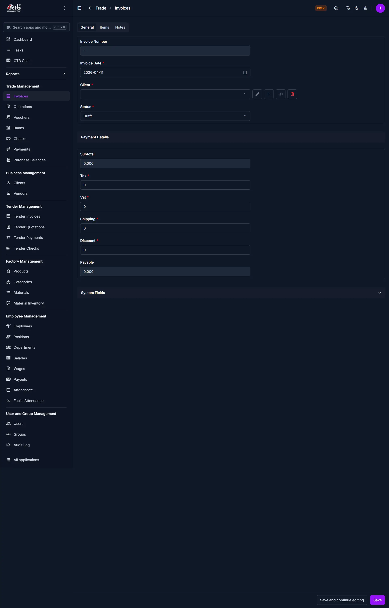

# Create Invoice

Use this page to create a standard invoice for a client. An invoice records the sale of products or services and tracks payment. Invoices are used to request payment, manage accounts receivable, and generate business reports.

## Summary

Use this page to create client invoices with items, charges, and totals in one workflow. A correctly prepared invoice improves payment tracking and reporting accuracy.

## When to use this page

- Selling CTB's own products to clients
- Recording sales of inventory from your company's stock
- Creating an invoice for direct product sales
- Issuing payment request for goods delivered to a customer

## How to access this page

From the sidebar, go to **Trade Management → Invoices**. On the Invoices List page, click the **purple (+) icon** in the top-right corner.

The system opens the **Create Invoice Page**.

## Step-by-step instructions

1. Open **Trade Management -> Invoices** and click the add icon.
1. Fill the invoice header details in **General Information**.
1. Add one or more line items in **Add Items**.
1. Review taxes, shipping, discount, and payable amount in **Payment Details**.
1. Add optional notes and set invoice visibility/status.
1. Click the appropriate save action to create the invoice.

## Field reference

- **Invoice Number** - Unique identifier used to track the invoice.
- **Invoice Date** - Billing date used in reports and period summaries.
- **Client** - Customer account receiving the invoice.
- **Status** - Lifecycle state such as Draft, Sent, or Cancelled.
- **Payable** - Final amount due after all charges and discounts.

______________________________________________________________________

## General Information

Fill in the following fields on the General tab:

| Step | Field          | What to Do              | Description                                  |
| ---- | -------------- | ----------------------- | -------------------------------------------- |
| 1    | Invoice Number | Auto-generated or enter | Unique identifier for this invoice           |
| 2    | Invoice Date   | Select date             | Date the invoice is issued                   |
| 3    | Client         | Select client           | The customer receiving the invoice           |
| 4    | Status         | Select status           | Current state (Draft, Sent, Cancelled, etc.) |

!!! warning "Required Fields"
Fields marked with a **red star (\*)** are mandatory.

______________________________________________________________________

## Payment Details

After adding items, configure the financial details:

| Step | Field    | What to Do      | Description                                                   |
| ---- | -------- | --------------- | ------------------------------------------------------------- |
| 1    | Subtotal | Auto-calculated | Sum of all item totals (Quantity × Selling Rate)              |
| 2    | Tax      | Enter amount    | Tax to be charged on the order                                |
| 3    | VAT      | Enter amount    | Value-added tax if applicable                                 |
| 4    | Shipping | Enter amount    | Shipping or delivery cost                                     |
| 5    | Discount | Enter amount    | Discount to apply to the invoice                              |
| 6    | Payable  | Auto-calculated | Final amount due (Subtotal + Tax + VAT + Shipping - Discount) |

!!! note
Payable is calculated automatically based on other fields.

______________________________________________________________________

## Add Items

Add products or services to the invoice:

| Step | Field        | What to Do           | Description                           |
| ---- | ------------ | -------------------- | ------------------------------------- |
| 1    | Product      | Select from dropdown | The product or service being sold     |
| 2    | Selling Rate | Enter or select      | Price per unit                        |
| 3    | Quantity     | Enter quantity       | Number of units (or quantity)         |
| 4    | Total        | Auto-calculated      | Quantity × Selling Rate for this item |

- Click **Add another Item** to add multiple products to one invoice
- Click the **trash icon** to remove an item
- Use the **edit icon** to modify an item's details

!!! tip
Each item's total is calculated automatically once you enter Selling Rate and Quantity.

______________________________________________________________________

## Notes and Status

Add optional notes or internal comments:

| Step | Field  | What to Do    | Description                           |
| ---- | ------ | ------------- | ------------------------------------- |
| 1    | Note   | Enter text    | Internal notes or special conditions  |
| 2    | Status | Toggle switch | Show or hide the invoice from reports |

______________________________________________________________________

## Saving the Invoice

After completing all sections:

- Click **Save** to create the invoice as Draft/sent/cancelled. based on the status you selected
- Click **Save and continue editing** to save and stay on the page
- Click **Save and add another** to save and create another invoice immediately

The invoice is now ready to be sent to the client or processed for payment.

______________________________________________________________________

!!! Tips and Common Issues

- **Client is required** — You must select a client before saving  
- **Items add to Subtotal** — The invoice calculates Subtotal automatically when you add items  
- **Discount reduces Payable** — Enter a discount to reduce the final amount due  
- **Status controls visibility** — Use Status to mark invoices as Draft, Sent,Cancelled, etc.  
- **Date affects reporting** — Invoice Date determines which reporting period the invoice appears in  

______________________________________________________________________

## Related Pages

- **Invoice Detail** — View or edit invoice details after creation
- **Edit Invoice** — Update invoice information and items
- **Print Invoice** — Generate a printable or shareable invoice document
- **Invoice Reports** — Analyze sales data and outstanding payments
