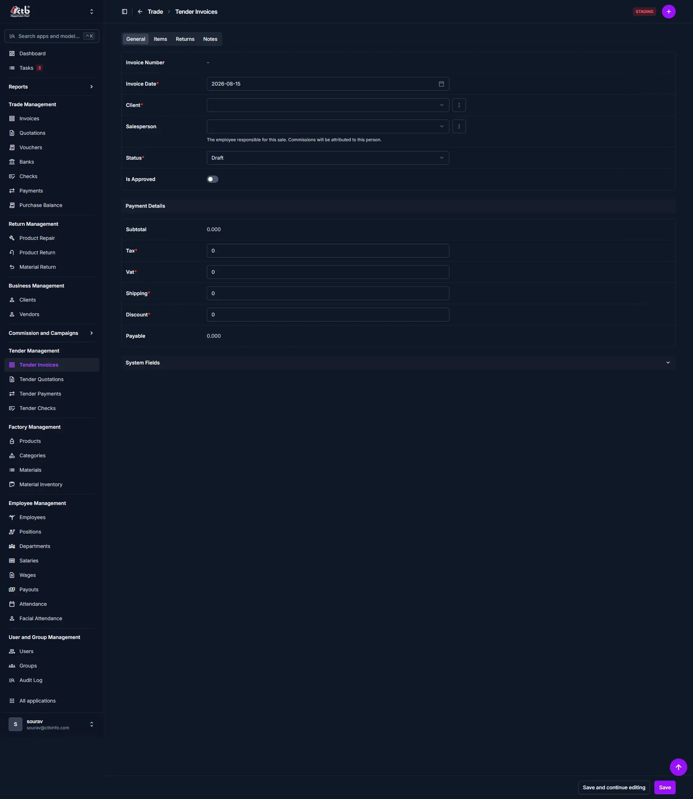

# Create Tender Invoice

## Summary

Use this page to create a tender invoice for a client. A tender invoice is a quotation or formal bid document used to propose itemized goods or services and pricing before a client commits to purchase. Tender invoices help track proposals and negotiate terms with clients.

______________________________________________________________________

## When to use this page

- Processing orders for tender order products
- Creating invoices for custom or special requests received from clients
- Issuing payment requests for tender-based products or services

______________________________________________________________________

## How to access this page

From the sidebar, go to **Trade → Tender Invoices**. On the Tender Invoices List page, click the **purple (+) icon** in the top-right corner.

The system opens the **Create Tender Invoice Page**.

______________________________________________________________________

## Step-by-step instructions

1. Open **Create Tender Invoice** from the **Trade** section of the sidebar.
1. Complete the **General information** section described below.
1. Complete the **Payment details** section described below.
1. Complete the **Add items** section described below.
1. Complete the **Terms and conditions** section described below.
1. Follow **Saving the Tender Invoice** below to finish.

______________________________________________________________________

## Field reference

| Field Name         | Type    | Required | Backend Validation / Constraints                                      | Description                                                                                       |
| :----------------- | :------ | :------- | :-------------------------------------------------------------------- | :------------------------------------------------------------------------------------------------ |
| **Tender Number**  | Text    | Yes      | Max 20 chars, unique                                                  | Unique identifier for the tender. Auto-generated if left blank.                                   |
| **Tender Date**    | Date    | Yes      | Valid date (`YYYY-MM-DD`)                                             | Date the tender is issued.                                                                         |
| **Valid Until**    | Date    | No       | Valid date >= Tender Date                                             | Expiration date for the tender offer.                                                             |
| **Client**         | Select  | Yes      | FK → `Business.Client`, `PROTECT` on delete                           | The client receiving the tender proposal.                                                         |
| **Salesperson**    | Select  | No       | FK → `Employee.Employee`, `SET_NULL` on delete                        | Staff responsible for the proposal (used for commission reporting).                                |
| **Status**         | Select  | Yes      | Choices: `Draft`, `Sent`, `Cancelled`                                 | Lifecycle state of the tender.                                                                     |
| **Is Approved**    | Toggle  | No       | Boolean                                                               | When enabled, indicates an authorized tender (may affect conversion to invoice).                   |
| **Subtotal**       | Decimal | Auto     | Max 13 digits, 3 decimal places                                       | Sum of all line item totals (`Qty × Rate`).                                                        |
| **Tax**            | Decimal | No       | Default `0.00`, 2 decimal places                                      | Tax amount applied to the order.                                                                   |
| **VAT**            | Decimal | No       | Default `0.00`, 3 decimal places                                      | Value-added tax amount.                                                                            |
| **Shipping**       | Decimal | No       | Default `0.00`, 3 decimal places                                      | Freight or delivery charges.                                                                       |
| **Discount**       | Decimal | No       | Default `0.00`, 2 decimal places                                      | Order-level discount deducted from Payable.                                                        |
| **Payable / Total**| Decimal | Auto     | Calculated: Subtotal + Tax + VAT + Shipping - Discount                | Final proposed amount to be presented to the client.                                              |
| **System Fields**  | Section | No       | Administrative metadata                                                | Internal system metadata (created/modified timestamps, internal IDs).                              |

_____________________________________________________________________

## Exception handling & error recovery

| Error Symptom / Message                            | Root Cause                                                                              | Step-by-Step Remediation                                                                                              |
| :------------------------------------------------- | :-------------------------------------------------------------------------------------- | :-------------------------------------------------------------------------------------------------------------------- |
| **Cannot save — Client is blank**                   | Required Client field not selected                                                     | 1. Select a valid Client from the dropdown. 2. If the Client is missing, add it under **Business → Clients**.      |
| **Total does not match expected value**             | Manual edits or unsaved line-items; rounding differences                                | 1. Click **Save and continue editing** to force recalculation. 2. Verify each line item's Qty and Rate.          |
| **Tender Number already exists**                    | Duplicate manual Tender Number entered                                                 | 1. Clear the Tender Number to use an auto-generated sequence or enter a unique identifier.                          |
| **Status cannot be moved to Sent**                  | Business rules (e.g., missing approval or exceeding client constraints)                | 1. Check for required approvals and toggle **Is Approved** if authorized. 2. Contact a superuser if constrained. |

_____________________________________________________________________

## Related workflows & next steps

- **Convert to Invoice** — After client acceptance, convert the Tender Invoice to a standard Invoice for billing.
- **Add Payment** — Record client payments against converted invoices.
- **Edit Tender Invoice** — Update terms, items or pricing prior to sending.

_____________________________________________________________________

## Related pages

- **Tender Detail** — View or comment on an individual tender
- **Edit Tender Invoice** — Modify existing tender records
- **Convert to Invoice** — Convert accepted tenders into sales invoices
- **Invoice Reports** — Analyze accepted tenders and forecast revenue
