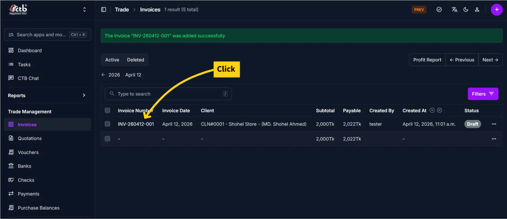
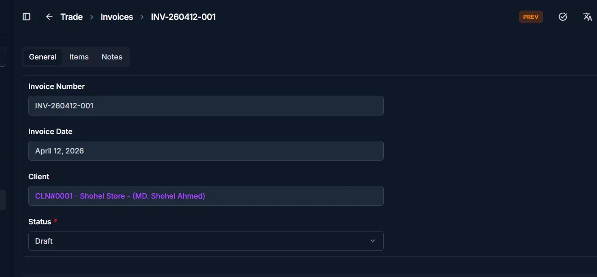
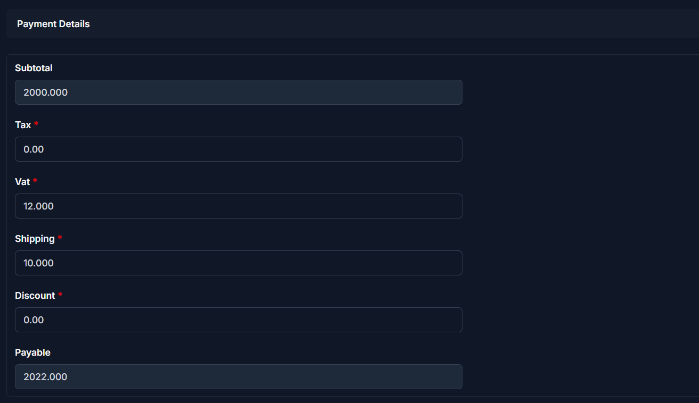
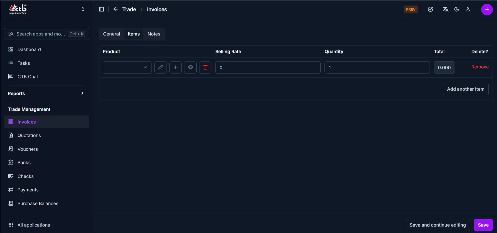

# Edit Invoice

Use this page to update invoice details, items, and payment information. Invoice editing capabilities depend on the invoice status—draft invoices can be fully edited, while sent or finalized invoices have restricted modifications to maintain audit integrity.

## Summary

Use this page to correct or update invoice data after creation, based on status rules. It helps you maintain accurate financial records while protecting finalized transactions.

## When to use this page

- Correcting errors in a draft invoice before sending
- Updating client information or delivery details
- Modifying item quantities or pricing before finalizing
- Adding or removing products from an unsent invoice
- Updating payment details or discounts

## How to access this page

From the sidebar, go to **Trade Management → Invoices**. On the Invoices List page, find the invoice you want to edit and click on the invoice number .

The system opens the **Edit Invoice Page**.

## Step-by-step instructions

1. Open **Trade Management -> Invoices** and select the target invoice.
1. Confirm current status and applicable edit restrictions.
1. Update allowed header fields in **General Information**.
1. Adjust line items and payment-related values if status permits.
1. Add or update internal notes as needed.
1. Save changes and review the updated invoice details.

## Field reference

- **Invoice Number** - Unique identifier for the invoice.
- **Client** - Linked customer account for this invoice.
- **Status** - Controls edit permissions and invoice lifecycle.
- **Subtotal** - Sum of all line-item totals.
- **Payable** - Final amount due after taxes, charges, and discount.

______________________________________________________________________

## Status-Based Edit Restrictions

Invoice editing capabilities depend on the current invoice status:

| Status    | Editable Fields                     | Restrictions                          |
| --------- | ----------------------------------- | ------------------------------------- |
| Draft     | tax,vat,shipping,discount and items | Invoice number, client, date          |
| Sent      | only status                         | Cannot modify client, items, or dates |
| Cancelled | View only; no editing               | Locked; preserves original record     |

!!! warning "Status Controls Permissions"
Some invoices are locked for editing to protect financial records. Check the Status before attempting to edit.

______________________________________________________________________

## General Information

Update the following fields on the General tab:

| Step | Field          | What to Do                | Description                             | Editable When |
| ---- | -------------- | ------------------------- | --------------------------------------- | ------------- |
| 1    | Invoice Number | View or edit (if allowed) | Unique identifier for this invoice      | Draft only    |
| 2    | Invoice Date   | Select new date           | Date the invoice is issued              | Draft only    |
| 3    | Client         | Select different client   | The customer receiving the invoice      | Draft only    |
| 4    | Status         | Select new status         | Current state (Draft, Sent, Paid, etc.) | All           |

!!! note
Once an invoice is Sent or Paid, the Client and Invoice Date become locked to preserve the original transaction record.

______________________________________________________________________

## Payment Details

Update the financial details of the invoice:

| Step | Field    | What to Do         | Description                                                   | Editable When |
| ---- | -------- | ------------------ | ------------------------------------------------------------- | ------------- |
| 1    | Subtotal | View; updates auto | Sum of all item totals (Quantity × Selling Rate)              | Auto-calc     |
| 2    | Tax      | Enter new amount   | Tax to be charged on the order                                | All           |
| 3    | VAT      | Enter new amount   | Value-added tax if applicable                                 | All           |
| 4    | Shipping | Enter new amount   | Shipping or delivery cost                                     | All           |
| 5    | Discount | Enter new amount   | Discount to apply to the invoice                              | All           |
| 6    | Payable  | View; updates auto | Final amount due (Subtotal + Tax + VAT + Shipping - Discount) | Auto-calc     |

______________________________________________________________________

## Edit Items

Modify the products or services on the invoice:

| Step | Field        | What to Do               | Description                           | Editable When |
| ---- | ------------ | ------------------------ | ------------------------------------- | ------------- |
| 1    | Product      | Select different product | The product or service being sold     | Draft only    |
| 2    | Selling Rate | Update price             | Price per unit                        | Draft only    |
| 3    | Quantity     | Change quantity          | Number of units (or quantity)         | Draft only    |
| 4    | Total        | View; updates auto       | Quantity × Selling Rate for this item | Auto-calc     |

**Item modification rules:**

- Click **Add another Item** to add new products (Draft invoices only)
- Click the **trash icon** to remove an item (Draft invoices only)
- Use the **edit icon** to modify an item's details (Draft invoices only)
- On Sent invoices, items cannot be changed

!!! warning "Items Lock After Sending"
Once an invoice is Sent, you cannot add, remove, or modify line items. Create a new invoice or use a credit note to adjust quantities or prices.

______________________________________________________________________

## Notes and Status

Update optional notes or internal comments:

| Step | Field  | What to Do    | Description                           | Editable When |
| ---- | ------ | ------------- | ------------------------------------- | ------------- |
| 1    | Note   | Edit text     | Internal notes or special conditions  | All           |
| 2    | Status | Toggle switch | Show or hide the invoice from reports | All           |

______________________________________________________________________

## Saving Changes

After making edits:

- Click **Save** to apply all changes and return to the Invoice Detail page
- Click **Save and continue editing** to save and remain on the Edit page
- Click **Cancel** to discard changes and return without saving

The invoice is now updated with your changes.

______________________________________________________________________

!!! Tips and Common Issues

- **Draft invoices are fully editable** — Make all corrections before changing Status to Sent  
- **Sent invoices have limited edits** — You can only adjust payment details on sent invoices  
- **Paid invoices are locked** — Do not attempt to edit paid invoices; create an adjustment invoice or credit note instead  
- **Status change is permanent** — Once marked Sent or Paid, you cannot revert to Draft  
- **Audit trail preserved** — The system tracks who edited the invoice and when  

______________________________________________________________________

## Related Pages

- **Invoice Detail** — View complete invoice information and history
- **Create Invoice** — Create a new invoice from scratch
- **Print Invoice** — Generate a printable or shareable invoice document
- **Invoice Reports** — Analyze invoice data and outstanding payments
