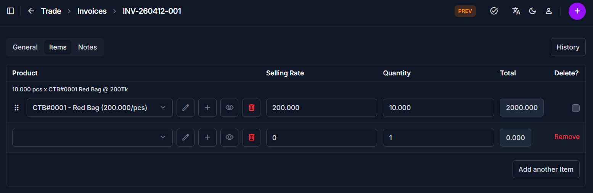
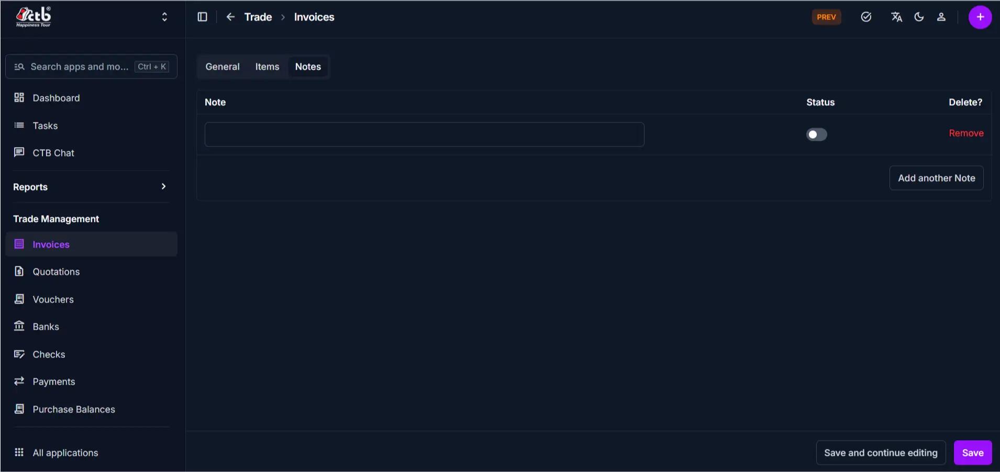

# Invoice Detail

Use this page to view and manage an invoice after it has been created. The invoice detail page displays all components of an invoice—general information, line items, and notes—with buttons to print, generate a chalan, and view change history. Editing capabilities depend on the invoice status.

## Summary

Use this page to review, update, and finalize invoice records based on status permissions. It helps you verify totals, preserve change history, and complete print and delivery-document actions.

## When to use this page

- Viewing a complete invoice record with all line items and calculations
- Checking invoice status and payment information
- Modifying invoice details (if status permits)
- Printing an invoice or chalan for the client
- Reviewing the invoice history and change log

## How to access this page

From the sidebar, go to **Trade Management → Invoices**. On the Invoices List page, click on any invoice number or select an invoice to open the **Invoice Detail page**.

The page displays the invoice with three main tabs: **General**, **Items**, and **Notes**.

______________________________________________________________________

## Page Overview

The invoice detail page includes action buttons at the top-right:

| Button  | Action                                         | Available When         |
| ------- | ---------------------------------------------- | ---------------------- |
| History | View past changes and modifications to invoice | Always visible         |
| Print   | Generate a printable or PDF version            | Invoice status is Sent |
| Chalan  | Generate a delivery chalan (no pricing)        | Invoice status is Sent |

______________________________________________________________________

## General Tab

The General tab displays invoice header information:

| Field          | Description                             | Editable When  |
| -------------- | --------------------------------------- | -------------- |
| Invoice Number | Unique identifier for this invoice      | auto generated |
| Invoice Date   | Date the invoice was issued             | Draft only     |
| Client         | Customer name linked to this invoice    | Draft only     |
| Status         | Current state (Draft, Sent, Cancelled,) | All statuses   |

!!! note "Status Restrictions"

    Once an invoice status is changed from Draft to Sent, the Invoice Number, Invoice Date, and Client become locked to preserve the transaction record.

______________________________________________________________________

## Items Tab

The Items tab displays all products or services on the invoice:

| Column       | Description                                |
| ------------ | ------------------------------------------ |
| Product      | Name of the product or service             |
| Selling Rate | Unit price                                 |
| Quantity     | Number of units                            |
| Total        | Quantity × Selling Rate for each line item |

- Click the **edit icon** on a line item to modify its details (if status is Draft)
- Click the **trash icon** to remove a line item (if status is Draft)
- The **Subtotal** is calculated automatically from all line items

!!! info "Item Editing"

    Line items can only be added, removed, or edited when the invoice is in Draft status. Once sent, items are locked.

______________________________________________________________________

## Payment Details Section

Below the items, the page displays financial calculations:

| Field    | Description                                               | Editable When |
| -------- | --------------------------------------------------------- | ------------- |
| Subtotal | Sum of all item totals (auto-calculated)                  | Auto-calc     |
| Tax      | Tax amount to be charged                                  | All statuses  |
| VAT      | Value-added tax (if applicable)                           | All statuses  |
| Shipping | Shipping or delivery cost                                 | All statuses  |
| Discount | Discount amount to reduce the total                       | All statuses  |
| Payable  | Final amount due (Subtotal + Tax + VAT + Shipping - Disc) | Auto-calc     |

!!! tip

    Payment details (Tax, VAT, Shipping, Discount) can be edited even after the invoice is Sent to adjust final charges.

______________________________________________________________________

## Notes Tab

The Notes tab contains internal comments and visibility settings:

| Field  | Description                              |
| ------ | ---------------------------------------- |
| Note   | Internal notes or special instructions   |
| Status | Toggle to show/hide invoice from reports |

______________________________________________________________________

## Status and Permissions

Invoice editing capabilities vary based on status:

| Status    | View Access | Editable Fields              | Restrictions                |
| --------- | ----------- | ---------------------------- | --------------------------- |
| Draft     | Full        | All fields, items, payments  | None                        |
| Sent      | Full        | Tax, VAT, Shipping, Discount | Cannot edit client or items |
| Cancelled | Full        | View only                    | Locked; no editing allowed  |

!!! warning "Save Changes"

    After making edits, click **Save** at the bottom to apply your changes.

______________________________________________________________________

## Step-by-step instructions

1. Open the **Invoices list** and select an invoice in Draft status
1. Click on the **General tab** to view or edit header information
1. Click on the **Items tab** to view or modify line items
1. Scroll down to update **Payment Details** (Tax, VAT, Shipping, Discount)
1. Click on the **Notes tab** to add internal notes
1. Click **Save** to apply all changes
1. Change the Status to **Sent** when ready to send to the client

## Field reference

- **Invoice Number** - Unique identifier used to track and reference the invoice.
- **Client** - Customer account linked to this invoice.
- **Status** - Controls workflow stage and available edit actions.
- **Subtotal** - Sum of all line-item totals.
- **Payable** - Final amount due after charges and discount.

______________________________________________________________________

## Related Actions

| Action        | Button/Link            | When to Use                            |
| ------------- | ---------------------- | -------------------------------------- |
| Print Invoice | **Print** button       | When status is Sent; email or archive  |
| Print Chalan  | **Chalan** button      | When status is Sent; shipment tracking |
| View History  | **History** button     | Review past edits and who changed it   |
| Edit Invoice  | Click invoice number   | Modify details (if status permits)     |
| Go Back       | Back button or sidebar | Return to invoices list                |

______________________________________________________________________

## Tips and common issues

- **Cannot edit client field?** — Once an invoice is sent, the client is locked. Create a new invoice or contact support if you need to change the client.
- **Items locked after sending?** — Invoice items cannot be edited after Sent status. Add a new invoice for additional items.
- **Always save before leaving** — Use the **Save** button at the bottom of the page. Unsaved changes will be lost.
- **Print disabled?** — The Print and Chalan buttons only work when the invoice is in Sent status.

______________________________________________________________________

## Related pages

- [Create Invoice](create-invoice.md) — Create a new invoice for a client
- [Edit Invoice](edit-invoice.md) — Modify invoice information
- [Print Invoice](print-invoice.md) — Generate a printable invoice document
- [Print Chalan](print-chalan.md) — Generate a delivery chalan
- [Invoice Reports](invoice-reports.md) — View analytics and outstanding payments
