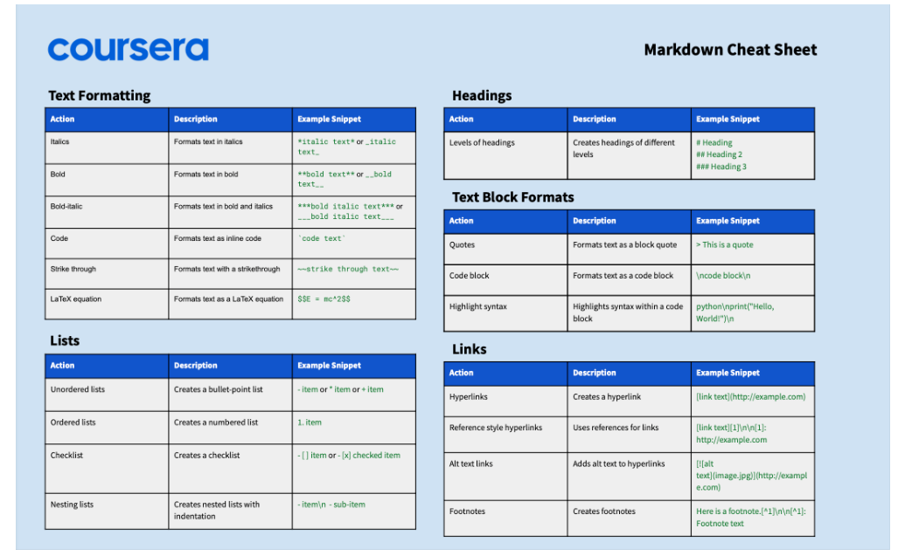

# Invoice Reports

Use this page to review invoice performance, outstanding collections, and trend data for decision-making.

## Summary

Use this page to monitor invoice status, revenue trends, and pending dues from one dashboard. It helps you identify collection risks and sales performance quickly.

## When to use this page

- When reviewing sales and receivable performance.
- When checking unpaid or partially paid invoices.
- When comparing invoice trends across a time period.
- When preparing management summaries or finance follow-up.

## How to access this page

From the left sidebar, go to **Trade Management -> Invoices -> Invoice Reports**.

## Prerequisites

- Invoices already exist in the system.
- You have access permission for invoice reporting views.

## Step-by-step instructions

1. Open **Invoice Reports** from the Invoices section.
1. Set date range and available filters.
1. Review summary metrics (total invoices, due amount, and paid amount).
1. Check status distribution to identify pending and overdue items.
1. Open invoice-level details where follow-up is required.
1. Export or share findings with operations or accounts teams.

## Field reference

- **Date range filter** - Limits report data to a selected period.
- **Status filter** - Narrows data by invoice state such as Draft, Sent, Paid, or Cancelled.
- **Total invoices** - Count of invoices in the filtered view.
- **Outstanding amount** - Sum of dues not yet fully settled.
- **Collected amount** - Sum of payments received against invoices.
- **Invoice list section** - Detailed rows for invoice-level follow-up.

## Tips and common issues

- Use shorter date ranges first when report data is large.
- Validate status filters before interpreting totals.
- Recheck outstanding values after recent payments are posted.

## Related pages

- [Create Invoice](create-invoice.md)
- [Invoice Detail](invoice-detail.md)
- [Print Invoice](print-invoice.md)
- [Add Payment](../payments/add-payment.md)
