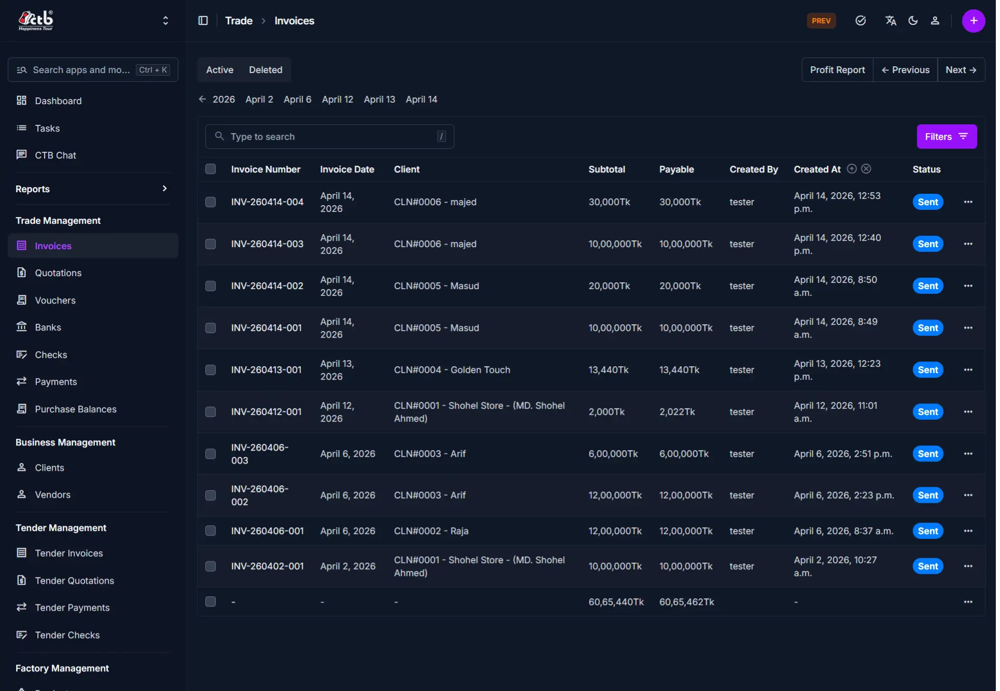

# Invoices Overview

The **Invoices** module is the main control point for managing all sales billing documents in CTB Admin. Use this page to view all invoices, search by invoice number or client, filter by status and date, and quickly access invoices for review, editing, printing, or payment follow-up.

## What you can do in this module

- **Create new invoices** — generate billing documents for clients with line items, taxes, and discounts.
- **View invoice status** — track whether invoices are draft, sent, paid, or cancelled.
- **Edit invoices** — modify invoice details before sending or after creation.
- **Print invoices** — generate PDF invoices or chalans for sharing or archival.
- **Record payments** — mark invoices as paid when payment is received.
- **Analyze invoice data** — use the Invoice Reports page for financial summaries and trends.

______________________________________________________________________

## How to access Invoices Overview page

From the sidebar, go to **Trade → Invoices**.

The system opens the **Invoices List** page where all invoices are displayed.

______________________________________________________________________

## List Page Columns and Fields

The Invoices list displays the following information for each invoice:

| Column             | Description                                                                |
| ------------------ | -------------------------------------------------------------------------- |
| **Invoice Number** | System-generated unique identifier for this invoice (e.g., INV-260414-004) |
| **Invoice Date**   | The billing date used in reports and on the printed invoice                |
| **Client**         | Name of the customer or client linked to this invoice                      |
| **Subtotal**       | Sum of all line item amounts before taxes and discounts                    |
| **Payable**        | The amount still due after discounts, taxes, and credits are applied       |
| **Created By**     | Username of the user who created this invoice                              |
| **Created At**     | Date and time the invoice was created in the system                        |
| **Status**         | Invoice status (Draft, Sent, Paid, Cancelled, or other applicable status)  |

______________________________________________________________________

## Search and Filter

Use the search and filter options to quickly locate specific invoices:

- **Search box** — Type to search by invoice number, client name, or reference
- **Status tabs** — Click **Active** or **Deleted** to filter invoices by their status
- **Filters** — Click **Filters** to narrow results by date range, client, or payable amount
- **Calendar picker** — Click the date arrows to navigate to a specific date

______________________________________________________________________

## List Actions

From the Invoices List page:

- **Create new invoice** — Click the **purple (+) icon** in the top-right corner to create a new invoice
- **View details** — Click on any row to open the full invoice detail page
- **Print invoice** — Click the **print icon** or select **Print** from the actions menu to generate a PDF
- **Edit invoice** — Open an invoice to modify its details (only available for draft or sent invoices)
- **Record payment** — Mark an invoice as paid from the invoice detail page

______________________________________________________________________

## Tips and common issues

- **Search by invoice number first** — Use the invoice number for the fastest lookup
- **Status determines actions** — Some actions like editing or marking as paid are only available for specific invoice statuses
- **Date filters help with reporting** — Use date ranges to view invoices for a specific month or period
- **Check payable amount** — The payable column shows what is still due, not the total invoice amount
- **Client information is required** — Invoices must be linked to a client before they can be sent or paid
- **Draft invoices can be edited** — Make all changes before sending an invoice to avoid confusion
- **Cancelled invoices are not removed** — Cancelled invoices remain in the list for audit purposes but do not appear in reports

______________________________________________________________________

## Related Pages

- **Create Invoice** — Generate a new invoice for a client
- **Edit Invoice** — Update an existing invoice's details
- **Invoice Detail** — View complete information and line items for a specific invoice
- **Invoice Reports** — View financial summaries and analytics across all invoices
- **Quotations** — Create preliminary quotes before generating invoices
- **Payments** — Record and track payments received against invoices
