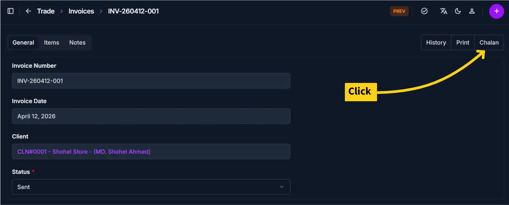

# Print Chalan

Use this page to generate a printable or PDF version of a chalan. A chalan is a delivery document that shows what goods are being shipped to a client without displaying pricing information. The chalan is a useful document for tracking shipments and confirming delivery. The chalan print option is available only when an invoice status is **Sent**.

## Summary

Use this page to generate delivery documentation for shipments without showing financial values. It helps operations teams confirm dispatch details while keeping pricing hidden.

______________________________________________________________________

## When to use this page

- Generating a chalan to send with physical shipments to track goods in transit
- Printing a delivery document to accompany packaged items
- Creating a record of what was delivered without disclosing prices
- Archiving delivery documentation for shipment tracking

______________________________________________________________________

## How to access this page

From the sidebar, go to **Trade → Invoices**. On the Invoices List page, select an invoice with a **Sent** status. Open the invoice detail page and click the **Chalan** button.

The system opens the **Print Chalan Page** in a print preview dialog or new window.

______________________________________________________________________

## Prerequisites

- The invoice status must be **Sent** for the chalan option to be enabled
- The invoice must have client information and line items
- All required invoice fields (Client, Invoice Date, Status) must be filled in

!!! warning "Chalan Option Restriction"

    The chalan option is **only available** when an invoice status is set to **Sent**. If the status is Draft, Cancelled, or any other state, the Chalan button will not be active.

______________________________________________________________________

## Step-by-step instructions

1. Go to the **Invoices list** from **Trade → Invoices**
1. Find and select the invoice for which you want to print a chalan (ensure its status is **Sent**)
1. Click on the invoice to open the **Invoice Detail page**
1. Click the **Chalan** button located at the top of the page
1. The system displays a print preview with the formatted chalan layout
1. Review the delivery details in the preview
1. Click **Print** in your browser's print dialog to print or **Save as PDF** to export as a PDF file
1. Choose your printer or PDF destination and complete the print process

!!! note "Browser Print Dialog"

    The exact print options depend on your browser. Most modern browsers can save as PDF directly from the print dialog.

______________________________________________________________________

## Field reference

- **Chalan Header** - Delivery document identifier and date context.
- **Client Details** - Recipient name and delivery destination.
- **Line Items** - Product and quantity details prepared for delivery.
- **Notes** - Operational delivery instructions.
- **No Pricing Block** - Chalan view intentionally excludes all financial amounts.

______________________________________________________________________

## Chalan view details

The chalan preview includes the following information:

| Section        | Information Shown                                |
| -------------- | ------------------------------------------------ |
| Chalan Header  | Chalan date and tracking reference number        |
| Client Details | Client name and delivery address                 |
| Line Items     | Product/service descriptions and quantities only |
| Notes          | Delivery instructions or special handling notes  |

!!! info "No Pricing Information"

    The chalan intentionally excludes pricing, taxes, and financial totals. It is designed as a delivery document only and does not contain billing information.

______________________________________________________________________

## Tips and common issues

- **Chalan button is greyed out?** — Ensure the invoice status is set to **Sent**. The chalan button is disabled for invoices in Draft or other non-Sent states.
- **Use for shipment tracking** — Print or save the chalan as a PDF to include with physical shipments for receiving and tracking purposes.
- **No prices on chalan** — The chalan intentionally hides pricing information and shows only item quantities and descriptions for delivery purposes.

______________________________________________________________________

## Related pages

- [Create Invoice](create-invoice.md) — Add new invoices for clients
- [Invoice Detail](invoice-detail.md) — View and edit invoice information
- [Print Invoice](print-invoice.md) — Print the full invoice with pricing
- [Invoice Reports](invoice-reports.md) — Generate analytics and reports on invoices
