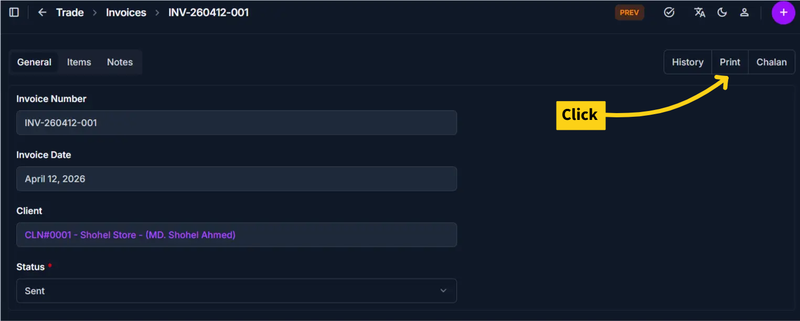

# Print Invoice

Use this page to generate a printable or PDF version of an invoice. The print view displays the invoice in a professional format suitable for sending to clients, filing records, or archiving. The print option is available only when an invoice status is saved as **Sent**.

## Summary

Use this page to produce a shareable invoice output for client communication, filing, and archival. It converts approved invoice details into a print-friendly layout or PDF.

## When to use this page

- Generating a PDF copy of an invoice to send to clients via email
- Printing a physical copy of an invoice for records
- Exporting invoice details in a standardized format
- Creating an archive copy after marking an invoice as Sent

## How to access this page

From the sidebar, go to **Trade Management → Invoices**. On the Invoices List page, select an invoice with a **Sent** status. Open the invoice detail page and click the **Print** button.

The system opens the **Print Invoice Page** in a print preview dialog or new window.

______________________________________________________________________

## Prerequisites

- The invoice status must be **Sent** for the print option to be enabled
- The invoice must be complete with client information, line items, and payment details
- All required fields (Client, Invoice Date, Status) must be filled in

!!! warning "Print Option Restriction"

    The print option is **only available** when an invoice status is being saved as **Sent**. If the status is Draft, Cancelled, or any other state, the Print button will not be active.

______________________________________________________________________

## Step-by-step instructions

1. Navigate to the **Invoices list** from **Trade Management → Invoices**
1. Find and select the invoice you want to print (ensure its status is **Sent**)
1. Click on the invoice to open the **Invoice Detail page**
1. Click the **Print** button located at the top of the page
1. The system displays a print preview with the formatted invoice layout
1. Review the invoice details in the preview
1. Click **Print** in your browser's print dialog to print or **Save as PDF** to export as a PDF file
1. Choose your printer or PDF destination and complete the print process

!!! note "Browser Print Dialog"

    The exact print options depend on your browser. Most modern browsers allow you to save as PDF directly from the print dialog.

______________________________________________________________________

## Field reference

- **Invoice Header** - Displays invoice number, issue date, and company identity.
- **Client Details** - Shows the billed client's contact and address information.
- **Line Items** - Lists products or services, quantities, and rates.
- **Financial Summary** - Shows subtotal, tax, VAT, shipping, discount, and final payable amount.
- **Notes/Terms** - Includes additional instructions or payment notes for the client.

______________________________________________________________________

## Print Invoice View Details

The print preview includes the following information:

| Section           | Information Shown                                       |
| ----------------- | ------------------------------------------------------- |
| Invoice Header    | Invoice number, invoice date, and company name          |
| Client Details    | Client name, address, phone, and email                  |
| Line Items        | Product/service descriptions, quantities, and amounts   |
| Financial Summary | Subtotal, tax, VAT, shipping, discount, and total due   |
| Payment Terms     | Due date and any special payment instructions           |
| Notes             | Additional notes or payment instructions for the client |

______________________________________________________________________

## Tips and common issues

- **Print option is greyed out?** — Ensure the invoice status is set to **Sent**. The print button is disabled for invoices in Draft or other non-Sent states.
- **Save as PDF for records** — Use your browser's "Save as PDF" option to create a permanent digital copy for your files.
- **Formatting issues** — If the invoice preview looks incorrect, make sure all client information and line items are filled in before printing.

______________________________________________________________________

## Related pages

- [Create Invoice](create-invoice.md) — Add new invoices for clients
- [Invoice Detail](invoice-detail.md) — View and edit invoice information
- [Edit Invoice](edit-invoice.md) — Modify invoice details
- [Print Chalan](print-chalan.md) — Print a delivery chalan
- [Invoice Reports](invoice-reports.md) — Generate analytics and reports on invoices
