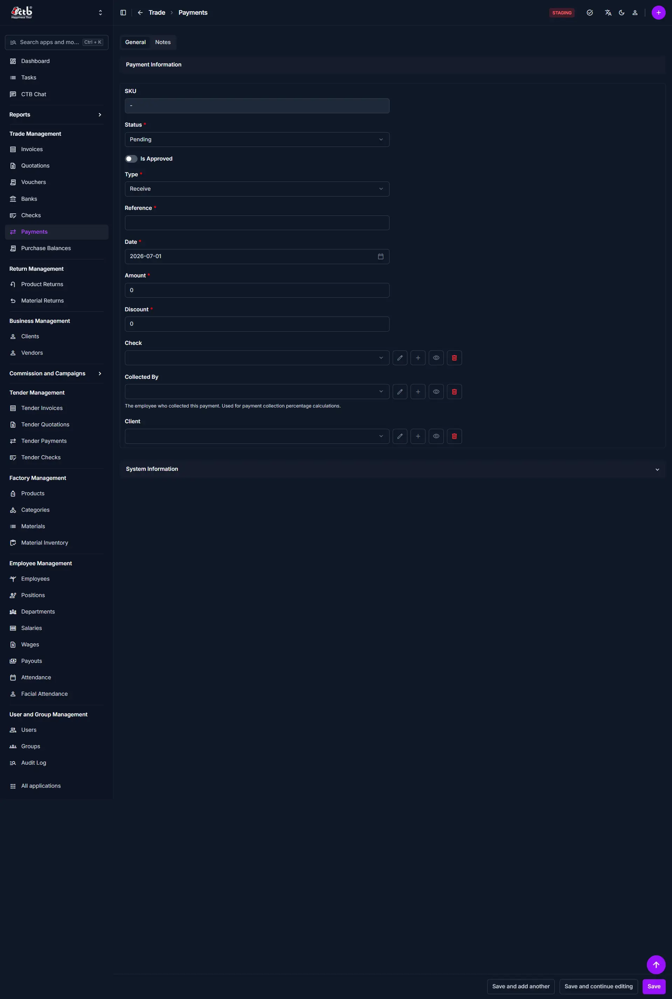
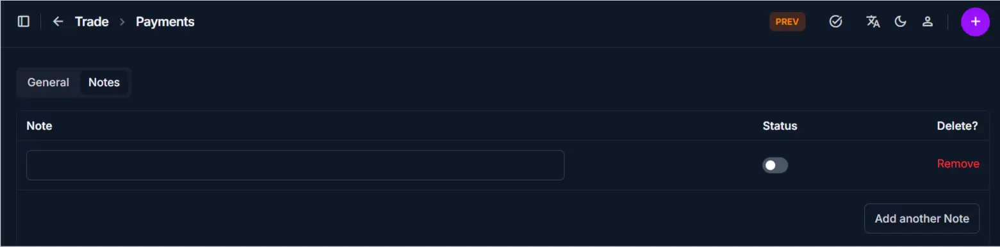

# Add Payment

Use this page to record a payment received from a client or sent to a vendor. Payments track cash flow, invoice settlements, bank checks, and financial transactions within CTB Admin.

## Summary

Use this page to capture incoming and outgoing payments with references, dates, optional check linkage, and approval status. Accurate payment entries keep balances and reconciliation reports reliable.

______________________________________________________________________

## When to use this page

- Recording a payment received from a client for an invoice
- Recording a payment sent to a vendor for purchases
- Applying payments using a bank check
- Creating payment records for bank reconciliation
- Documenting discounts or partial payments

______________________________________________________________________

## How to access this page

From the sidebar, go to **Trade → Payments**. On the Payments List page, click the **purple (+) icon** in the top-right corner.

The system opens the **Add Payment Page**.

______________________________________________________________________

## Step-by-step instructions

1. Go to **Trade → Payments** and click the **purple (+) icon**.
1. Complete the **Payment information** section: set **Status**, **Type**, **Reference**, **Date**, and **Amount**.
1. Select the **Collected By** employee so the payment counts toward commission.
1. Link a **Check** in the **Check and Client selection** section if the payment uses one.
1. Add any context in the **Notes** section.
1. Save the payment using one of the options under **Saving the payment**.

______________________________________________________________________

## Field reference

- **Status** - Payment lifecycle state, such as Pending or Completed.
- **Is Approved** - Toggle to mark the payment as verified and ready for processing.
- **Type** - Direction of payment: Receive or Send.
- **Reference** - External reference number used for tracing transactions.
- **Date** - Date the payment was made or received.
- **Amount** - Payment value recorded in system currency.
- **Discount** - Any discount or adjustment applied to the payment.
- **Check** - Optional check linkage that affects both party and check balances.
- **Collected By** - Employee who collected the payment, used for commission calculation.
- **Client/Vendor** - Counterparty associated with the payment record.

______________________________________________________________________

## Payment information

Fill in the following fields:

| Step | Field        | What to Do       | Description                                                               |
| ---- | ------------ | ---------------- | ------------------------------------------------------------------------- |
| 1    | SKU          | Auto-generated   | Unique identifier for the payment (read-only)                             |
| 2    | Status       | Select status    | Current payment state (Pending, Completed, etc.)                          |
| 3    | Type         | Select type      | Receive (from client) or Send (to vendor)                                 |
| 4    | Reference    | Enter reference  | Reference number or transaction ID                                        |
| 5    | Date         | Select date      | Date the payment was made or received                                     |
| 6    | Amount       | Enter amount     | Total payment amount in the default currency                              |
| 7    | Discount     | Enter discount   | Any discount or adjustment applied (optional)                             |
| 8    | Is Approved  | Toggle on or off | Mark the payment as approved after verification                           |
| 9    | Collected By | Select employee  | Choose the employee who collected the payment for commission calculations |

!!! warning "Required Fields"

    Fields marked with a **red star (\*)** are mandatory.

______________________________________________________________________

## Check and Client selection

| Step | Field        | What to Do           | Description                                                                                    |
| ---- | ------------ | -------------------- | ---------------------------------------------------------------------------------------------- |
| 1    | Check        | Click to select      | Opens a dropdown of all available checks (optional). Selecting one links the payment to check. |
| 3    | Collected By | Select employee      | The employee who collected the payment for commission calculations                             |
| 4    | Client       | Select client/vendor | The party involved in the payment (client or vendor)                                           |

!!! note

    When you select a **Check**, the payment amount will be deducted from both the client/vendor balance AND the check balance. If you leave the **Check** field empty, the payment amount will reduce only the client/vendor balance.

______________________________________________________________________

## Notes

Add optional notes or internal comments related to the payment:

| Step | Field | What to Do | Description                                                    |
| ---- | ----- | ---------- | -------------------------------------------------------------- |
| 1    | Notes | Enter text | Add internal notes, remarks, or special conditions for payment |

!!! tip

    Use the Notes field to document additional details such as payment terms, special instructions, or reasons for discounts applied to the payment.

______________________________________________________________________

## Saving the Payment

After completing all sections:

- Click **Save** to create the payment record
- Click **Save and continue editing** to save and stay on the page
- Click **Save and add another** to save and create another payment immediately

The payment is now recorded in the system.

______________________________________________________________________

## Tips and common issues

- **Check selection is optional** — Leave the Check field empty for non-check payments; only select a check if the payment is from a bank check
- **Check reduces two balances** — When a check is selected, the payment amount reduces both the client/vendor balance and the check balance
- **No check reduces client balance only** — When the Check field is empty, only the client/vendor balance is reduced
- **Type matters** — Use Receive for client payments and Send for vendor payments to ensure correct reporting
- **Reference tracking** — Enter a meaningful reference (check number, transaction ID, or invoice number) for easy reconciliation
- **Dates for reconciliation** — Always set the Date field to match the actual payment date to ensure accurate bank reconciliation
- **Discount field** — Use only for actual discounts or adjustments, not for separate transactions
- **Collected By** — Select the employee who collected the payment so commission calculations can be generated correctly

______________________________________________________________________

## Related pages

- **Payments Overview** — View all payments
- **Payment Detail** — View payment details and history
- **Checks Overview** — Manage bank checks
- **Add Check** — Create a new bank check
- **Invoices Overview** — Manage invoices and sales records
