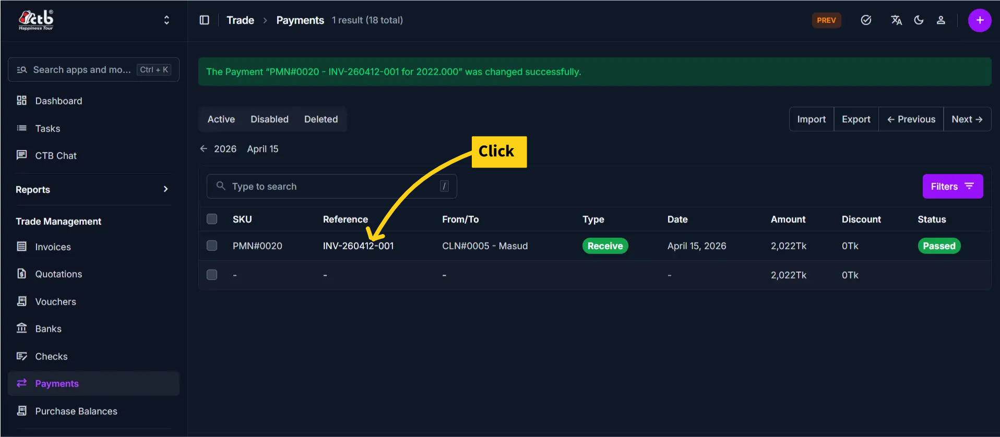
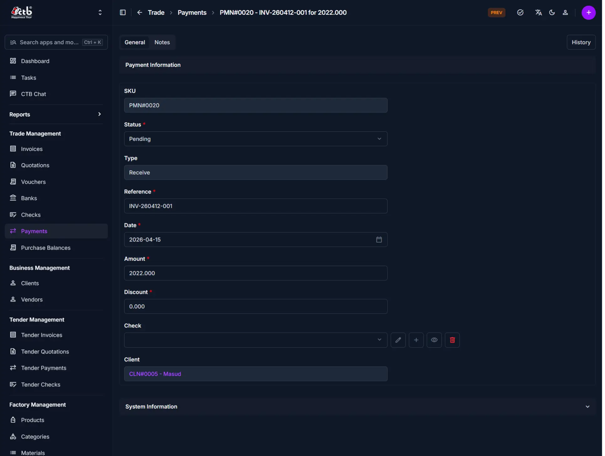

# Edit Payment

Use this page to update payment details, status, and associated information. Payment editing capabilities depend on the payment status—pending payments can be fully edited, while completed or reconciled payments have restricted modifications to maintain financial integrity.

## Summary

Use this page to correct payment records while respecting status-based restrictions. It helps you keep reconciliation, balances, and transaction history accurate.

______________________________________________________________________

## When to use this page

- Correcting errors in payment details before completion
- Updating the payment status (e.g., from Pending to Completed)
- Modifying client, vendor, or check information
- Adjusting payment amounts or discounts
- Adding or updating payment references for reconciliation

______________________________________________________________________

## How to access this page

From the sidebar, go to **Trade → Payments**. On the Payments List page, find the payment you want to edit and click on the payment reference.

The system opens the **Payment Detail page**.

______________________________________________________________________

## Step-by-step instructions

1. Open **Trade → Payments** and select the payment record.
1. Check the current status and confirm what fields can be edited.
1. Update allowed values in **Payment Information**.
1. Update check linkage or notes if needed.
1. Save changes and verify the updated payment details.

______________________________________________________________________

## Field reference

- **Status** - Determines both payment state and edit permissions.
- **Type** - Receive or Send direction for the transaction.
- **Reference** - Traceable identifier for reconciliation.
- **Date** - Effective payment date used in financial reporting.
- **Amount** - Monetary value of the payment.
- **Discount** - Optional adjustment amount applied to payment processing.

______________________________________________________________________

## Status-based edit restrictions

Payment editing capabilities depend on the current payment status:

| Status  | Editable Fields                              | Restrictions                                 | Can Delete |
| ------- | -------------------------------------------- | -------------------------------------------- | ---------- |
| Pending | All fields (status, type, amount, reference) | None; fully editable                         | Yes        |
| Passed  | Status, notes only                           | Cannot modify amount, date, or client/vendor | No         |
| Failed  | View only; no editing                        | Locked; preserves original reconciliation    | Yes        |

!!! warning "Status Controls Permissions"

    Payments with Pending or Failed status can be deleted. Once a payment is marked Passed , it cannot be deleted or edited to protect financial records. Check the Status before attempting to delete or edit.

______________________________________________________________________

## Payment information

Update the following fields in the Payment Information section:

| Step | Field     | What to Do              | Description                                           | Editable When    |
| ---- | --------- | ----------------------- | ----------------------------------------------------- | ---------------- |
| 1    | SKU       | View (read-only)        | Unique identifier for this payment                    | Never            |
| 2    | Status    | Select new status       | Current payment state (Pending, Failed, Passed, etc.) | Pending & Failed |
| 3    | Type      | View or select          | Receive (from client) or Send (to vendor)             | Not Editable     |
| 4    | Reference | Update reference number | Reference ID or transaction number for tracing        | Pending          |
| 5    | Date      | Select new date         | Date the payment was made or received                 | Pending          |
| 6    | Amount    | Enter new amount        | Total payment amount in the default currency          | Pending          |
| 7    | Discount  | Enter new amount        | Any discount or adjustment applied (optional)         | Pending          |

!!! note

    Once a payment is marked Passed, critical fields like Amount and Date become locked to preserve the original transaction record. Status can still be adjusted if needed.

______________________________________________________________________

## Check and Client selection

Update the parties involved in the payment:

| Step | Field  | What to Do               | Description                                                                                   | Editable When |
| ---- | ------ | ------------------------ | --------------------------------------------------------------------------------------------- | ------------- |
| 1    | Check  | Click to select or clear | Links the payment to a specific bank check (optional). Affects both client and check balance. | Pending       |
| 2    | Client | Select different client  | The party involved in the payment (client or vendor receiving/issuing the payment)            | Not Editable  |

!!! note "Check Behavior"

    When you select a Check, the payment amount affects both the client/vendor balance AND the check balance. If you leave Check empty, only the client/vendor balance is changed.

______________________________________________________________________

## Notes and additional information

Add or update optional notes related to the payment:

| Step | Field | What to Do | Description                                    | Editable When |
| ---- | ----- | ---------- | ---------------------------------------------- | ------------- |
| 1    | Notes | Edit text  | Internal notes, remarks, or special conditions | All           |

!!! tip

    Use Notes to document payment terms, special instructions, reasons for delays, or reasons for discounts applied to the payment.

______________________________________________________________________

## Saving changes

After making edits:

- Click **Save** to apply all changes and return to the Payment Detail page
- Click **Save and continue editing** to save and remain on the Edit page

The payment record is now updated with your changes.

______________________________________________________________________

## Tips and common issues

- **Pending and Failed payments are deletable** — Make all corrections or delete before changing Status to Passed
- **Passed payments have limited edits** — You can only adjust Status and Notes on passed payments; cannot delete
- **Failed payments are locked** — Do not attempt to edit or delete failed payments; create a new adjustment payment instead
- **Check selection affects two balances** — Selecting a check reduces both the client balance and the check balance; leaving it empty only affects the client balance
- **Reference for reconciliation** — Update the Reference field with check numbers or transaction IDs to simplify bank reconciliation
- **Audit trail preserved** — The system tracks who edited the payment and when for compliance

______________________________________________________________________

## Related pages

- **Payments Overview** — View all recorded payments
- **Payment Detail** — View complete payment information and history
- **Add Payment** — Create a new payment record
- **Checks Overview** — Manage bank checks
- **Invoices Overview** — Manage invoices and payment references
