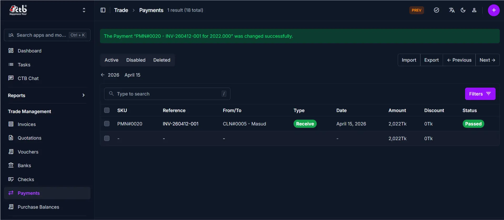

# Payments Overview

The **Payments** module in CTB Admin records all incoming and outgoing financial transactions. A payment represents money received from a client for an invoice, money sent to a vendor for purchases, or payments made using bank checks. Each payment record tracks the transaction date, amount, status, and links to the client, vendor, or check involved. Payment records update client and vendor balances automatically and enable accurate bank reconciliation.

## What you can do in this module

- **Record client payments** — Log money received from clients against invoices.
- **Record vendor payments** — Log money sent to vendors for purchases or services.
- **Link payments to bank checks** — Associate payments with specific bank checks to track check usage and reduce check balances.
- **Track payment status** — Monitor whether payments are Pending, Passed (reconciled), or Failed.
- **Apply discounts** — Record discounts or adjustments on payments.
- **View payment history** — Access all transaction details, notes, and change logs from the Payment Detail page.
- **Add internal notes** — Document payment terms, references, or special instructions.
- **Reconcile accounts** — Match payment records with bank statements and invoices.

______________________________________________________________________

## Module structure

| Page           | Purpose                                                                |
| -------------- | ---------------------------------------------------------------------- |
| Overview       | This page. Module summary and navigation guide.                        |
| Payments List  | View all payments with filters, search, and bulk actions.              |
| Add Payment    | Create a new payment record and link it to a client, vendor, or check. |
| Edit Payment   | Update payment details (if status permits).                            |
| Payment Detail | View a payment's full record, status, notes, and transaction history.  |

______________________________________________________________________

## Typical workflow

1. **Add** a new payment when you receive money from a client or send money to a vendor.
1. **Link to a check** (optional) if the payment is from or using a bank check.
1. **View the Payment Detail** page to verify the payment was recorded correctly.
1. **Edit the payment** to update details, status, or notes (only for Pending payments).
1. **Mark as Passed** when the payment has been reconciled with your bank statement.

______________________________________________________________________

## Related modules

- **Business → Clients** — Client records maintain opening balances that payments update.
- **Business → Vendors** — Vendor records maintain payable amounts that payments reduce.
- **Trade → Invoices** — Payments are recorded against invoices to mark them as paid.
- **Trade → Checks** — Bank checks can be linked to payments to track check usage and reduce check balances.
- **Trade → Banks** — Bank records are used for reconciliation and tracking account balances.
