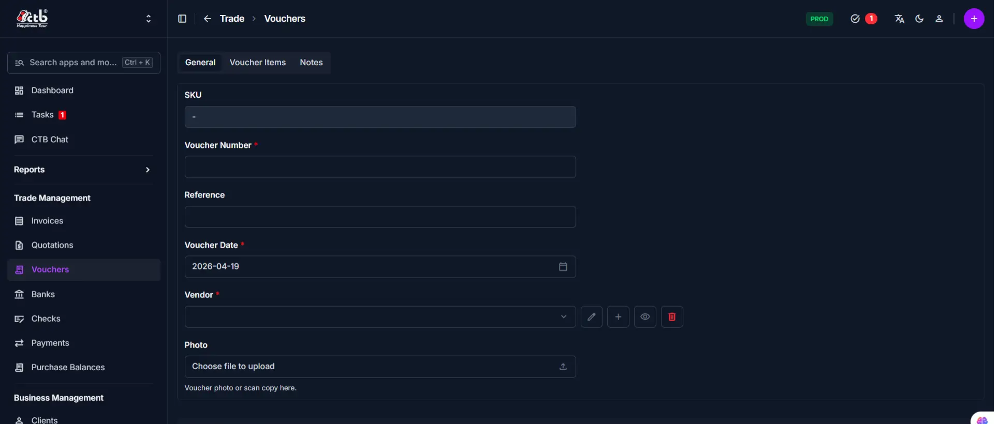
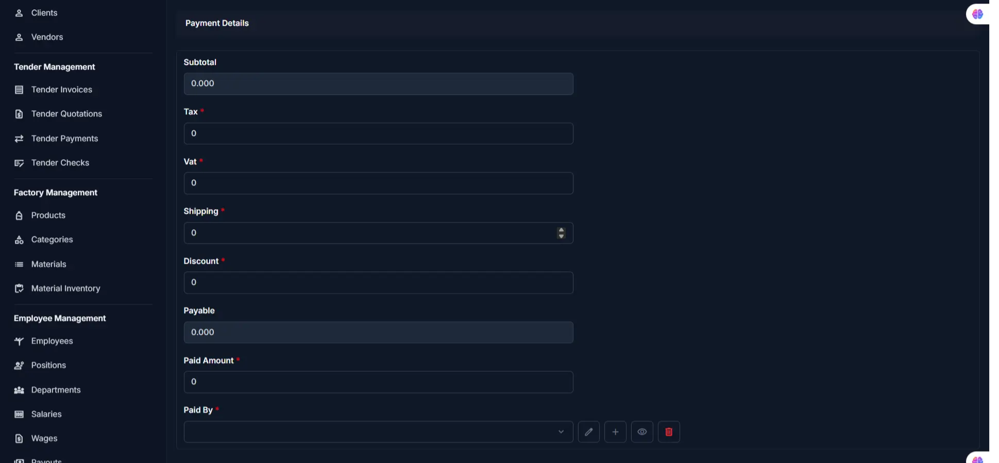
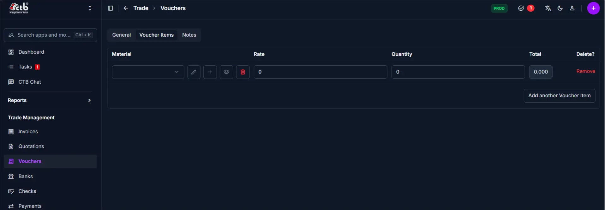

# Create Voucher

## Summary

Use this page to create a voucher for recording purchases from vendors. A voucher documents the receipt of materials or services and tracks payment obligations. Vouchers are used to manage accounts payable, record vendor transactions, and generate procurement reports.

______________________________________________________________________

## When to use this page

- Recording purchases of materials from vendors
- Documenting received goods with associated costs
- Creating a payment record for vendor-supplied materials
- Tracking outstanding payables to vendors

______________________________________________________________________

## How to access this page

From the sidebar, go to **Trade → Vouchers**. On the Vouchers List page, click
the **purple (+) icon** in the top-right corner.

The system opens the **Create Voucher Page**.

______________________________________________________________________

## Step-by-step instructions

1. Open **Create Voucher** from the **Trade** section of the sidebar.
1. Complete the **General information** section described below.
1. Complete the **Payment details** section described below.
1. Complete the **Add Voucher items** section described below.
1. Complete the **Notes** section described below.
1. Follow **Saving the Voucher** below to finish.

______________________________________________________________________

## Field reference

### General information

Fill in the following fields on the **General** tab:

| Step | Field          | What to Do     | Description                                         |
| ---- | -------------- | -------------- | --------------------------------------------------- |
| 1    | SKU            | Auto-generated | System-generated identifier for the voucher         |
| 2    | Voucher Number | Enter number   | Unique reference number for this voucher            |
| 3    | Reference      | Enter text     | External reference (e.g., vendor invoice number)    |
| 4    | Voucher Date   | Select date    | Date the voucher is created (defaults to today)     |
| 5    | Vendor         | Select vendor  | The vendor or vendor associated with this voucher   |
| 6    | Photo          | Upload file    | Attach a photo or scan copy of the physical voucher |

!!! warning

    Fields marked with a **red star (\*)** are mandatory.

### Payment details

After adding voucher items, configure the financial details:

| Step | Field       | What to Do      | Description                                                   |
| ---- | ----------- | --------------- | ------------------------------------------------------------- |
| 1    | Subtotal    | Auto-calculated | Sum of all item totals (Quantity × Rate)                      |
| 2    | Tax         | Enter amount    | Tax charged on the purchase                                   |
| 3    | VAT         | Enter amount    | Value-added tax if applicable                                 |
| 4    | Shipping    | Enter amount    | Shipping or delivery cost                                     |
| 5    | Discount    | Enter amount    | Discount applied to the voucher                               |
| 6    | Payable     | Auto-calculated | Final amount due (Subtotal + Tax + VAT + Shipping - Discount) |
| 7    | Paid Amount | Enter amount    | Amount already paid to the vendor                             |
| 8    | Paid By     | Select option   | Payment method or account used for payment                    |

!!! note

    Subtotal and Payable are calculated automatically based on other fields.

### Add Voucher items

Add materials to the voucher using the **Voucher Items** tab:

| Step | Field    | What to Do           | Description                          |
| ---- | -------- | -------------------- | ------------------------------------ |
| 1    | Material | Select from dropdown | The material or item being purchased |
| 2    | Rate     | Enter rate           | Cost per unit of the material        |
| 3    | Quantity | Enter quantity       | Number of units received             |
| 4    | Total    | Auto-calculated      | Quantity × Rate for this item        |

- Click **Add another Voucher Item** to add multiple materials to one voucher
- Click **Remove** to delete a voucher item
- Use the **edit (pencil) icon** to modify material details
- Use the **view (eye) icon** to preview material information
- Use the **(+) icon** to quickly add a new material record

!!! tip

    Each item's total is calculated automatically once you enter Rate and Quantity.

### Notes

Add optional notes or internal comments using the **Notes** tab:

| Step | Field | What to Do | Description                          |
| ---- | ----- | ---------- | ------------------------------------ |
| 1    | Note  | Enter text | Internal notes or special conditions |

______________________________________________________________________

## Saving the Voucher

After completing all sections:

- Click **Save** to create the voucher
- Click **Save and continue editing** to save and remain on the page
- Click **Save and add another** to save and create a new voucher immediately

The voucher is now recorded and available for payment processing and reporting.

______________________________________________________________________

## Tips and common issues

- **Vendor is required** — You must select a vendor before saving
- **Voucher Number is required** — Enter a unique reference number for each voucher
- **Items add to Subtotal** — The voucher calculates Subtotal automatically when you add items
- **Paid Amount tracks partial payments** — Enter the amount paid so far to track outstanding balances
- **Upload a scan for audit trails** — Attach a photo or scan of the physical voucher for record-keeping
- **Date affects reporting** — Voucher Date determines which reporting period the voucher appears in

______________________________________________________________________

## Related pages

- **Voucher Detail** — View or edit voucher details after creation
- **Edit Voucher** — Update voucher information and items
- **Vendors** — Manage vendor records linked to vouchers
- **Purchase Balances** — Track outstanding payables to vendors
