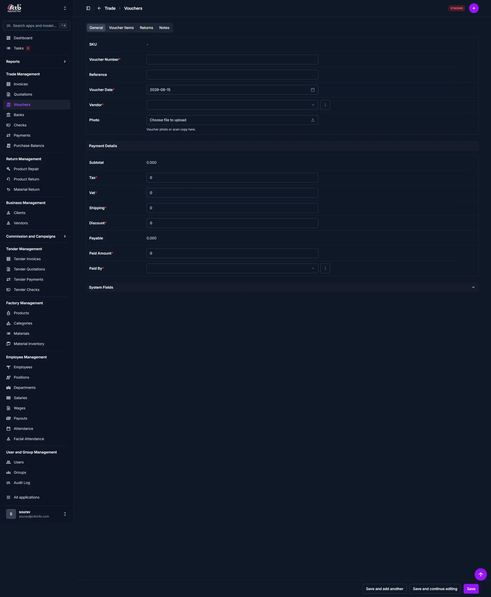

# Create Voucher

<!-- metadata: owner: trade_team, last_updated: 2026-07-26, git_ref: main, staging_verified: true -->

## Summary

Use this page to record vendor purchase vouchers for raw materials or stock inventory. A voucher documents received goods, tracks accounts payable, records partial or full payments, and attaches scanned physical receipts.

______________________________________________________________________

## When to use this page

- Recording raw material purchases or fabric procurement from vendors
- Documenting incoming goods with associated unit costs and freight charges
- Attaching digital scans or photos of physical vendor receipts for audit compliance
- Tracking outstanding accounts payable balances for vendors

______________________________________________________________________

## How to access this page

From the sidebar, go to **Trade → Vouchers** (`/en/admin/Trade/voucher/`). On the Vouchers List page, click the **purple (+) icon** in the top-right corner.

______________________________________________________________________

## Prerequisites

- **Active Vendor**: The vendor must exist in **Business → Vendors**.
- **Material Catalog**: Raw materials or inventory items must be registered under **Factory → Materials**.
- **Required User Permissions**:
    - `Trade | Voucher | Can add Voucher` (`trade.add_voucher`)
    - `Trade | Voucher | Can change Voucher` (`trade.change_voucher`)

______________________________________________________________________

## Step-by-step instructions

1. Open **Trade → Vouchers** and click **(+) Add Voucher**.
1. Enter the **Voucher Number** provided on the vendor's physical receipt.
1. Select the supplying **Vendor** from the dropdown menu.
1. Specify the **Voucher Date** and optional **Reference** code.
1. Upload a photo or scan of the receipt under **Photo** if required for audit.
1. Switch to the **Voucher Items** tab to add one or more material line items. See "Adding items to the voucher" below for detailed steps.
1. Set order charges: **Tax**, **VAT**, **Shipping**, and **Discount**.
1. Enter **Paid Amount** and select the **Paid By** employee if a payment was issued.
1. Click **Save** to record the purchase voucher.

______________________________________________________________________

## Verification & definition of done

- **Auto-Generated SKU**: The system assigns a unique voucher SKU (`VCH-YYYYMMDD-XXXX`).
- **Inventory Update**: Stock balances for linked materials increase according to received quantities.
- **Payable Ledger**: The net payable (`Subtotal + Tax + VAT + Shipping - Discount - Paid Amount`) credits the vendor's accounts payable.

______________________________________________________________________

## Field reference

| Field Name         | Type    | Required | Backend Validation / Constraints              | Description                                        |
| :----------------- | :------ | :------- | :-------------------------------------------- | :------------------------------------------------- |
| **SKU**            | Text    | Auto     | Prefix `VCH`, read-only                       | Unique tracking SKU assigned by system.            |
| **Voucher Number** | Text    | Yes      | Max 50 characters                             | External voucher number from vendor.               |
| **Reference**      | Text    | No       | Max 100 characters                            | Optional internal reference code.                  |
| **Voucher Date**   | Date    | Yes      | Default: `timezone.now`                       | Date goods were received.                          |
| **Vendor**         | Select  | Yes      | Foreign Key (`Business.Vendor`), `PROTECT`    | Supplying vendor account.                          |
| **Photo**          | File    | No       | Upload size `1000x1448`, resized image        | Scanned image or digital copy of physical voucher. |
| **Subtotal**       | Decimal | Auto     | Max 13 digits, 3 decimal places               | Calculated sum of material line items.             |
| **Tax**            | Decimal | No       | Default `0.00`, 2 decimal places              | Purchase tax applied.                              |
| **VAT**            | Decimal | No       | Default `0.00`, 3 decimal places              | Value-added tax.                                   |
| **Shipping**       | Decimal | No       | Default `0.00`, 3 decimal places              | Freight and transport costs.                       |
| **Discount**       | Decimal | No       | Default `0.00`, 2 decimal places              | Purchase discount granted by vendor.               |
| **Payable**        | Decimal | Auto     | `Subtotal + Tax + VAT + Shipping - Discount`  | Net total obligation.                              |
| **Paid Amount**    | Decimal | No       | Default `0.00`, 3 decimal places              | Amount paid immediately upon receipt.              |
| **Paid By**        | Select  | No       | Foreign Key (`Employee.Employee`), `SET_NULL` | Staff member who executed payment.                 |

______________________________________________________________________

<!-- Voucher items field reference table: placed below the main Field reference table -->

### Voucher item fields

| Field Name | Type | Required | Backend Validation / Behavior | Description |
| :--------- | :--- | :------: | :---------------------------- | :---------- |
| **Material** | Select | Yes | Foreign Key (`Factory.Material`) — selectable from catalog; plus (+) icon to add new material inline (requires `Factory | Materials | Can add Material`) | Material or inventory item received. Use the dropdown to select an existing material. The pencil icon edits the selected material; the eye icon views details. |
| **Rate** | Decimal | Yes | Must be >= 0; 3 decimal places typical | Unit cost for the material; used to compute the line total. Editable per line. |
| **Quantity** | Decimal | Yes | Accepts decimals for weight/measure-based materials | Quantity received. Combined with Rate to compute the line Total. |
| **Total** | Decimal | Auto | Calculated as `Rate × Quantity`; updates in real time | Line total amount. Read-only in the line; included in Subtotal. |
| **Delete?** | Action link | No | Remove link deletes the line from the voucher before save | Click **Remove** to delete the current line. Deleting an already-saved line requires saving the voucher to persist inventory changes. |
| **Row actions** | Icons | No | Inline icons: pencil (edit material), + (create new material), eye (view material), trash (remove material from catalog — requires catalog perms) | Quick access actions for managing materials directly from the voucher line. |

Notes

- Use the **Add another Voucher Item** button to append blank rows for additional materials; totals recompute automatically.
- Subtotal and Payable totals recalculate whenever any line Total changes. Confirm Subtotal before saving.
- Saving the voucher updates material inventory balances; use **Save and continue editing** to test image uploads or data without leaving the page.
- Inline material creation or deletion requires the appropriate `Factory | Materials` permissions; catalog deletions do not retroactively remove materials from saved vouchers.

## Exception handling & error recovery

| Error Symptom / Message                           | Root Cause                                                           | Step-by-Step Remediation                                                                                 |
| :------------------------------------------------ | :------------------------------------------------------------------- | :------------------------------------------------------------------------------------------------------- |
| **"Cannot delete vendor with existing vouchers"** | Django protection constraint (`models.PROTECT`) locks vendor record. | 1. Reassign or archive vouchers before removing vendor. 2. Deactivate vendor instead of deleting.     |
| **Image upload fails**                            | File format unsupported or file size exceeds server limits.          | 1. Ensure file is JPG/PNG format under 5 MB. 2. Upload image and click **Save and continue editing**. |
| **Material stock count out of sync**              | Line item deleted without resaving voucher.                          | 1. Open voucher in edit mode. 2. Remove line item and click **Save** to update material inventory.    |

______________________________________________________________________

## Related workflows & next steps

- **Record Vendor Payment** — Issue payments against unpaid voucher balances.
- **Material Inventory** — Inspect raw material stock levels updated by this voucher.
- **Vendor Ledger** — Review statement of accounts payable.

______________________________________________________________________

## Related pages

- **Voucher Detail** — View or edit voucher details after creation
- **Edit Voucher** — Update voucher information and items
- **Vendors** — Manage vendor records linked to vouchers
- **Purchase Balances** — Track outstanding payables to vendors
