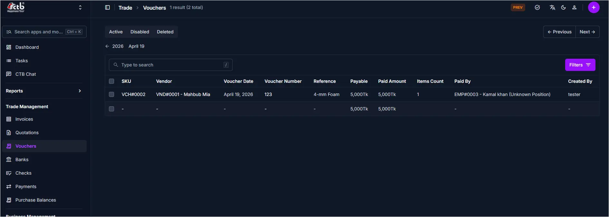

# Vouchers Overview

## Summary

The **Vouchers** page lets you review all voucher records, check their status, and open individual vouchers for more detail or editing. Use this section to track non-invoice financial entries and confirm which vouchers are active, disabled, or deleted.

______________________________________________________________________

## When to use this page

- Review all voucher records in one place
- Find a voucher by vendor, reference, or date
- Open a voucher for details or updates
- Check voucher status before reconciliation

______________________________________________________________________

## How to access this page

1. From the sidebar, go to **Trade Management → Vouchers**.
1. The list page shows vouchers grouped by **Active**, **Disabled**, and **Deleted**.
1. Select a record to open the voucher detail page.

______________________________________________________________________

## Page sections

### Voucher List

The main list displays each voucher record on a single page.

Key columns include:

- **SKU** — Internal reference for the voucher
- **Vendor** — Linked vendor name and code
- **Voucher Date** — Date the voucher was created or recorded
- **Voucher Number** — Unique number for the voucher
- **Reference** — Description or note for the voucher
- **Payable** — Amount due on the voucher
- **Paid Amount** — Amount already paid
- **Items Count** — Number of items included in the voucher
- **Paid By** — Employee who processed the payment
- **Created By** — User who created the voucher

### Search and filters

- Use the search field to find vouchers by vendor, number, or reference.
- Use the **Active / Disabled / Deleted** tabs to filter records by status.
- Use the **Filters** button to narrow results by additional values.

______________________________________________________________________

## Best practices

- Use clear references so finance staff can find vouchers quickly.
- Check the voucher status before editing, as some may become read-only.
- If a voucher is missing, confirm it was saved in the correct module.

______________________________________________________________________

## Related Pages

- **Add Voucher** — Record a new voucher entry
- **Voucher Detail** — Review or update voucher information
- **Banks Overview** — Manage bank accounts and transactions
- **Payments Overview** — Track payment records and statuses
