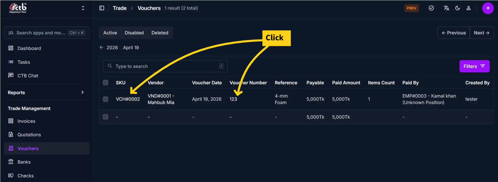
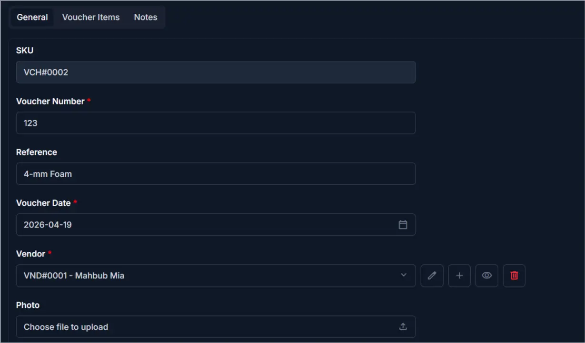
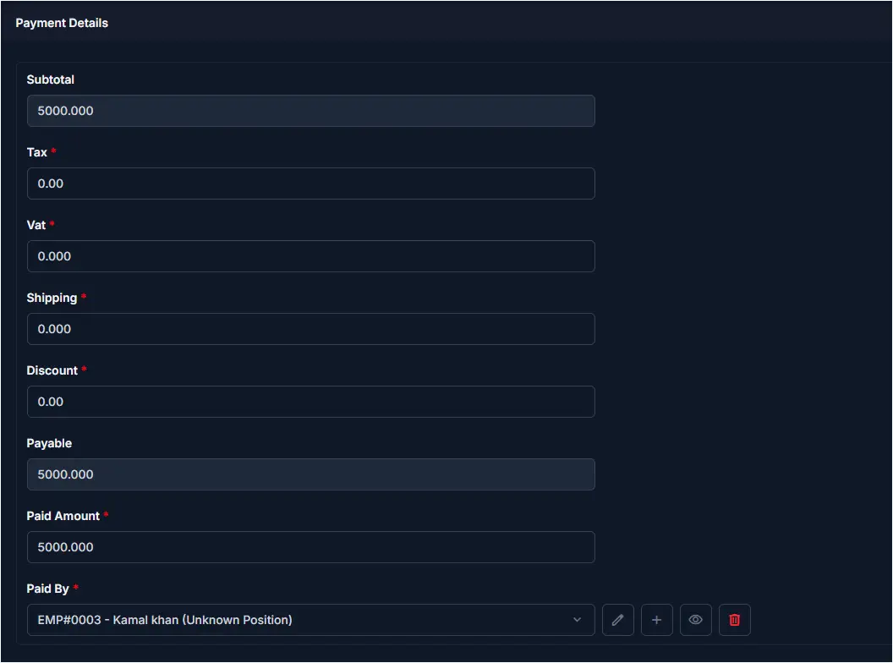
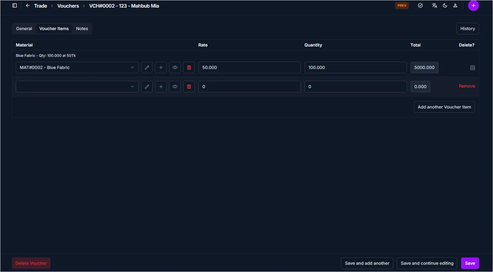

# Voucher Detail

Use this page to view and manage a voucher after it has been created. The voucher detail page displays all components of a voucher—general information, voucher items, and notes—with a button to view change history. Editing capabilities are available directly on this page.

## When to use Voucher Detail

- Viewing a complete voucher record with all materials and calculations
- Checking voucher payment information and paid amount
- Modifying voucher details, items, or payment fields
- Reviewing the voucher history and change log
- Deleting a voucher that is no longer needed

## How to access this page

From the sidebar, go to **Trade Management → Vouchers**. On the Vouchers List page, click on any voucher number or SKU to open the **Voucher Detail page**.

The page displays the voucher with three main tabs: **General**, **Voucher Items**, and **Notes**.

______________________________________________________________________

## Page Overview

The voucher detail page includes an action button at the top-right:

| Button  | Action                                         | Available When |
| ------- | ---------------------------------------------- | -------------- |
| History | View past changes and modifications to voucher | Always visible |

______________________________________________________________________

## General Tab

The General tab displays voucher header information:

| Field          | Description                                       |
| -------------- | ------------------------------------------------- |
| SKU            | Auto-generated unique stock-keeping identifier    |
| Voucher Number | Unique identifier for this voucher                |
| Reference      | Optional reference number or external document ID |
| Voucher Date   | Date the voucher was issued                       |
| Vendor         | The supplier linked to this voucher               |
| Photo          | Attached voucher photo or scan copy               |

!!! note "Required Fields"
Fields marked with a **red star (\*)** are mandatory and must be filled before saving.

______________________________________________________________________

## Payment Details Section

Below the general fields, the page displays financial information:

| Field       | Description                                                   | Editable  |
| ----------- | ------------------------------------------------------------- | --------- |
| Subtotal    | Sum of all item totals (auto-calculated)                      | Auto-calc |
| Tax         | Tax amount charged on the voucher                             | Yes       |
| VAT         | Value-added tax if applicable                                 | Yes       |
| Shipping    | Shipping or delivery cost                                     | Yes       |
| Discount    | Discount amount applied to reduce the total                   | Yes       |
| Payable     | Final amount due (Subtotal + Tax + VAT + Shipping - Discount) | Auto-calc |
| Paid Amount | Amount already paid to the vendor                             | Yes       |
| Paid By     | Employee or method used to make the payment                   | Yes       |

!!! note
**Subtotal** and **Payable** are calculated automatically based on other fields.

______________________________________________________________________

## Voucher Items Tab

The Voucher Items tab displays all materials or services on the voucher:

| Column   | Description                            |
| -------- | -------------------------------------- |
| Material | Name and code of the material procured |
| Rate     | Price per unit                         |
| Quantity | Number of units received               |
| Total    | Quantity × Rate for each line item     |

- Each item row shows a **summary label** above it (e.g., *Blue Fabric - Qty: 100.000 at 50Tk*) for quick reference
- Click the **edit icon** on a line item to modify its details
- Click the **trash icon** to delete a line item
- Click **Add another Voucher Item** to add more materials to the voucher
- Click **Remove** on an empty or unwanted row to discard it

!!! tip
Each item's total is calculated automatically once Rate and Quantity are entered.

______________________________________________________________________

## Notes Tab

The Notes tab contains internal comments for the voucher:

| Field | Description                                    |
| ----- | ---------------------------------------------- |
| Note  | Internal notes, special conditions, or remarks |

______________________________________________________________________

## Saving Changes

After making edits on any tab:

- Click **Save** to apply changes and stay on the detail page
- Click **Save and continue editing** to save and remain in edit mode
- Click **Save and add another** to save and immediately create a new voucher

!!! warning "Save Changes"
After making edits, always click **Save** at the bottom-right to apply your changes. Unsaved changes will be lost if you navigate away.

______________________________________________________________________

## Deleting a Voucher

A **Delete Voucher** button is available at the bottom-left of the page.

!!! warning "Permanent Action"
Deleting a voucher is permanent. Ensure the voucher is no longer needed before confirming deletion.

______________________________________________________________________

## Tips and Common Issues

- **Vendor is required** — You must select a vendor before saving  
- **Subtotal is auto-calculated** — It updates automatically as you add or modify voucher items  
- **Discount reduces Payable** — Enter a discount to lower the final amount due  
- **Paid Amount tracks settlement** — Keep Paid Amount updated to reflect actual payments made 
- **Photo upload supported** — Attach a physical voucher scan for document record-keep 
- **History tracks all changes** — Use the History button to audit who changed what and when 

______________________________________________________________________

## Related Pages

- [Vouchers Overview](overview.md) — View all vouchers and search by vendor or date
- [Create Voucher](add-voucher.md) — Create a new voucher for a vendor
- [Vendor Overview](../../01-business/vendors/overview.md) — Manage vendor profiles and contact information
- [Purchase Balance](../../04-employee/purchase-balance/overview.md) — Track outstanding payments to vendors
- [Materials Overview](../../02-factory/materials/overview.md) — View and manage available materials
