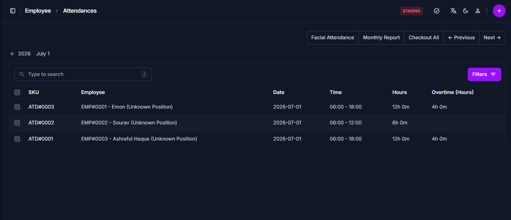

# Attendance Overview

<!-- metadata: owner: hr, last_updated: 2026-07-26, git_ref: main, staging_verified: true -->

## Summary

Use the **Attendance Overview** page to inspect, search, and manage daily employee presence logs in CTB Admin. The attendance table provides a master view of shift logs, check-in/out times, work minutes, and attendance status pills used in payroll processing.

______________________________________________________________________

## When to use this page

- Auditing daily attendance logs across factory floor and office teams
- Searching for specific employee shift records by name or date range
- Identifying missing or unverified attendance entries before salary generation
- Accessing manual attendance entry forms for shift corrections

______________________________________________________________________

## How to access this page

From the sidebar navigation, select **Employee → Attendance** (`/admin/employee/attendance/`).

______________________________________________________________________

## Prerequisites

- **Permissions:** `employee.view_attendance` permission codename (HR, Accountant, Manager, or Superuser role).
- **Active Records:** Active **Employee** profiles.

______________________________________________________________________

## Step-by-step instructions

1. Open **Attendance** from the **Employee** section of the sidebar.
1. Review the attendance records list for employee presence and status.
1. Use the search bar to locate records by employee name or SKU.
1. Click **Filters** to narrow results by shift date range or employee status.
1. Click **(+) Add Attendance** to log a new entry, or click a row to edit.

______________________________________________________________________

## Verification and definition of done

- Master list correctly renders attendance entries with shift timestamps and status pills.
- Filter criteria accurately constrain visible logs for payroll review.

______________________________________________________________________

## Field reference

### Table summary

| Column     | Required | What to Do  | Description                                             |
| ---------- | -------- | ----------- | ------------------------------------------------------- |
| Employee   | Yes      | Click link  | Name of staff member                                    |
| Date       | Yes      | View date   | Shift attendance date                                   |
| Status     | Yes      | View status | Attendance state (`Present`, `Absent`, `Late`, `Leave`) |
| Shift      | No       | View value  | Assigned work shift                                     |
| Time in    | Yes      | View time   | Clock-in shift timestamp                                |
| Time out   | No       | View time   | Clock-out shift timestamp                               |
| Note       | No       | View text   | Exception notes or correction reason                    |
| Created By | No       | View user   | System username that logged the record                  |

______________________________________________________________________

## Exception handling and error recovery

| Symptom / Error Message      | Root Cause                                        | Remediation Action                                                                                 |
| ---------------------------- | ------------------------------------------------- | -------------------------------------------------------------------------------------------------- |
| Attendance entry not visible | Filter date range excludes target attendance date | Click **Filters** and widen or reset the date range                                                |
| Attendance status incorrect  | Incorrect clock-in time logged                    | Open the record and update clock-in/out timestamps under [Record Attendance](record-attendance.md) |

______________________________________________________________________

## Related pages

- [Record Attendance](record-attendance.md) — Log or edit daily attendance entries
- [Employees Overview](../employees/overview.md) — Manage staff profile details
- [Generate Salary](../salary/generate-salary.md) — Calculate salary using attendance logs
