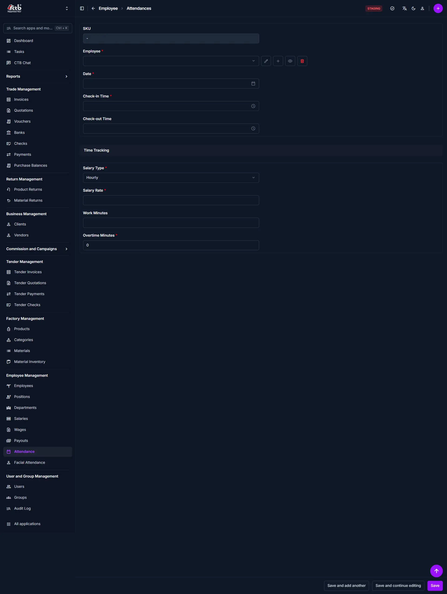

# Record Attendance

Use this page to enter attendance manually when records are not coming from an automatic attendance source.

## Summary

Record Attendance lets you capture a staff member’s work day when automatic attendance is unavailable or needs correction. Enter time details, salary type, and minutes worked so payroll and reporting stay accurate.

______________________________________________________________________

## When to use this page

- When an employee missed automatic time capture.
- When you need to correct a saved attendance entry.
- When attendance must be recorded manually for payroll.
- When you need to enter overtime details for hourly staff.

______________________________________________________________________

## How to access this page

From the sidebar, go to **Employee → Attendance**. On the Attendances page, click the **purple (+) icon** or **Add Attendance**.

The system opens the **Record Attendance** page.

______________________________________________________________________

## Step-by-step instructions

1. Go to **Employee → Attendance** and open the attendance form.
1. Select the **Employee** and the **Date** the entry applies to.
1. Enter **Check-in Time** and, if the day is complete, **Check-out Time**.
1. Set **Salary Type** and **Salary Rate** for the entry.
1. Enter **Work Minutes**, and **Overtime Minutes** if any were worked.
1. Save the record.

______________________________________________________________________

## Field reference

| Field name           | What to do                 | Description                                                     |
| -------------------- | -------------------------- | --------------------------------------------------------------- |
| **SKU**              | Review the record ID       | System-generated identifier for the attendance record           |
| **Employee**         | Select an employee         | The staff member who is present or absent for this record       |
| **Date**             | Choose the attendance date | The day the attendance entry applies to                         |
| **Check-in Time**    | Enter the start time       | Start time for the work day                                     |
| **Check-out Time**   | Enter the end time         | End time for the work day, if available                         |
| **Salary Type**      | Select the pay structure   | The salary model used for this attendance entry, such as Hourly |
| **Salary Rate**      | Enter the rate             | The rate used to calculate pay for the attendance period        |
| **Work Minutes**     | Enter worked minutes       | Total minutes worked during the normal shift                    |
| **Overtime Minutes** | Enter overtime minutes     | Additional minutes worked beyond the normal work period         |

______________________________________________________________________

## Tips and common issues

- **Required fields** — Employee, Date, Check-in Time, Salary Type, Salary Rate, and Overtime Minutes are required when marked with a red star.
- **Check-out time** — Add it when known to ensure proper work minute calculations.
- **Salary type matters** — Use the correct salary type for hourly staff to calculate wages accurately.
- **Overtime entry** — Only enter overtime minutes for actual overtime work.
- **Use manual entry for exceptions** — Prefer automatic attendance first, and use this form only for missing or corrected records.

______________________________________________________________________

## Related pages

- **[Attendance Overview](overview.md)** — Review and search attendance records.
- **[Generate Salary](../salary/generate-salary.md)** — Create payroll using attendance and salary data.
- **[Salary Overview](../salary/overview.md)** — View salary records and payment status.
- **[Employees Overview](../employees/overview.md)** — Manage employee details used in attendance records.
